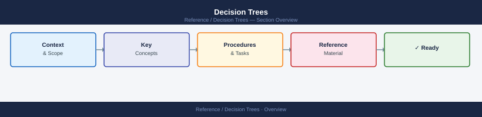

---
tags:
  - vsphere
  - architecture
  - operations
  - comparison
---
# Decision Trees

Flowcharts for common VMware infrastructure design decisions — storage policy, NSX topology, DR tool selection, and Aria product selection.

<a class="kb-card" href="vsan-policy/">
<strong>vSAN Storage Policy</strong> 
Choose FTT level, RAID type, encryption, and dedup/compression based on cluster size and requirements.
</a>
<a class="kb-card" href="nsx-topology/">
<strong>NSX Topology</strong> 
Select overlay vs VLAN, T0/T1 placement, Edge sizing, HA model, and north-south routing type.
</a>
<a class="kb-card" href="dr-tool/">
<strong>DR Tool Selection</strong> 
SRM vs vSphere Replication vs backup-based DR — choose based on RPO, RTO, and licensing.
</a>
<a class="kb-card" href="aria-selection/">
<strong>Aria Product Selection</strong> 
Which Aria product fits your need — monitoring, logging, automation, network visibility, or lifecycle.
</a>

---

## Product Comparison Tables

### vSAN vs ONTAP vs PowerStore vs FlashArray

| Feature | vSAN | NetApp ONTAP | Dell PowerStore | Pure Storage FlashArray |
|---|---|---|---|---|
| **Primary use case** | HCI storage for vSphere clusters | Enterprise NAS/SAN, data management | Unified all-flash block + file | All-flash block with NVMe focus |
| **Protocol support** | iSCSI, NFS (via vSAN File Services) | NFS, SMB, iSCSI, FC, NVMe/FC, NVMe/TCP | NFS, SMB, iSCSI, FC, NVMe/FC | iSCSI, FC, NVMe/FC, NVMe/TCP |
| **Max raw capacity** | Scales with cluster nodes (PB-scale with large clusters) | PB-scale (AFF A-series, C-series) | Up to 4PB raw per cluster | Up to 4PB (//X) |
| **Dedup/compression** | Inline dedup + compression (all-flash clusters) | Inline dedup, compression, compaction | Inline dedup + compression, data reduction ratio reporting | Always-on inline dedup + compression (always enabled) |
| **Replication tool** | vSphere Replication / HCX / vSAN Stretched Cluster | SnapMirror (sync/async), MetroCluster | PowerStore replication (sync/async), Dell RecoverPoint | ActiveDR (sync), ActiveCluster (stretch), async replication |
| **Cloud integration** | VMware Cloud on AWS, Azure VMware Solution | Cloud Volumes ONTAP (AWS/Azure/GCP), BlueXP | PowerStore with Dell APEX cloud services | Pure Cloud Block Store (AWS, Azure) |
| **Ideal workload** | vSphere VMs, VDI, Kubernetes (Tanzu) | Mixed NAS/SAN, Oracle, SAP, DevOps | Mixed enterprise block + file, virtualization | High-performance databases, VDI, Kubernetes |
| **Management UI** | vSphere Client (native), vSAN Health UI | ONTAP System Manager, BlueXP | PowerStore Manager (REST-first UI) | Pure1 (cloud-based), Purity//FA GUI |

> **When to choose:** Pick **vSAN** when you want hyper-converged simplicity and everything runs in vSphere. Pick **ONTAP** when you need mature NAS at scale with rich data management (SnapMirror, FlexClone). Pick **PowerStore** when the workload is mixed block/file on Dell hardware. Pick **FlashArray** when latency is the primary constraint and NVMe-first architecture matters.

---

### Veeam vs CommVault vs NetBackup

| Feature | Veeam Backup & Replication | Commvault Complete Backup & Recovery | Veritas NetBackup |
|---|---|---|---|
| **Backup targets** | Disk (repo), tape, object storage (S3/Azure/GCS), immutable object, Veeam Cloud Connect | Disk, tape, object storage, Commvault Metallic (SaaS), cloud-native | Disk, tape, object storage, cloud (AWS/Azure/GCP), NetBackup CloudCatalyst |
| **VMware integration depth** | Native vStorage API (VADP), vSphere plug-in, instant VM recovery, SureBackup auto-testing | VADP-based, IntelliSnap for array snapshots, deep vCenter integration | VADP, VMware snapshot integration, Accelerator for fast full backups |
| **Cloud archive support** | S3-compatible + cloud tier with capacity licensing; native Azure Blob/GCS archive tiers | Commvault Metallic SaaS, direct-to-cloud backups, WORM object lock | S3/Azure Blob/GCS archive tiers, CloudCatalyst dedup to cloud |
| **Ransomware protection** | Immutable repos (Linux hardened, object lock), SureBackup integrity scan, 4-eyes auth for delete | Ransomware detection analytics, immutable storage, honeypot files, threat scan on restore | Anomaly detection, WORM/immutable storage, NetBackup Malware Scanning |
| **RPO/RTO capabilities** | RPO: minutes (continuous CDP option); RTO: seconds with Instant VM Recovery | RPO: minutes; RTO: minutes with IntelliSnap; granular file/app recovery | RPO: minutes; RTO: minutes with Instant Access; ROBO optimised |
| **Licensing model** | Per-VM socket or per-workload (Universal License); perpetual + subscription | Per-capacity TB or per-workload subscription; VaultBridge SaaS option | Per-front-end TB (FETB) subscription; workload-based add-ons |

> **When to choose:** Pick **Veeam** for a VMware-first environment where speed of recovery and simplicity matter most. Pick **Commvault** for heterogeneous enterprise environments requiring broad workload coverage and analytics. Pick **NetBackup** for large enterprise or service provider environments with tape, complex SLA tiers, and multi-site policies.

---

### NSX vs Physical SAN Networking

| Feature | VMware NSX (Software-Defined) | Physical SAN Networking (FC/FCoE) |
|---|---|---|
| **Micro-segmentation approach** | Distributed Firewall (DFW) rules at each vNIC — policy follows the workload regardless of location | VLAN/Zone-based segmentation on physical switches/directors; changes require reconfiguration of fabric |
| **East-west traffic handling** | Stays within the hypervisor kernel (no physical hop); line-rate forwarding via DPDK/SmartNIC offload | All east-west traffic traverses physical fabric switches; latency depends on switch hops and ISL capacity |
| **Operational complexity** | Policy managed centrally in NSX Manager; zero-touch provisioning; infra team owns policy, not per-switch configs | Per-switch zone configuration (WWPN/WWNN zoning); change control required per fabric; separate SAN admin skill set |
| **Hardware requirements** | Commodity 10/25/100 GbE NICs + standard Ethernet switches; SmartNICs optional for offload | Dedicated FC HBAs, FC switches (Brocade/Cisco MDS), SFPs; separate physical fabric from LAN |

> **When to choose:** Choose **NSX** when you want security policy that follows workloads, want to eliminate dedicated SAN fabric costs, or need rapid micro-segmentation at scale. Choose **physical SAN networking** when you have latency-sensitive storage workloads (sub-100us FC), existing Fibre Channel investment, or compliance requirements mandating physical separation of storage traffic.

---

### Ansible vs Terraform vs PowerCLI for VMware Automation

| Feature | Ansible | Terraform | PowerCLI |
|---|---|---|---|
| **Idempotency** | Module-level idempotency; most VMware modules check current state before acting | Full state-driven idempotency via `.tfstate`; plan shows exact drift before apply | Script-level; developer must write idempotency logic explicitly |
| **VMware module ecosystem** | `community.vmware` collection (200+ modules); Ansible Automation Platform adds EE support | `hashicorp/vsphere` provider + `dell/vxrail`, `netapp/netapp-ontap`; growing ecosystem | Full native vSphere/vSAN/NSX/Aria API coverage via VMware-maintained cmdlets |
| **State management** | Stateless — no drift tracking between runs; re-runs tasks if not skipped by conditionals | Stateful — tracks all managed resources in `.tfstate`; detects and reconciles drift | Stateless — no built-in state; script output only |
| **Learning curve** | Low-medium; YAML playbooks readable by ops teams; Python knowledge helps for custom modules | Medium; HCL syntax straightforward; understanding plan/apply/state lifecycle takes time | Low for Windows/PowerShell admins; steep for Linux/non-MS backgrounds |
| **Best for (Day 0/1/2)** | **Day 1-2**: Config management, post-deploy hardening, patching, service config on VMs | **Day 0-1**: Infrastructure provisioning (deploy VMs, networks, clusters, datastores) | **Day 1-2**: Interactive admin, one-off scripting, deep vSphere API tasks, health checks |

> **When to choose:** Use **Terraform** to provision VMware infrastructure (VMs, port groups, datastores) as code with full lifecycle management. Use **Ansible** for configuration management, compliance enforcement, and Day 2 operations on running VMs. Use **PowerCLI** for ad-hoc administration, reporting, and tasks requiring deep vSphere API access beyond what provider modules expose. In practice, all three often coexist: Terraform provisions, Ansible configures, PowerCLI audits.
