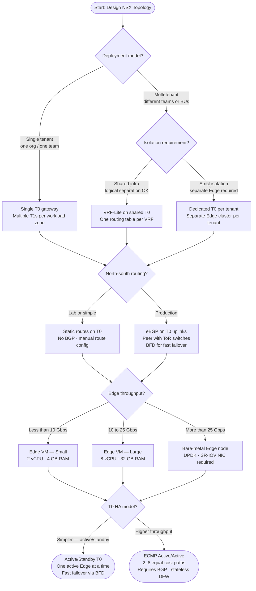

---
tags:
  - nsx
  - networking
  - architecture
---
# NSX Topology Decision Tree

Design your NSX topology: overlay vs VLAN transport, T0/T1 gateway placement, Edge cluster sizing, HA model, and north-south routing type.

## Key design decisions

| Decision | Option A | Option B | Tiebreaker |
|---|---|---|---|
| Tenant model | VRF-Lite (shared T0) | Dedicated T0 per tenant | Strict compliance → dedicated |
| Routing | Static routes | eBGP to ToR | Production → always BGP |
| Edge size | VM (Small/Large) | Bare-metal | >25 Gbps → bare-metal |
| T0 HA | Active/Standby | ECMP | Stateful NAT → Active/Standby |

## Important constraints

- **ECMP** requires BGP — you cannot use ECMP with static routes on a T0.
- **Stateful services** (NAT, LB, VPN) **pin to one Edge** even in ECMP — service traffic uses only the active Edge for that service.
- **Bare-metal Edge** requires a dedicated physical server — cannot share with ESXi hypervisor workloads.
- **VRF-Lite** on a T0 requires NSX 3.1+ and separate uplink interfaces per VRF.
- Minimum Edge cluster size for production: **2 nodes** (HA). For ECMP: **2–8 nodes**.

## See also

- [NSX Cheat Sheet](../../cheat-sheets/nsx/)
- [NSX Architecture](../../../virtualization/vmware/nsx/architecture/)
- [NSX Network Interaction Map](../../interaction-map/network/)
- [Back to Decision Trees](index.md)
