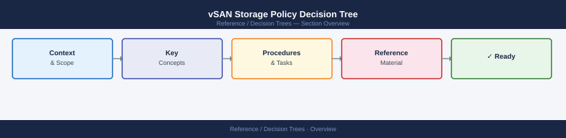
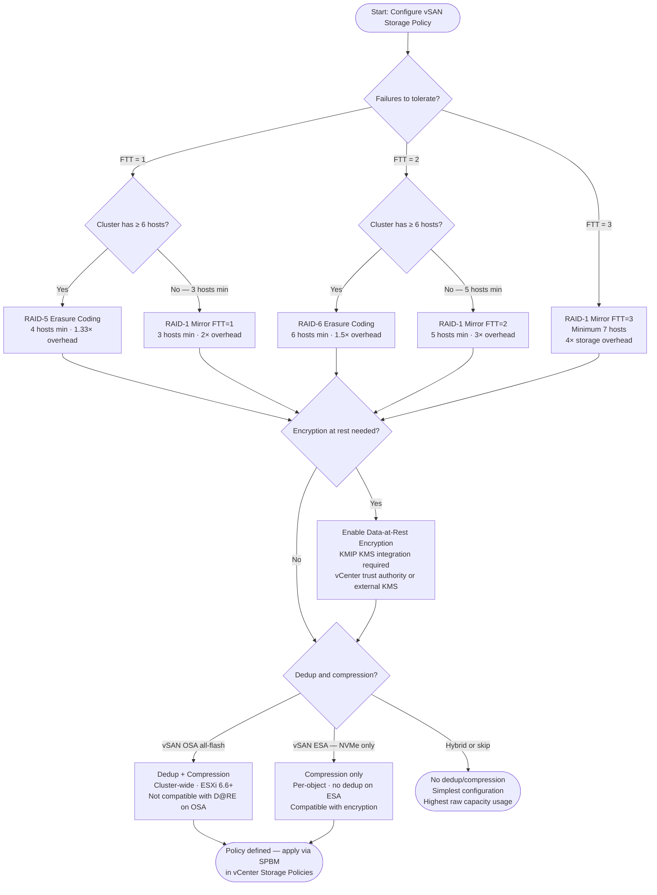

---
tags:
  - vsan
  - storage
  - architecture
---
# vSAN Storage Policy Decision Tree

<div class="kb-summary">
Choose the right vSAN storage policy: FTT level, RAID type (mirror vs erasure coding), encryption, and dedup/compression based on cluster size and requirements.
</div>





```d2
direction: right

center: "Decision Trees" {shape: hexagon}
quick_reference: "Quick reference" {shape: rectangle}
key_rules: "Key rules" {shape: rectangle}

center -> quick_reference
center -> key_rules
```

## Quick reference

| FTT | RAID | Min hosts | Overhead | Use case |
|---|---|---|---|---|
| 1 | RAID-1 Mirror | 3 | 2× | Small clusters, dev/test |
| 1 | RAID-5 EC | 4 | 1.33× | Production, ≥4 nodes |
| 2 | RAID-1 Mirror | 5 | 3× | Critical workloads, small cluster |
| 2 | RAID-6 EC | 6 | 1.5× | Production, best efficiency |
| 3 | RAID-1 Mirror | 7 | 4× | Mission-critical only |

## Key rules

- **FTT=1 + RAID-5** requires exactly 4 hosts minimum (4+1 parity striping across 4 nodes).
- **FTT=2 + RAID-6** requires exactly 6 hosts minimum.
- **D@RE (Data-at-Rest Encryption)** on vSAN OSA is **incompatible with dedup** — enabling both will revert dedup to disabled.
- **vSAN ESA** (8.x, NVMe-only) uses compression only — no traditional dedup; encryption is compatible.
- Policies are applied per-VM or per-VMDK via SPBM in vCenter → Policies and Profiles.

## See also

- [vSAN Cheat Sheet](../cheat-sheets/vsan/)
- [vSAN Architecture](../../virtualization/vmware/vsan/architecture/)
- [vSAN Operations](../../virtualization/vmware/vsan/operations/procedures/)
- [Back to Decision Trees](index.md)
