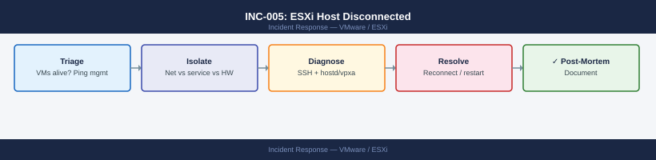
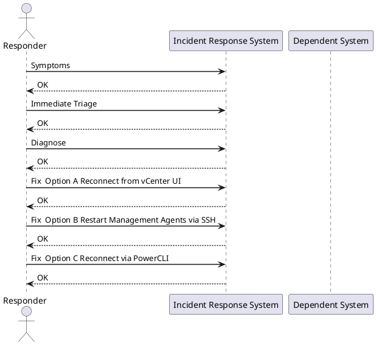

---
tags:
  - vmware
  - esxi
  - incident-response
search:
  boost: 1
---
# INC-005: ESXi Host Disconnected from vCenter

<div class="kb-summary">
Response procedure for an ESXi host showing "Not Responding" or "Disconnected" in vCenter. Severity depends on whether VMs are running and inaccessible on that host.
</div>



> **Severity: P1** if VMs are running on the host and unreachable. **P2** if host is empty or HA has already restarted VMs elsewhere.



## Symptoms

- Host shows "Not Responding" or "Disconnected" in vCenter inventory
- VMs on that host may show stale status or be completely inaccessible
- vCenter alarm: "Host connection and power state" firing
- vSphere HA may have already restarted VMs on other hosts

## Immediate Triage

**First: are the VMs still reachable?**

```bash
ping <vm-ip>
```


```text title="Expected output"
PING 192.168.45.87 (192.168.45.87) 56(84) bytes of data.
64 bytes from 192.168.45.87: icmp_seq=1 ttl=64 time=2.341 ms
64 bytes from 192.168.45.87: icmp_seq=2 ttl=64 time=2.156 ms
64 bytes from 192.168.45.87: icmp_seq=3 ttl=64 time=2.489 ms
64 bytes from 192.168.45.87: icmp_seq=4 ttl=64 time=2.278 ms

--- 192.168.45.87 statistics ---
4 packets transmitted, 4 received, 0% packet loss, time 3004ms
rtt min/avg/max/stddev = 2.156/2.316/2.489/0.131 ms
```

!!! warning "Common errors"
    **`ping: unknown host <vm-ip>`** — Replace `<vm-ip>` with the actual IP address (e.g., `ping 192.168.45.87`).
    **`From 192.168.1.1 icmp_seq=1 Destination Host Unreachable`** — Verify the VM is powered on and check network connectivity; confirm the IP address is correct and on the same subnet.
    **`ping: sendto: Operation not permitted`** — Run the command with appropriate permissions or check if ICMP is blocked by a firewall rule on the host or network.
If VMs respond to ping, the host is up but vCenter lost the management agent — lower urgency.

**Check HA events** — did HA already handle it?
vCenter → Host → Monitor → Events → filter "HA restarted VM"

## Diagnose

### Step 1 — Ping the host management IP

```bash
ping <esxi-management-ip>
```


```text title="Expected output"
PING 192.168.1.42 (192.168.1.42) 56(84) bytes of data.
64 bytes from 192.168.1.42: icmp_seq=1 ttl=64 time=2.34 ms
64 bytes from 192.168.1.42: icmp_seq=2 ttl=64 time=1.89 ms
64 bytes from 192.168.1.42: icmp_seq=3 ttl=64 time=2.12 ms
64 bytes from 192.168.1.42: icmp_seq=4 ttl=64 time=2.01 ms
^C
--- 192.168.1.42 statistics ---
4 packets transmitted, 4 received, 0% packet loss, time 3004ms
rtt min/avg/max/stddev = 1.89/2.09/2.34/0.16 ms
```

!!! warning "Common errors"
    **`ping: unknown host <esxi-management-ip>`** — Replace `<esxi-management-ip>` with the actual ESXi management IP address (e.g., `192.168.1.42`).
    **`From 192.168.1.1 icmp_seq=1 Destination Host Unreachable`** — Verify the ESXi host is powered on and the management network is reachable; check physical connectivity and firewall rules.
| Result | Meaning |
|---|---|
| Responds | ESXi is alive; issue is `hostd` or `vpxa` agent crash |
| No response | Network problem or host hardware failure |

### Step 2 — SSH directly to the host

```bash
ssh root@<esxi-management-ip>

# Check management agent status
/etc/init.d/hostd status
/etc/init.d/vpxa status

# Check uptime
uptime

# Scan for hardware errors
grep -i "error\|fault\|fail" /var/log/vmkernel.log | tail -20
```


```text title="Expected output"
root@esxi-prod-01.dc1 [ ~ ]# /etc/init.d/hostd status
hostd is running.
root@esxi-prod-01.dc1 [ ~ ]# /etc/init.d/vpxa status
vpxa is running.
root@esxi-prod-01.dc1 [ ~ ]# uptime
 14:32:18 up 187 days, 3:45, 0 users, load average: 0.42, 0.38, 0.35
root@esxi-prod-01.dc1 [ ~ ]# grep -i "error\|fault\|fail" /var/log/vmkernel.log | tail -20
2024-01-15T14:28:33.847Z cpu2:2097)FSS: 2097: Failed to open swap file /vmfs/volumes/datastore1/swap/esx-prod-01-2097.vswp
2024-01-15T14:15:22.451Z cpu5:2156)WARNING: NMP: nmp_ThrottleLogForDevice: Reducing number of error messages from device naa.6001405a1b2c4d8e9f0a1b2c3d4e5f6a
2024-01-15T13:42:10.923Z cpu1:2045)ALERT: FS: 2045: Failed to allocate memory for inode cache
2024-01-15T13:15:47.632Z cpu3:2089)WARNING: Hostd: Failed to retrieve VM inventory from vCenter
2024-01-15T12:58:33.119Z cpu0:2001)NMP: nmp_DeviceAttemptFailover: Failover attempt 2 for device naa.6001405a1b2c4d8e9f0a1b2c3d4e5f6a
```

!!! warning "Common errors"
    **`ssh: connect to host <esxi-management-ip> port 22: Connection timed out`** — Verify the ESXi host is powered on and reachable by pinging the management IP; check firewall rules allow SSH on port 22.
    **`hostd is stopped.`** — Restart the management agent with `/etc/init.d/hostd start` and check `/var/log/hostd.log` for startup errors.
    **`grep: /var/log/vmkernel.log: No such file or directory`** — Verify the ESXi host filesystem is accessible; if corrupted, boot into maintenance mode and check `/var/log/vmkernel.log` path exists.
### Step 3 — Try vSphere Host Client directly

Browse to `https://<esxi-ip>/ui` — if this loads, the host is healthy but the vCenter agent has crashed.

## Fix — Option A: Reconnect from vCenter UI

If the host is network-reachable:

1. vCenter → Hosts and Clusters
2. Right-click disconnected host → **Connect**
3. If a credential error appears: re-enter the ESXi root credentials

## Fix — Option B: Restart Management Agents via SSH

```bash
# Restart hostd and vpxa individually
/etc/init.d/hostd restart
/etc/init.d/vpxa restart

# Or restart all management agents at once
services.sh restart
```


```text title="Expected output"
Stopping hostd... done
Starting hostd... done
Stopping vpxa... done
Starting vpxa... done
Stopping management agents
Stopping hostd... done
Stopping vpxa... done
Stopping netcpa... done
Stopping datastore... done
Starting datastore... done
Starting netcpa... done
Starting vpxa... done
Starting hostd... done
```

!!! warning "Common errors"
    **`hostd: unrecognized service`** — Verify you are running this command on an ESXi host (not vCenter); these services only exist on ESXi.
    **`/etc/init.d/hostd: Permission denied`** — Execute the commands with root privileges using `sudo` or by logging in as root.
Wait 60–90 seconds — the host should reconnect to vCenter automatically.

## Fix — Option C: Reconnect via PowerCLI

```powershell
Get-VMHost "esxi-host.domain" | Set-VMHost -State Connected
```

## Fix — Option D: Evacuate VMs via Host Client

Use when the host has a hardware fault but VMs are still running:

1. Browse to `https://<esxi-ip>/ui`
2. Manually initiate vMotion for each VM to another host
3. Or put host in maintenance mode to trigger DRS evacuation:

```bash
# From ESXi SSH shell
esxcli system maintenanceMode set --enable true
```


```text title="Expected output"
(no output — command completes silently)
```

!!! warning "Common errors"
    **`Error: Unknown option or flag '--enable'`** — Use `esxcli system maintenanceMode set --enable=true` with an equals sign instead of a space.
    **`Error: Permission denied`** — Ensure you are logged in as root or a user with administrative privileges on the ESXi host.
## If VMs Are Inaccessible and Host Is Down

1. **Wait for HA timeout** (default 5 minutes) — HA will restart VMs on surviving hosts
2. If HA does not trigger, manually re-register the VMX from the shared datastore:
   - vCenter → Storage → right-click the datastore → Register VM → browse to the `.vmx` file
3. Power on the re-registered VM

## Verify

- Host shows "Connected" in vCenter inventory
- All VMs show correct power state
- No pending HA failover events: Monitor → vSphere HA → Virtual Machine
- Host hardware alarms cleared
- No new critical entries in `/var/log/vmkernel.log`

## See Also

- [VMware ESXi Operations](../../../virtualization/vmware/esxi/operations//)
- [vCenter Operations](../../../virtualization/vmware/vcenter/operations//)
- [INC-001: vCenter Server Unreachable](vcenter-unreachable.md)
- [VMware Morning Health Check](../../../virtualization/vmware/operations/morning-health-check//)
