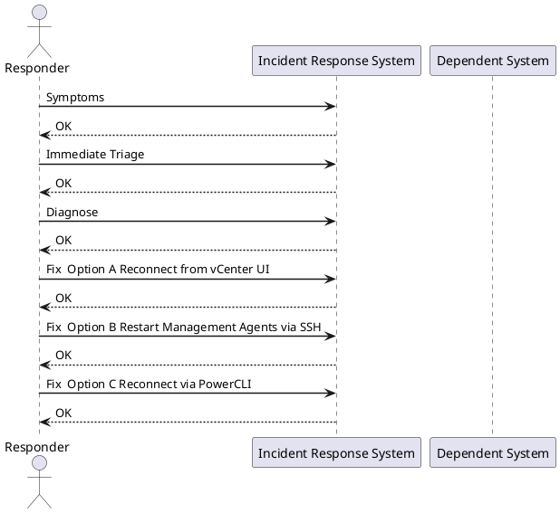

---
tags:
  - vmware
  - esxi
  - incident-response
search:
  boost: 1
---
# INC-005: ESXi Host Disconnected from vCenter

<div class="kb-summary">
Response procedure for an ESXi host showing "Not Responding" or "Disconnected" in vCenter. Severity depends on whether VMs are running and inaccessible on that host.
</div>


> **Severity: P1** if VMs are running on the host and unreachable. **P2** if host is empty or HA has already restarted VMs elsewhere.



## Symptoms

- Host shows "Not Responding" or "Disconnected" in vCenter inventory
- VMs on that host may show stale status or be completely inaccessible
- vCenter alarm: "Host connection and power state" firing
- vSphere HA may have already restarted VMs on other hosts

## Immediate Triage

**First: are the VMs still reachable?**

```bash
ping <vm-ip>
```

If VMs respond to ping, the host is up but vCenter lost the management agent — lower urgency.

**Check HA events** — did HA already handle it?
vCenter → Host → Monitor → Events → filter "HA restarted VM"

## Diagnose

### Step 1 — Ping the host management IP

```bash
ping <esxi-management-ip>
```

| Result | Meaning |
|---|---|
| Responds | ESXi is alive; issue is `hostd` or `vpxa` agent crash |
| No response | Network problem or host hardware failure |

### Step 2 — SSH directly to the host

```bash
ssh root@<esxi-management-ip>

# Check management agent status
/etc/init.d/hostd status
/etc/init.d/vpxa status

# Check uptime
uptime

# Scan for hardware errors
grep -i "error\|fault\|fail" /var/log/vmkernel.log | tail -20
```

### Step 3 — Try vSphere Host Client directly

Browse to `https://<esxi-ip>/ui` — if this loads, the host is healthy but the vCenter agent has crashed.

## Fix — Option A: Reconnect from vCenter UI

If the host is network-reachable:

1. vCenter → Hosts and Clusters
2. Right-click disconnected host → **Connect**
3. If a credential error appears: re-enter the ESXi root credentials

## Fix — Option B: Restart Management Agents via SSH

```bash
# Restart hostd and vpxa individually
/etc/init.d/hostd restart
/etc/init.d/vpxa restart

# Or restart all management agents at once
services.sh restart
```

Wait 60–90 seconds — the host should reconnect to vCenter automatically.

## Fix — Option C: Reconnect via PowerCLI

```powershell
Get-VMHost "esxi-host.domain" | Set-VMHost -State Connected
```

## Fix — Option D: Evacuate VMs via Host Client

Use when the host has a hardware fault but VMs are still running:

1. Browse to `https://<esxi-ip>/ui`
2. Manually initiate vMotion for each VM to another host
3. Or put host in maintenance mode to trigger DRS evacuation:

```bash
# From ESXi SSH shell
esxcli system maintenanceMode set --enable true
```

## If VMs Are Inaccessible and Host Is Down

1. **Wait for HA timeout** (default 5 minutes) — HA will restart VMs on surviving hosts
2. If HA does not trigger, manually re-register the VMX from the shared datastore:
   - vCenter → Storage → right-click the datastore → Register VM → browse to the `.vmx` file
3. Power on the re-registered VM

## Verify

- Host shows "Connected" in vCenter inventory
- All VMs show correct power state
- No pending HA failover events: Monitor → vSphere HA → Virtual Machine
- Host hardware alarms cleared
- No new critical entries in `/var/log/vmkernel.log`

## See Also

- [VMware ESXi Operations](../../../virtualization/vmware/esxi/operations/index.md)
- [vCenter Operations](../../../virtualization/vmware/vcenter/operations/index.md)
- [INC-001: vCenter Server Unreachable](vcenter-unreachable.md)
- [VMware Morning Health Check](../../../virtualization/vmware/operations/morning-health-check/index.md)
