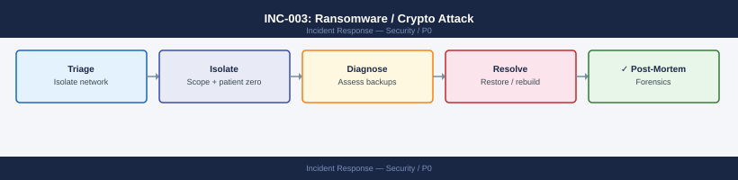
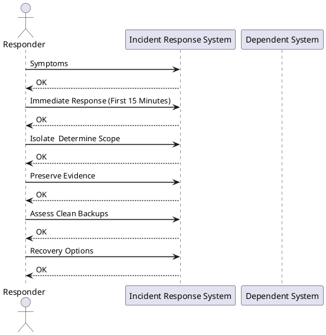

---
tags:
  - security
  - incident-response
  - data-protection
search:
  boost: 2
---
# INC-003: Ransomware / Crypto Attack Detected

<div class="kb-summary">
P0 incident response for ransomware or crypto-locker activity detected on infrastructure. Priority: isolate, preserve evidence, recover from immutable backup. Do NOT reboot affected systems before evidence capture.
</div>



> **Severity: P0** — Engage security team and management immediately. Contact cyber insurance before taking any recovery actions.



## Symptoms

- Mass file rename or encryption across shared datastores
- Changed file extensions (`.locked`, `.encrypted`, random strings)
- Ransom note file found on shared storage or VM desktops
- Sudden spike in CPU and storage write I/O across multiple VMs
- Antivirus / EDR alerts for known ransomware signatures
- NSX DFW alert: high-volume lateral movement between VMs

## Immediate Response (First 15 Minutes)

> **Do NOT reboot affected VMs** — memory forensics may be possible and rebooting destroys evidence.

### Step 1 — Isolate affected hosts from network

Via NSX DFW (preferred) — add an emergency block rule for the affected VM IP range:
NSX Manager → Security → Distributed Firewall → Add rule: Block ALL from affected IP range.

Via physical network if NSX unavailable: notify network team to isolate the port-group or VLAN at the switch level.

### Step 2 — Notify immediately

1. Security team lead
2. IT management / CISO
3. Cyber insurance provider — **call before any recovery action** as this may affect your claim

### Step 3 — Do NOT pay ransom

- No guarantee of decryption key delivery
- Marks the organisation as a paying target
- May violate sanctions regulations depending on threat actor

## Isolate — Determine Scope

```powershell
# List all VMs and datastore usage
Get-VM | Select Name,PowerState,@{n='Datastore';e={(Get-Datastore -VM $_).Name}} | Sort Datastore

# Check if backup repos are reachable
Get-VBRBackupRepository | Select Name,FriendlyPath | ForEach-Object {
    [PSCustomObject]@{ Name=$_.Name; Reachable=(Test-Path $_.FriendlyPath) }
}
```

Questions to answer:
- Which VMs are actively encrypting? (check write IOPS per VM in vCenter)
- Which datastores are impacted?
- Has the encryption reached backup repositories?

## Preserve Evidence

Before any recovery action:

```powershell
# Snapshot affected VMs with memory capture
Get-VM -Name "AffectedVM" | New-Snapshot -Name "Forensic-$(Get-Date -Format yyyyMMdd-HHmm)" -Memory:$true -Quiesce:$false
```

- Export NSX flow logs: NSX Manager → Operations → Flow Monitoring → Export last 24h
- Capture Windows Event logs from unaffected domain controllers before they are targeted
- Record the exact time of first observed symptoms

## Assess Clean Backups

```powershell
# Find restore points before suspected infection time
$infectionTime = Get-Date "2026-06-21 08:00"
Get-VBRRestorePoint | Where-Object { $_.CreationTime -lt $infectionTime } |
    Select-Object Name,CreationTime,@{n='SizeGB';e={[math]::Round($_.ApproxSize/1GB,1)}} |
    Sort-Object CreationTime -Descending | Select-Object -First 10
```

Check Pure SafeMode snapshots (immutable — cannot be deleted by ransomware):
```bash
puresnapshot list --pgrouplist <pgroup> --sort created --reverse
# Verify eradication period (default 24h) has not expired
```

Check Veeam Hardened Repository: confirm immutability lock is active and unexpired.

## Recovery Options

| Option | RPO | Complexity | When to Use |
|---|---|---|---|
| Pure SafeMode snapshot restore | Hours | Low | Storage-level encryption detected |
| Veeam Hardened Repo restore | Hours | Medium | VM-level encryption |
| VM snapshot revert | Minutes | Low | Limited scope, clean snapshot exists |
| Rebuild from template | Zero | High | Patient zero VMs with no clean snapshot |

### Option A — Pure SafeMode Restore

```bash
# List available immutable snapshots
puresnapshot list --pgrouplist <pgroup>

# Restore volume from clean snapshot
purevol copy <pgroup>.<snapshot>.<vol> <restore-vol-name> --overwrite
```

### Option B — Veeam Restore from Hardened Repository

1. Veeam Console → Home → Backups → Disk
2. Right-click job → Restore → Entire VM
3. Select restore point from **before** the infection timestamp
4. Restore to isolated network first, validate, then reconnect

## Communication Template

```text
Subject: [P0 INCIDENT] Ransomware Activity Detected — [Date/Time]

Status: Contained / Investigating / Recovering
Affected systems: [list]
Impact: [describe user/service impact]
Actions taken: [isolation steps, backup assessment, recovery plan]
Next update: [time]
Incident commander: [name/channel]
```

## Post-Incident

After recovery is confirmed and validated:

1. **Forensics handoff** — preserve snapshots and logs for investigation team
2. **Root cause** — identify patient zero: phishing email, exposed RDP, unpatched service
3. **Remediation** — patch the vulnerability, reset all credentials, review NSX DFW rules
4. **Backup validation** — run SureBackup against all restored VMs
5. **Lessons learned** — document full timeline, response quality, gaps identified

## See Also

- [NSX Security Operations](../../../compute/vmware/nsx/security/index.md)
- [Veeam Backup Operations](../../../backup/veeam/operations/index.md)
- [Pure FlashArray Operations](../../../storage/pure/flasharray/operations/index.md)
- [DR Failover Runbook](../../../storage/runbooks/dr-failover-vmware-srm-snapmirror.md)
