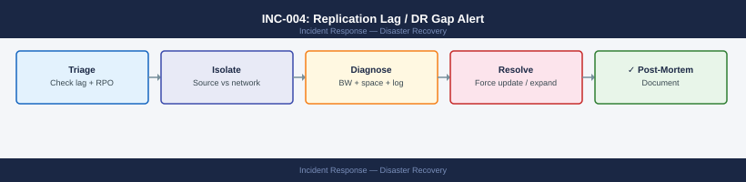
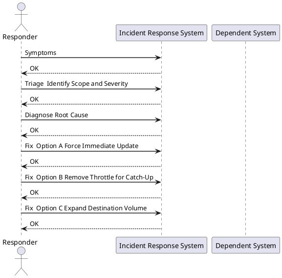

---
tags:
  - disaster-recovery
  - netapp
  - vmware
  - incident-response
search:
  boost: 1
---
# INC-004: Replication Lag / DR Gap Alert

<div class="kb-summary">
Response procedure for SnapMirror lag exceeding RPO targets, SRM replication alerts, or RecoverPoint RPO breach. Severity escalates to P1 the moment lag exceeds your documented RPO target.
</div>



> **Severity: P2** (lag increasing) → **P1** (RPO breached). Escalate immediately on RPO breach.



## Symptoms

- ONTAP SnapMirror alert: lag time exceeds configured threshold
- SRM alarm in vCenter: "Replication not meeting RPO"
- RecoverPoint RPO breach alert in vSphere Client
- Monitoring dashboard: replication lag trending upward
- Destination cluster shows stale `last-transfer-end-timestamp`

## Triage — Identify Scope and Severity

```bash
# ONTAP: list all SnapMirror relationships with lag and health
snapmirror show -fields source-path,destination-path,lag-time,health,state

# Inspect a specific relationship
snapmirror show -source-path <svm>:<vol> \
  -fields lag-time,last-transfer-size,last-transfer-end-timestamp
```

Compare current lag to your RPO target:

| RPO Target | Lag | Severity |
|---|---|---|
| 1 hour | < 30 min | OK |
| 1 hour | 30–60 min | Warning — investigate now |
| 1 hour | > 60 min | **P1 — RPO Breach** |
| 4 hours | > 4 hours | **P1 — RPO Breach** |

## Diagnose Root Cause

Common causes: WAN bandwidth saturation, high source change rate, destination full, missed schedule window.

```bash
# Check intercluster LIF speed and utilisation
network interface show -role intercluster -fields curr-speed,status-oper

# Check source volume change rate (delta between recent snapshots)
snapshot show -volume <vol> -fields cumulative-total,name | head -5

# Check destination aggregate space
volume show -vserver <dstsvm> -fields available,percent-used

# Check if a transfer is currently in progress
snapmirror show -fields transfer-progress,bytes-transferred
```

## Fix — Option A: Force Immediate Update

Use when lag is recoverable and bandwidth is available:

```bash
# Trigger immediate update
snapmirror update -source-path <svm:vol> -destination-path <dstsvm:dstvol>

# Monitor progress
snapmirror show -fields transfer-progress,bytes-transferred
```

## Fix — Option B: Remove Throttle for Catch-Up

Use when throttle is limiting catch-up speed:

```bash
# Remove bandwidth throttle temporarily
snapmirror modify -destination-path <dstsvm:dstvol> -throttle 0

# After catching up, restore throttle
snapmirror modify -destination-path <dstsvm:dstvol> -throttle 100000
```

## Fix — Option C: Expand Destination Volume

Use when destination is full and blocking replication:

```bash
# Grow destination volume
volume modify -vserver <dstsvm> -volume <dstvol> -size +200g

# Confirm new space
volume show -vserver <dstsvm> -fields available -volume <dstvol>
```

## If RPO Is Breached

1. **Notify DR owner and IT management** — document breach start time and cause
2. **Assess exposure** — how much data is unprotected if a failover occurred right now?
3. **Force update immediately** and monitor to completion
4. **Open change request** for root-cause fix (bandwidth, schedule, destination capacity)
5. **Document** breach in incident log: start time, end time, lag peak, cause, resolution

## Verify

```bash
# Confirm lag returned within RPO
snapmirror show -fields lag-time,health

# Confirm last successful transfer
snapmirror show -fields last-transfer-end-timestamp
```

Also confirm:
- SRM alarm cleared in vCenter
- RecoverPoint shows RPO met
- Monitoring dashboard returns to green

## Prevent Recurrence

- Set alert threshold at **50% of RPO** — catch problems while there's still recovery time
- Review transfer schedule vs. change rate on a monthly basis
- Maintain 20%+ free space headroom on destination volumes
- Size intercluster LIFs for peak change rate, not average

## See Also

- [ONTAP SnapMirror Operations](../../../storage/netapp/ontap/operations//)
- [DR Failover Runbook](../../../storage/runbooks/dr-failover-vmware-srm-snapmirror.md)
- [VMware SRM Operations](../../../virtualization/vmware/srm/operations//)
- [Monitoring Thresholds Reference](../monitoring-thresholds/index.md)
