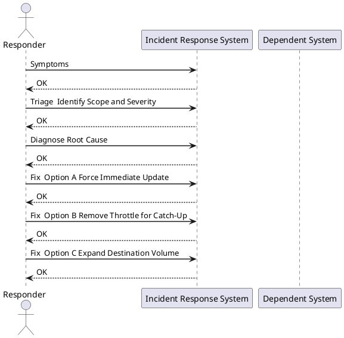

---
tags:
  - disaster-recovery
  - netapp
  - vmware
  - incident-response
search:
  boost: 1
---
# INC-004: Replication Lag / DR Gap Alert

*Applies to: All products*

<div class="kb-summary">
Response procedure for SnapMirror lag exceeding RPO targets, SRM replication alerts, or RecoverPoint RPO breach. Severity escalates to P1 the moment lag exceeds your documented RPO target.
</div>


> **Severity: P2** (lag increasing) → **P1** (RPO breached). Escalate immediately on RPO breach.



## Symptoms

- ONTAP SnapMirror alert: lag time exceeds configured threshold
- SRM alarm in vCenter: "Replication not meeting RPO"
- RecoverPoint RPO breach alert in vSphere Client
- Monitoring dashboard: replication lag trending upward
- Destination cluster shows stale `last-transfer-end-timestamp`

## Triage — Identify Scope and Severity

```bash
# ONTAP: list all SnapMirror relationships with lag and health
snapmirror show -fields source-path,destination-path,lag-time,health,state

# Inspect a specific relationship
snapmirror show -source-path <svm>:<vol> \
  -fields lag-time,last-transfer-size,last-transfer-end-timestamp
```


```text title="Expected output"
Source Path                Destination Path           Lag Time  Health    State
========================== ========================== ========= ========= ==========
svm1:vol_prod_data         svm2:vol_prod_data_dr      00:15:32  Healthy   SnapMirrored
svm1:vol_logs              svm2:vol_logs_dr           00:02:18  Healthy   SnapMirrored
svm1:vol_archive           svm3:vol_archive_dr        12:45:00  Unhealthy Broken-off
svm1:vol_temp              svm2:vol_temp_dr           00:00:45  Healthy   Transferring
svm1:vol_config            svm2:vol_config_dr         00:08:12  Healthy   SnapMirrored

Source Path                Lag Time  Last Transfer Size  Last Transfer End Timestamp
========================== ========= =================== ============================
svm1:vol_prod_data         00:15:32  2.4GB               2024-01-15 14:32:18 +00:00
```

!!! warning "Common errors"
    **`Error: command not found: snapmirror`** — Verify you are connected to an ONTAP cluster with `cluster show` and have appropriate admin credentials.
    **`Error: invalid field name "lag-time"`** — Use `snapmirror show -fields ?` to list valid field names for your ONTAP version, as field names vary between releases.
    **`Error: no records found`** — Confirm the source path format is correct (use `svm:volume` syntax) and the relationship exists with `snapmirror list-destinations`.
Compare current lag to your RPO target:

| RPO Target | Lag | Severity |
|---|---|---|
| 1 hour | < 30 min | OK |
| 1 hour | 30–60 min | Warning — investigate now |
| 1 hour | > 60 min | **P1 — RPO Breach** |
| 4 hours | > 4 hours | **P1 — RPO Breach** |

## Diagnose Root Cause

Common causes: WAN bandwidth saturation, high source change rate, destination full, missed schedule window.

```bash
# Check intercluster LIF speed and utilisation
network interface show -role intercluster -fields curr-speed,status-oper

# Check source volume change rate (delta between recent snapshots)
snapshot show -volume <vol> -fields cumulative-total,name | head -5

# Check destination aggregate space
volume show -vserver <dstsvm> -fields available,percent-used

# Check if a transfer is currently in progress
snapmirror show -fields transfer-progress,bytes-transferred
```


```text title="Expected output"
cluster1::> network interface show -role intercluster -fields curr-speed,status-oper
Vserver     Interface       curr-speed  status-oper
----------- --------------- ----------- -----------
cluster1    ic_lif_01       10Gb        up
cluster1    ic_lif_02       10Gb        up
cluster2    ic_lif_03       1Gb         up
2 entries were displayed.

cluster1::> snapshot show -volume vol_prod_01 -fields cumulative-total,name | head -5
Vserver  Volume       Snapshot                 cumulative-total
-------- ------------ ------------------------ ----------------
svm_prod vol_prod_01  hourly.2024-01-15_0900  847.2GB
svm_prod vol_prod_01  hourly.2024-01-15_0800  823.1GB
svm_prod vol_prod_01  hourly.2024-01-15_0700  798.5GB
svm_prod vol_prod_01  daily.2024-01-14_0000   756.3GB

cluster1::> volume show -vserver svm_dr -fields available,percent-used
Vserver Name            Available Percent-Used
------- --------------- --------- ------------
svm_dr  vol_dr_mirror   2.1TB     78%
svm_dr  vol_dr_backup   4.8TB     45%
2 entries were displayed.

cluster1::> snapmirror show -fields transfer-progress,bytes-transferred
Source Destination Mirror State Lag Time Transfer Progress Bytes Transferred
------ ----------- ------------ -------- --------- ----------------------
svm_src:vol_prod_01 svm_dr:vol_dr_mirror SnapMirrored In-Sync 0s 100% 847.2GB
1 entry was displayed.
```

!!! warning "Common errors"
    **`Error: command not found: snapmirror`** — Verify you are connected to the correct cluster with `cluster show` and that SnapMirror is licensed with `system license show`.
    **`Error: There is no data to display`** — Confirm the volume name is correct and exists in the specified SVM using `volume show -vserver <dstsvm>`.
## Fix — Option A: Force Immediate Update

Use when lag is recoverable and bandwidth is available:

```bash
# Trigger immediate update
snapmirror update -source-path <svm:vol> -destination-path <dstsvm:dstvol>

# Monitor progress
snapmirror show -fields transfer-progress,bytes-transferred
```


```text title="Expected output"
Operation is queued: snapmirror transfer with id "4f3c8b92-1a2e-11ee-9c4a-005056b3d3f1" for pair "cluster1:svm_prod:vol_data" -> "cluster2:svm_dr:vol_data_mirror"

Source Destination Status Progress
cluster1:svm_prod:vol_data cluster2:svm_dr:vol_data_mirror transferring 45% 2.3GB/5.1GB
cluster1:svm_prod:vol_logs cluster2:svm_dr:vol_logs_mirror idle - -
cluster1:svm_prod:vol_config cluster2:svm_dr:vol_config_mirror idle - -
```

!!! warning "Common errors"
    **`Error: "snapmirror update" command requires source and destination paths in the format svm:volume`** — Verify both source and destination paths follow the exact format `<svm_name>:<volume_name>` with no extra spaces or special characters.
    **`Error: SnapMirror relationship does not exist for source-path <svm:vol>`** — Initialize the SnapMirror relationship first using `snapmirror create -source-path <svm:vol> -destination-path <dstsvm:dstvol> -type XDP` before attempting an update.
    **`Error: Transfer already in progress for this relationship`** — Wait for the current transfer to complete or abort it with `snapmirror abort -source-path <svm:vol> -destination-path <dstsvm:dstvol>` before issuing a new update command.
## Fix — Option B: Remove Throttle for Catch-Up

Use when throttle is limiting catch-up speed:

```bash
# Remove bandwidth throttle temporarily
snapmirror modify -destination-path <dstsvm:dstvol> -throttle 0

# After catching up, restore throttle
snapmirror modify -destination-path <dstsvm:dstvol> -throttle 100000
```


```text title="Expected output"
Operation succeeded: SnapMirror of "cluster2://svm_dr:vol_backup" is now unthrottled.
(no output — command completes silently)
```

!!! warning "Common errors"
    **`Error: command failed: Invalid destination path format`** — Ensure the destination path follows the format `cluster-name://svm-name:volume-name` with proper colons and slashes.
    **`Error: This operation is not permitted on the source of an active SnapMirror relationship`** — Run the command on the destination cluster/SVM, not the source.
## Fix — Option C: Expand Destination Volume

Use when destination is full and blocking replication:

```bash
# Grow destination volume
volume modify -vserver <dstsvm> -volume <dstvol> -size +200g

# Confirm new space
volume show -vserver <dstsvm> -fields available -volume <dstvol>
```


```text title="Expected output"
Volume modify successful: Volume "data_vol" size set to 1.2TB.

Vserver     Volume      Available
----------- ----------- ----------
prod-svm    data_vol    487.6GB
```

!!! warning "Common errors"
    **`Error: command failed: no such volume <dstvol>`** — Verify the destination volume name matches exactly and the vserver is online with `vserver show`.
    **`Error: Insufficient space in aggregate to grow volume by 200GB`** — Check aggregate free space with `storage aggregate show -fields available` and reduce the growth size or add disks to the aggregate.
## If RPO Is Breached

1. **Notify DR owner and IT management** — document breach start time and cause
2. **Assess exposure** — how much data is unprotected if a failover occurred right now?
3. **Force update immediately** and monitor to completion
4. **Open change request** for root-cause fix (bandwidth, schedule, destination capacity)
5. **Document** breach in incident log: start time, end time, lag peak, cause, resolution

## Verify

```bash
# Confirm lag returned within RPO
snapmirror show -fields lag-time,health

# Confirm last successful transfer
snapmirror show -fields last-transfer-end-timestamp
```


```text title="Expected output"
Cluster::> snapmirror show -fields lag-time,health
Source Destination Mirror State Lag Time Health
------- ----------- ------ ----- -------- ------
svm1:vol_prod svm2:vol_prod_mirror SnapMirror Snapmirrored 00:15:32 Healthy
svm1:vol_data svm2:vol_data_mirror SnapMirror Snapmirrored 00:08:17 Healthy
svm3:vol_logs svm4:vol_logs_mirror SnapMirror Snapmirrored 00:22:45 Healthy

Cluster::> snapmirror show -fields last-transfer-end-timestamp
Source Destination Mirror State Last Transfer End Timestamp
------- ----------- ------ ----- ---------------------------
svm1:vol_prod svm2:vol_prod_mirror SnapMirror Snapmirrored 2024-01-15 14:32:18 +00:00
svm1:vol_data svm2:vol_data_mirror SnapMirror Snapmirrored 2024-01-15 14:28:45 +00:00
svm3:vol_logs svm4:vol_logs_mirror SnapMirror Snapmirrored 2024-01-15 14:15:22 +00:00
```

!!! warning "Common errors"
    **`Error: command not found: snapmirror`** — Ensure you are logged into the ONTAP cluster CLI (not the local shell) and have SnapMirror licensed.
    **`Error: No SnapMirror relationships found`** — Verify SnapMirror relationships exist with `snapmirror list-destinations` and confirm source and destination SVMs are peered.
Also confirm:
- SRM alarm cleared in vCenter
- RecoverPoint shows RPO met
- Monitoring dashboard returns to green

## Prevent Recurrence

- Set alert threshold at **50% of RPO** — catch problems while there's still recovery time
- Review transfer schedule vs. change rate on a monthly basis
- Maintain 20%+ free space headroom on destination volumes
- Size intercluster LIFs for peak change rate, not average

## See Also

- [ONTAP SnapMirror Operations](../../../storage/products/netapp/ontap/operations//)
- [DR Failover Runbook](../../storage/runbooks/dr-failover-vmware-srm-snapmirror.md)
- [VMware SRM Operations](../../../virtualization/vmware/products/srm/operations//)
- [Monitoring Thresholds Reference](../monitoring-thresholds/index.md)
