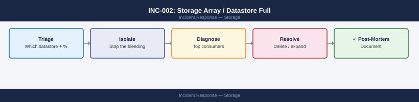
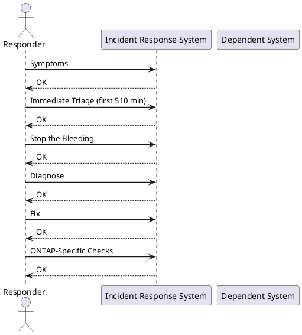

---
tags:
  - storage
  - vmware
  - incident-response
description: "P1/P2 incident — a datastore or storage array volume has hit capacity. VMs may be paused or failing writes. Stop space growth immediately, then diagnose..."
---
# INC-002: Storage Array / Datastore Full

*Applies to: All products*

<div class="kb-summary">
P1/P2 incident — a datastore or storage array volume has hit capacity. VMs may be paused or failing writes. Stop space growth immediately, then diagnose the largest consumers, then expand or relocate.
</div>



**Severity:** P1 if VMs are paused or write I/O is failing; P2 if approaching threshold but still running  
**Typical resolution time:** 15–30 min (snapshot cleanup) / 1–2 hr (Storage vMotion) / 2–4 hr (LUN expansion)

---



## Symptoms

- VMs in vCenter show "Virtual machine disk consolidation is needed" warning
- VMs paused with "Out of disk space" or "No space left on device" event
- Snapshot operations fail with "Not enough space" error
- Application writes failing inside guest OS (`df -h` shows 100%)
- ONTAP `volume show` shows `percent-used` at 95%+
- vSAN health shows "Slack space" warning below 30%

---

## Immediate Triage (first 5–10 min)

**Identify which datastore is full:**

```powershell
# PowerCLI — list datastores sorted by free space
Get-Datastore | Select-Object Name, CapacityGB, FreeSpaceGB,
  @{N="UsedPct";E={[math]::Round((1 - $_.FreeSpaceGB/$_.CapacityGB)*100,1)}} |
  Sort-Object UsedPct -Descending | Format-Table -AutoSize
```

**Check current fill rate (ONTAP):**

```bash
volume show -fields size,used,percent-used,available
```


```text title="Expected output"
Vserver   Volume       Size       Used       Percent-Used   Available
--------- ------------ ---------- ---------- -------------- ----------
svm-prod  vol_data_01  2.0TB      1.9TB      95%            100.0GB
svm-prod  vol_logs     500GB      487GB      97%            13.0GB
svm-prod  vol_backup   1.5TB      1.2TB      80%            300.0GB
svm-dr    vol_replica  2.0TB      1.8TB      90%            200.0GB
svm-dr    vol_temp     750GB      45GB       6%             705.0GB
```

!!! warning "Common errors"
    | Error | Fix |
    |---|---|
    | `Error: command not found` | Ensure you are connected to a NetApp ONTAP cluster via SSH or the ONTAP CLI, not a standard Linux shell. |
    | `Error: Invalid field name "percent-used"` | Use the correct field name `percent_used` (underscore instead of hyphen) for your ONTAP version. |
**Identify rate of growth:**

```bash
# ONTAP: check recent space events
event log show -event *vol* -severity ALERT -time-range 1h
```


```text title="Expected output"
Time                 Severity Event
-------------------- -------- -----------------------------------------------
2024-01-15 14:32:18  ALERT    vol.nearly.full: Volume 'data_prod' is 92% full
2024-01-15 14:28:45  ALERT    vol.nearly.full: Volume 'backup_tier' is 88% full
2024-01-15 14:15:22  ALERT    vol.space.low: Volume 'logs_archive' space low
2024-01-15 13:47:09  ALERT    vol.snapshot.full: Snapshot reserve exhausted on 'dr_sync'
2024-01-15 13:22:51  ALERT    vol.nearly.full: Volume 'temp_staging' is 95% full
```

!!! warning "Common errors"
    | Error | Fix |
    |---|---|
    | `Error: command not found: event` | Ensure you are connected to the ONTAP cluster via SSH or the ONTAP CLI, not the local shell. |
    | `Error: No matching events found` | Adjust the time-range parameter (e.g., `-time-range 24h`) or remove the severity filter to broaden the search. |
---

## Stop the Bleeding

The priority is to stop growth immediately before attempting permanent fixes.

### Pause all snapshot policies on affected datastores

```powershell
# PowerCLI — find all snapshots on VMs in the affected datastore
$ds = Get-Datastore -Name "DATASTORE-NAME"
Get-VM -Datastore $ds | Get-Snapshot | Select-Object VM, Name, Created, SizeGB |
  Sort-Object SizeGB -Descending
```

Remove oversized snapshots immediately (async):

```powershell
Get-VM -Datastore $ds | Get-Snapshot | Where-Object {$_.Created -lt (Get-Date).AddDays(-7)} |
  Remove-Snapshot -RunAsync -Confirm:$false
```

### Find large files on VMFS

SSH to an ESXi host with access to the datastore:

```bash
# Find files larger than 10 GB
find /vmfs/volumes/<UUID-or-label> -size +10G -exec ls -lh {} \; 2>/dev/null

# List top 20 largest files
find /vmfs/volumes/<UUID-or-label> -type f -exec du -sh {} \; 2>/dev/null | \
  sort -rh | head -20
```


```text title="Expected output"
-rw------- 1 root root 15G Nov 12 10:34 /vmfs/volumes/datastore1/vm-logs/esx-host-07.log
-rw------- 1 root root 12G Nov 11 23:18 /vmfs/volumes/datastore1/vm-swap/prod-db-01.vswp
-rw------- 1 root root 11G Nov 10 15:42 /vmfs/volumes/datastore1/backups/snapshot-2024-11-10.vmdk

15G	/vmfs/volumes/datastore1/vm-logs/esx-host-07.log
12G	/vmfs/volumes/datastore1/vm-swap/prod-db-01.vswp
11G	/vmfs/volumes/datastore1/backups/snapshot-2024-11-10.vmdk
8.5G	/vmfs/volumes/datastore1/vms/web-app-03/disk-2.vmdk
7.2G	/vmfs/volumes/datastore1/vms/app-server-02/memory.dump
6.8G	/vmfs/volumes/datastore1/iso-images/rhel-8.9-full.iso
5.4G	/vmfs/volumes/datastore1/vms/legacy-app/disk-1.vmdk
4.9G	/vmfs/volumes/datastore1/backups/incremental-2024-11-09.vmdk
3.7G	/vmfs/volumes/datastore1/logs/vmkernel.log
2.1G	/vmfs/volumes/datastore1/vms/test-vm-04/disk-0.vmdk
```

!!! warning "Common errors"
    | Error | Fix |
    |---|---|
    | `find: '/vmfs/volumes/<UUID-or-label>': No such file or directory` | Replace `<UUID-or-label>` with the actual datastore name or UUID (e.g., `/vmfs/volumes/datastore1` or `/vmfs/volumes/5a3c8e2f-1b4d-7c9a-e2f1-3d5a8c2b9e4f`). |
    | `Permission denied` | Run the command with `sudo` or as root user since `/vmfs/volumes` requires elevated privileges on ESXi hosts. |
### Suspend non-critical snapshot schedules

In ONTAP, temporarily suspend the SnapMirror schedule on the affected volume to stop growth from replication overhead:

```bash
snapmirror quiesce -destination-path svm:volume
```


```text title="Expected output"
Operation succeeded: SnapMirror relationship quiesced.
Destination: cluster2://svm_dr/vol_backup
Source: cluster1://svm_prod/vol_data
Last Transfer Size: 2.1GB
Last Transfer Duration: 00:04:32
Quiesce Status: Success
```

!!! warning "Common errors"
    | Error | Fix |
    |---|---|
    | `Error: command failed: Unexpected error from Data ONTAP: entry doesn't exist` | Verify the destination path syntax matches the format `cluster-name://svm-name/volume-name` and that the SnapMirror relationship exists. |
    | `Error: This operation is not permitted on a broken SnapMirror relationship` | Resynchronize the SnapMirror relationship using `snapmirror resync -destination-path <path>` before attempting to quiesce. |
---

## Diagnose

### Identify top space consumers

```powershell
# PowerCLI — VM disk usage on affected datastore
Get-VM -Datastore $ds | Get-HardDisk | Select-Object @{N="VM";E={$_.Parent.Name}},
  @{N="Disk";E={$_.Name}}, @{N="CapacityGB";E={[math]::Round($_.CapacityGB,1)}},
  StorageFormat | Sort-Object CapacityGB -Descending
```

**Check for failed snapshot consolidations:**

```powershell
Get-VM | Where-Object {$_.Extensiondata.Config.ExtraConfig |
  Where-Object {$_.Key -eq "checkpoint.vmState" -and $_.Value -ne ""}} |
  Select-Object Name
```

These VMs have stale snapshot chains consuming hidden space. Consolidate:

```powershell
Get-VM -Name "VM-NAME" | Invoke-VMScript -GuestCredential $cred -ScriptText "echo done"
# Then in vCenter: right-click VM → Snapshots → Consolidate
```

---

## Fix

### Option A: Delete stale snapshots (fastest)

Already covered in Stop the Bleeding. After async removal completes, verify:

```powershell
Get-VM -Datastore $ds | Get-Snapshot | Measure-Object -Property SizeGB -Sum
```

### Option B: Storage vMotion to a datastore with free space

```powershell
# Find target datastore with sufficient free space
Get-Datastore | Where-Object {$_.FreeSpaceGB -gt 200} | Sort-Object FreeSpaceGB -Descending

# Migrate VM storage (live, no downtime)
Move-VM -VM (Get-VM "VM-NAME") -Datastore (Get-Datastore "TARGET-DS") -RunAsync
```

### Option C: Expand the datastore — LUN extend (ONTAP + VMFS)

**Step 1 — Expand the ONTAP volume and LUN:**

```bash
# Extend the volume first
volume modify -vserver SVM -volume vol_name -size +500g

# Then extend the LUN
lun resize -vserver SVM -path /vol/vol_name/lun_name -size +500g
```


```text title="Expected output"
Volume modify successful: Volume "vol_name" size extended.

LUN resize successful: LUN "/vol/vol_name/lun_name" size extended to 1.5TB.
```

!!! warning "Common errors"
    | Error | Fix |
    |---|---|
    | `Error: command not found: volume` | Ensure you are connected to the NetApp cluster management interface (SSH to the cluster IP or use System Manager) rather than a standard Linux shell. |
    | `Error: LUN is mapped and cannot be resized` | Unmount the LUN from all hosts and unmap it from igroups before resizing, then remap and remount after the operation completes. |
**Step 2 — Rescan storage on ESXi hosts:**

```powershell
Get-VMHost | Get-VMHostStorage -RescanAllHba
```

**Step 3 — Expand the VMFS datastore in vCenter:**

- Storage → Datastores → Right-click datastore → **Increase Datastore Capacity**
- Select the expanded LUN and follow the wizard

### Option D: Add a new datastore extent

If the LUN cannot be expanded, add a new LUN as an extent to the existing VMFS-5 datastore, or create a new datastore and vMotion VMs.

---

## ONTAP-Specific Checks

```bash
# Volume space breakdown (data, snapshots, reserves)
volume show-space -vserver SVM -volume vol_name

# Snapshot usage per volume
snapshot show -vserver SVM -volume vol_name -fields size,create-time | sort-by size

# Delete old snapshots to reclaim space immediately
snapshot delete -vserver SVM -volume vol_name -snapshot <snapshot-name>

# Check if snapshot autodelete is configured
volume snapshot autodelete show -vserver SVM -volume vol_name
```


```text title="Expected output"
Vserver     Volume       Data Used   Snapshots   Reserves    Available
----------- ------------ ----------- ----------- ----------- -----------
prod-svm    vol_name     847.2GB     156.8GB     42.1GB      54.9GB

Vserver     Volume       Snapshot                 Size        Create Time
----------- ------------ ----------------------- ----------- -----------------
prod-svm    vol_name     hourly.2024-01-15_0200  18.3GB      Jan 15 02:00
prod-svm    vol_name     hourly.2024-01-15_0100  17.9GB      Jan 15 01:00
prod-svm    vol_name     daily.2024-01-14_2300   22.4GB      Jan 14 23:00
prod-svm    vol_name     daily.2024-01-13_2300   21.7GB      Jan 13 23:00
prod-svm    vol_name     hourly.2024-01-15_0000  16.8GB      Jan 15 00:00
...

Snapshot "hourly.2024-01-15_0200" deleted successfully.

Vserver     Volume       State    Enabled   Trigger   Target Free Space
----------- ------------ -------- --------- --------- ------------------
prod-svm    vol_name     on       true      snap_reserve  10%
```

!!! warning "Common errors"
    | Error | Fix |
    |---|---|
    | `Snapshot "hourly.2024-01-15_0200" is in use by a clone or SnapMirror relationship` | Verify the snapshot has no dependent clones or SnapMirror destinations before deletion using `snapshot show -vserver SVM -volume vol_name -snapshot <snapshot-name> -fields owners`. |
    | `Error: command not found: volume show-space` | Confirm you are connected to a NetApp ONTAP cluster with appropriate admin credentials and the correct SVM context is set. |
    | `Vserver "SVM" does not exist` | Replace "SVM" with the actual SVM name from your cluster, obtainable via `vserver show`. |
---

## vSAN-Specific Checks

```powershell
# Check vSAN datastore capacity
Get-VsanView -Id "VsanSpaceReportSystem-vsan-space-report-system" |
  Invoke-Method -MethodName "VsanQuerySpaceUsage" -Arguments @{cluster=(Get-Cluster "ClusterName").Id}
```

**vSAN slack space rule:** vSAN requires at least 30% free (slack space) to rebuild after disk failure. If below 30%, DO NOT add more VMs — resolve space first.

To decommission a disk and return its space:

```powershell
# Evacuate disk first, then remove
Set-VMHostDisk -Disk (Get-VMHostDisk -VMHost $vmhost | Where-Object {$_.ScsiLun -eq "naa.xxx"}) -Evacuate
```

---

## Verify

After remediation, confirm all checks pass:

```powershell
# All datastores above 20% free
Get-Datastore | Where-Object {($_.FreeSpaceGB / $_.CapacityGB) -lt 0.2} | Select-Object Name, FreeSpaceGB

# No VMs in paused or invalid state
Get-VM | Where-Object {$_.PowerState -eq "Suspended" -or $_.ExtensionData.Runtime.ConnectionState -ne "connected"}

# No pending snapshot consolidations
Get-VM | Where-Object {$_.Extensiondata.Summary.Runtime.ConsolidationNeeded}
```

Confirm with storage team that ONTAP volume is below 80% used and snapshot policy is re-enabled.

---

## Post-Incident

**Document:**

- Which datastore / volume filled, when, and why (unexpected VM growth, failed consolidation, orphaned snapshots)
- Space freed and how
- Any VMs that paused and when they recovered

**Prevent recurrence:**

- Set vCenter alarm: datastore free space < 15% → alert; < 10% → critical
- Set ONTAP event: `volume modify -percent-snapshot-space 20` to cap snapshot reserve
- Enable ONTAP snapshot autodelete policy for all production volumes at 85% threshold
- Review VM snapshot retention policy — never exceed 72 hours for production VMs
