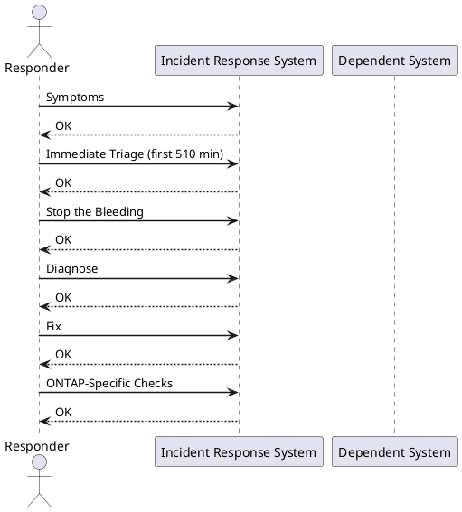

---
tags:
  - storage
  - vmware
  - incident-response
---
# INC-002: Storage Array / Datastore Full

<div class="kb-summary">
P1/P2 incident — a datastore or storage array volume has hit capacity. VMs may be paused or failing writes. Stop space growth immediately, then diagnose the largest consumers, then expand or relocate.
</div>


**Severity:** P1 if VMs are paused or write I/O is failing; P2 if approaching threshold but still running  
**Typical resolution time:** 15–30 min (snapshot cleanup) / 1–2 hr (Storage vMotion) / 2–4 hr (LUN expansion)

---



## Symptoms

- VMs in vCenter show "Virtual machine disk consolidation is needed" warning
- VMs paused with "Out of disk space" or "No space left on device" event
- Snapshot operations fail with "Not enough space" error
- Application writes failing inside guest OS (`df -h` shows 100%)
- ONTAP `volume show` shows `percent-used` at 95%+
- vSAN health shows "Slack space" warning below 30%

---

## Immediate Triage (first 5–10 min)

**Identify which datastore is full:**

```powershell
# PowerCLI — list datastores sorted by free space
Get-Datastore | Select-Object Name, CapacityGB, FreeSpaceGB,
  @{N="UsedPct";E={[math]::Round((1 - $_.FreeSpaceGB/$_.CapacityGB)*100,1)}} |
  Sort-Object UsedPct -Descending | Format-Table -AutoSize
```

**Check current fill rate (ONTAP):**

```bash
volume show -fields size,used,percent-used,available
```

**Identify rate of growth:**

```bash
# ONTAP: check recent space events
event log show -event *vol* -severity ALERT -time-range 1h
```

---

## Stop the Bleeding

The priority is to stop growth immediately before attempting permanent fixes.

### Pause all snapshot policies on affected datastores

```powershell
# PowerCLI — find all snapshots on VMs in the affected datastore
$ds = Get-Datastore -Name "DATASTORE-NAME"
Get-VM -Datastore $ds | Get-Snapshot | Select-Object VM, Name, Created, SizeGB |
  Sort-Object SizeGB -Descending
```

Remove oversized snapshots immediately (async):

```powershell
Get-VM -Datastore $ds | Get-Snapshot | Where-Object {$_.Created -lt (Get-Date).AddDays(-7)} |
  Remove-Snapshot -RunAsync -Confirm:$false
```

### Find large files on VMFS

SSH to an ESXi host with access to the datastore:

```bash
# Find files larger than 10 GB
find /vmfs/volumes/<UUID-or-label> -size +10G -exec ls -lh {} \; 2>/dev/null

# List top 20 largest files
find /vmfs/volumes/<UUID-or-label> -type f -exec du -sh {} \; 2>/dev/null | \
  sort -rh | head -20
```

### Suspend non-critical snapshot schedules

In ONTAP, temporarily suspend the SnapMirror schedule on the affected volume to stop growth from replication overhead:

```bash
snapmirror quiesce -destination-path svm:volume
```

---

## Diagnose

### Identify top space consumers

```powershell
# PowerCLI — VM disk usage on affected datastore
Get-VM -Datastore $ds | Get-HardDisk | Select-Object @{N="VM";E={$_.Parent.Name}},
  @{N="Disk";E={$_.Name}}, @{N="CapacityGB";E={[math]::Round($_.CapacityGB,1)}},
  StorageFormat | Sort-Object CapacityGB -Descending
```

**Check for failed snapshot consolidations:**

```powershell
Get-VM | Where-Object {$_.Extensiondata.Config.ExtraConfig |
  Where-Object {$_.Key -eq "checkpoint.vmState" -and $_.Value -ne ""}} |
  Select-Object Name
```

These VMs have stale snapshot chains consuming hidden space. Consolidate:

```powershell
Get-VM -Name "VM-NAME" | Invoke-VMScript -GuestCredential $cred -ScriptText "echo done"
# Then in vCenter: right-click VM → Snapshots → Consolidate
```

---

## Fix

### Option A: Delete stale snapshots (fastest)

Already covered in Stop the Bleeding. After async removal completes, verify:

```powershell
Get-VM -Datastore $ds | Get-Snapshot | Measure-Object -Property SizeGB -Sum
```

### Option B: Storage vMotion to a datastore with free space

```powershell
# Find target datastore with sufficient free space
Get-Datastore | Where-Object {$_.FreeSpaceGB -gt 200} | Sort-Object FreeSpaceGB -Descending

# Migrate VM storage (live, no downtime)
Move-VM -VM (Get-VM "VM-NAME") -Datastore (Get-Datastore "TARGET-DS") -RunAsync
```

### Option C: Expand the datastore — LUN extend (ONTAP + VMFS)

**Step 1 — Expand the ONTAP volume and LUN:**

```bash
# Extend the volume first
volume modify -vserver SVM -volume vol_name -size +500g

# Then extend the LUN
lun resize -vserver SVM -path /vol/vol_name/lun_name -size +500g
```

**Step 2 — Rescan storage on ESXi hosts:**

```powershell
Get-VMHost | Get-VMHostStorage -RescanAllHba
```

**Step 3 — Expand the VMFS datastore in vCenter:**

- Storage → Datastores → Right-click datastore → **Increase Datastore Capacity**
- Select the expanded LUN and follow the wizard

### Option D: Add a new datastore extent

If the LUN cannot be expanded, add a new LUN as an extent to the existing VMFS-5 datastore, or create a new datastore and vMotion VMs.

---

## ONTAP-Specific Checks

```bash
# Volume space breakdown (data, snapshots, reserves)
volume show-space -vserver SVM -volume vol_name

# Snapshot usage per volume
snapshot show -vserver SVM -volume vol_name -fields size,create-time | sort-by size

# Delete old snapshots to reclaim space immediately
snapshot delete -vserver SVM -volume vol_name -snapshot <snapshot-name>

# Check if snapshot autodelete is configured
volume snapshot autodelete show -vserver SVM -volume vol_name
```

---

## vSAN-Specific Checks

```powershell
# Check vSAN datastore capacity
Get-VsanView -Id "VsanSpaceReportSystem-vsan-space-report-system" |
  Invoke-Method -MethodName "VsanQuerySpaceUsage" -Arguments @{cluster=(Get-Cluster "ClusterName").Id}
```

**vSAN slack space rule:** vSAN requires at least 30% free (slack space) to rebuild after disk failure. If below 30%, DO NOT add more VMs — resolve space first.

To decommission a disk and return its space:

```powershell
# Evacuate disk first, then remove
Set-VMHostDisk -Disk (Get-VMHostDisk -VMHost $vmhost | Where-Object {$_.ScsiLun -eq "naa.xxx"}) -Evacuate
```

---

## Verify

After remediation, confirm all checks pass:

```powershell
# All datastores above 20% free
Get-Datastore | Where-Object {($_.FreeSpaceGB / $_.CapacityGB) -lt 0.2} | Select-Object Name, FreeSpaceGB

# No VMs in paused or invalid state
Get-VM | Where-Object {$_.PowerState -eq "Suspended" -or $_.ExtensionData.Runtime.ConnectionState -ne "connected"}

# No pending snapshot consolidations
Get-VM | Where-Object {$_.Extensiondata.Summary.Runtime.ConsolidationNeeded}
```

Confirm with storage team that ONTAP volume is below 80% used and snapshot policy is re-enabled.

---

## Post-Incident

**Document:**

- Which datastore / volume filled, when, and why (unexpected VM growth, failed consolidation, orphaned snapshots)
- Space freed and how
- Any VMs that paused and when they recovered

**Prevent recurrence:**

- Set vCenter alarm: datastore free space < 15% → alert; < 10% → critical
- Set ONTAP event: `volume modify -percent-snapshot-space 20` to cap snapshot reserve
- Enable ONTAP snapshot autodelete policy for all production volumes at 85% threshold
- Review VM snapshot retention policy — never exceed 72 hours for production VMs
