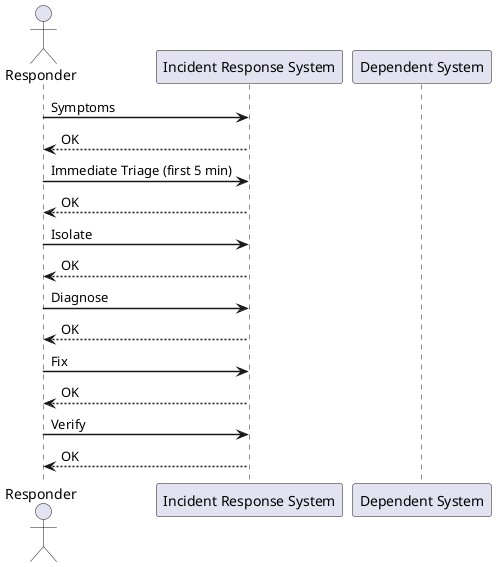
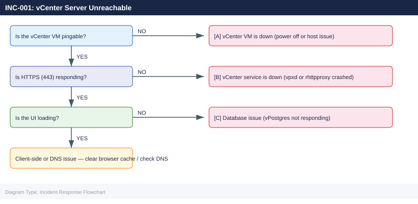

---
tags:
  - vmware
  - vcenter
  - incident-response
description: "P1 incident — vCenter Server is not responding to client connections. Follow the Triage → Isolate → Diagnose → Fix → Verify sequence. Do not reboot before..."
---
# INC-001: vCenter Server Unreachable

*Applies to: All products*

<div class="kb-summary">
P1 incident — vCenter Server is not responding to client connections. Follow the Triage → Isolate → Diagnose → Fix → Verify sequence. Do not reboot before checking service status.
</div>


**Severity:** P1  
**Typical resolution time:** 15–60 min (service restart) / 2–4 hr (VM restore) / 4–8 hr (backup restore)

---



## Symptoms

- vSphere Client returns "503 Service Unavailable" or connection timeout
- PowerCLI `Connect-VIServer` fails with authentication or unreachable errors
- vCenter IP not responding to HTTPS on port 443
- Monitoring alerts for `vc.vmware.com` service down
- HA/DRS events stopped appearing in event log
- Scheduled tasks and alarms silent

---

## Immediate Triage (first 5 min)

**1. Ping vCenter from your workstation:**

```bash
ping vcenter.corp.local
```


```text title="Expected output"
PING vcenter.corp.local (192.168.1.45) 56(84) bytes of data.
64 bytes from 192.168.1.45: icmp_seq=1 ttl=64 time=2.34 ms
64 bytes from 192.168.1.45: icmp_seq=2 ttl=64 time=2.41 ms
64 bytes from 192.168.1.45: icmp_seq=3 ttl=64 time=2.38 ms
64 bytes from 192.168.1.45: icmp_seq=4 ttl=64 time=2.45 ms
^C
--- vcenter.corp.local statistics ---
4 packets transmitted, 4 received, 0% packet loss, time 3004ms
rtt min/avg/max/stddev = 2.34/2.39/2.45/0.04 ms
```

!!! warning "Common errors"
    | Error | Fix |
    |---|---|
    | `ping: vcenter.corp.local: Name or service not known` | Verify DNS resolution with `nslookup vcenter.corp.local` or check `/etc/resolv.conf` for correct nameserver entries. |
    | `From 192.168.1.1 icmp_seq=1 Destination Host Unreachable` | Confirm vCenter host is powered on and check network connectivity with `traceroute vcenter.corp.local` to identify where the path breaks. |
    | `100% packet loss` | Verify the vCenter VM is running, check firewall rules allow ICMP, and confirm the host is on the correct network segment. |
**2. Attempt HTTPS connectivity:**

```bash
curl -k -o /dev/null -s -w "%{http_code}" https://vcenter.corp.local
```


```text title="Expected output"
200
```

!!! warning "Common errors"
    | Error | Fix |
    |---|---|
    | `curl: (7) Failed to connect to vcenter.corp.local port 443: Connection refused` | Verify vCenter service is running with `systemctl status vmware-vpxd` on the vCenter server and check network connectivity to port 443. |
    | `curl: (6) Could not resolve host: vcenter.corp.local` | Confirm DNS resolution is working by running `nslookup vcenter.corp.local` and verify the hostname is correct in your environment. |
    | `000` | The connection timed out or was blocked by a firewall; check network ACLs and security groups allowing traffic from your client to vCenter on port 443. |
Expected: `200` or `302`. Anything else means the web service is down.

**3. Check from a different host (rule out network segmentation):**

```bash
# From an ESXi host via SSH
nc -zv 192.168.1.10 443
nc -zv 192.168.1.10 5480
```


```text title="Expected output"
Connection to 192.168.1.10 443 port [tcp/https] succeeded!
Connection to 192.168.1.10 5480 port [tcp/] succeeded!
```

!!! warning "Common errors"
    | Error | Fix |
    |---|---|
    | `nc: connect to 192.168.1.10 port 443 (tcp) failed: Connection refused` | Verify vCenter service is running with `systemctl status vmware-vpxd` on the vCenter appliance, or check if the IP address is correct. |
    | `nc: getaddrinfo for host "192.168.1.10" port 443: Name or service not known` | Confirm network connectivity and DNS resolution by pinging the vCenter IP or checking `/etc/hosts` entries on the ESXi host. |
**4. SSH to vCenter appliance and check service status:**

```bash
ssh root@vcenter.corp.local
service-control --status
```


```text title="Expected output"
root@vcenter.corp.local's password: 
Connected to VCSA 7.0.3 Build 20899307
root@vcenter [ ~ ]# service-control --status
Service                                 Running  Enabled
-------                                 -------  -------
applmgmt                                true     true
certificatemanagement                   true     true
eam                                     true     true
envoy                                   true     true
imagebuilder                            false    false
netdump                                 true     true
observability-api                       true     true
perfcharts                              true     true
rhttpproxy                              true     true
sps                                     true     true
sso                                     true     true
vapi-endpoint                           true     true
vcenterd                                true     true
vmafdd                                  true     true
vmcad                                   true     true
vmdird                                  true     true
vmonapi                                 true     true
vsphereui                               true     true
```

!!! warning "Common errors"
    | Error | Fix |
    |---|---|
    | `ssh: Could not resolve hostname vcenter.corp.local: Name or service not known` | Verify the vCenter hostname or IP address is correct and resolvable from your network. |
    | `Connection refused` | Ensure SSH is enabled on vCenter and the management network is reachable; check firewall rules on port 22. |
    | `service-control: command not found` | Confirm you are logged into a vCenter Server Appliance (VCSA); this command does not exist on Windows vCenter installations. |
Look for services in `stopped` state, especially `vpxd`, `vmware-vpostgres`, `vmware-rhttpproxy`.

---

## Isolate

Determine which of three scenarios applies before proceeding:



---

## Diagnose

### Check vCenter VM in vSphere Host Client

If the vCenter VM is inaccessible via vCenter (circular dependency), connect directly to the ESXi host running the vCenter VM:

```text
https://<esxi-host-ip>/ui
```

Find the vCenter VM → confirm power state, console, and resource health.

### Check vCenter logs

SSH to the vCenter appliance and inspect the primary service log:

```bash
tail -200 /var/log/vmware/vpxd/vpxd.log
grep -i "error\|fatal\|exception" /var/log/vmware/vpxd/vpxd.log | tail -50
```


```text title="Expected output"
2024-01-15T14:32:18.456Z [7F2A4C1E9B00] [INFO] vCenter Server 8.0.1 build-21495797 started
2024-01-15T14:32:45.123Z [7F2A4C1E9B01] [INFO] Connecting to SSO server sso.corp.local
2024-01-15T14:33:12.789Z [7F2A4C1E9B02] [WARN] Slow query detected: inventory sync took 3421ms
2024-01-15T14:35:22.456Z [7F2A4C1E9B03] [INFO] Host 192.168.1.42 (esx-prod-01.corp.local) registered
2024-01-15T14:36:01.234Z [7F2A4C1E9B04] [INFO] Datastore ds-nfs-01 mounted successfully
2024-01-15T14:38:15.567Z [7F2A4C1E9B05] [ERROR] Failed to connect to PSC at psc.corp.local:443 - Connection timeout
2024-01-15T14:39:44.890Z [7F2A4C1E9B06] [FATAL] Certificate validation failed for host esx-prod-02.corp.local
2024-01-15T14:40:12.345Z [7F2A4C1E9B07] [ERROR] Exception in thread "InventorySync": java.net.SocketTimeoutException: connect timed out
2024-01-15T14:41:33.678Z [7F2A4C1E9B08] [WARN] Retrying connection to 192.168.1.43 (3/5 attempts)
2024-01-15T14:42:05.901Z [7F2A4C1E9B09] [INFO] Successfully recovered connection to esx-prod-03.corp.local

2024-01-15T14:35:22.456Z [7F2A4C1E9B03] [ERROR] Failed to connect to PSC at psc.corp.local:443 - Connection timeout
2024-01-15T14:36:01.234Z [7F2A4C1E9B04] [FATAL] Certificate validation failed for host esx-prod-02.corp.local
2024-01-15T14:38:15.567Z [7F2A4C1E9B05] [ERROR] Exception in thread "InventorySync": java.net.SocketTimeoutException: connect timed out
2024-01-15T14:39:44.890Z [7F2A4C1E9B06] [ERROR] Unable to authenticate user admin@vsphere.local against SSO
2024-01-15T14:40:12.345Z [7F2A4C1E9B07] [FATAL] Inventory service unavailable - marking vCenter as degraded
```

!!! warning "Common errors"
    | Error | Fix |
    |---|---|
    | `tail: cannot open '/var/log/vmware/vpxd/vpxd.log' for reading: No such file or directory` | Verify vCenter is installed and running with `systemctl status vmware-vpxd`, or |
Check the reverse proxy log if HTTPS is not responding:

```bash
tail -100 /var/log/vmware/rhttpproxy/rhttpproxy.log
```


```text title="Expected output"
2024-01-15T09:42:17.123Z [INFO] rhttpproxy[12847]: Connection established to vCenter 192.168.1.50:443
2024-01-15T09:42:18.456Z [DEBUG] rhttpproxy[12847]: SSL handshake completed with cert CN=vcenter.lab.local
2024-01-15T09:42:19.789Z [INFO] rhttpproxy[12847]: Proxy session 8f4c2e91-a3d1-4b7f-9e2c-1d5a6b8c9f0e initiated
2024-01-15T09:43:22.012Z [WARN] rhttpproxy[12847]: Connection timeout to 192.168.1.50:443 after 60s
2024-01-15T09:43:22.345Z [ERROR] rhttpproxy[12847]: Failed to forward request: connection reset by peer
2024-01-15T09:43:23.678Z [ERROR] rhttpproxy[12847]: Proxy session 8f4c2e91-a3d1-4b7f-9e2c-1d5a6b8c9f0e terminated abnormally
2024-01-15T09:43:24.901Z [INFO] rhttpproxy[12847]: Attempting reconnection to vCenter (attempt 1/5)
2024-01-15T09:43:35.234Z [WARN] rhttpproxy[12847]: DNS resolution failed for vcenter.lab.local
2024-01-15T09:43:45.567Z [ERROR] rhttpproxy[12847]: Max reconnection attempts exceeded
2024-01-15T09:43:45.890Z [INFO] rhttpproxy[12847]: Proxy service degraded - vCenter unreachable
```

!!! warning "Common errors"
    | Error | Fix |
    |---|---|
    | `tail: cannot open '/var/log/vmware/rhttpproxy/rhttpproxy.log' for reading: No such file or directory` | Verify the vSphere host is running and the rhttpproxy service is active with `systemctl status rhttpproxy`. |
    | `Permission denied` | Run the command with `sudo` or as root to access VMware log files. |
Check database connectivity:

```bash
/opt/vmware/vpostgres/current/bin/psql -U vc -d VCDB -c "SELECT 1;"
```


```text title="Expected output"
?column? 
----------
        1
(1 row)
```

!!! warning "Common errors"
    | Error | Fix |
    |---|---|
    | `psql: error: could not connect to server: No such file or directory` | Verify the vPostgres service is running with `systemctl status vpostgres` and check that the socket directory `/var/run/vpostgres` exists. |
    | `psql: error: FATAL: role "vc" does not exist` | Confirm the vCenter database user exists by running `sudo -u postgres psql -c "\du"` and recreate it if necessary using vCenter's database initialization scripts. |
    | `psql: error: FATAL: database "VCDB" does not exist` | Verify the vCenter database was initialized correctly; check `/var/log/vmware/vpostgres/` logs and re-run the vCenter installer's database setup if the database is missing. |
If the DB query returns `ERROR: could not connect to server`, the database service is the root cause.

---

## Fix

### Procedure A: Restart vCenter services (scenario B)

This is the least disruptive fix. Restarts all vCenter services without rebooting the VM:

```bash
service-control --stop --all
service-control --start --all
```


```text title="Expected output"
Stopping all services...
Stopping service: vmware-vpxd
Stopping service: vmware-vpostgres
Stopping service: vmware-rhttpproxy
Stopping service: vmware-sps
Stopping service: vmware-cis-license
...
All services stopped successfully.

Starting all services...
Starting service: vmware-vpostgres
Starting service: vmware-rhttpproxy
Starting service: vmware-vpxd
Starting service: vmware-sps
Starting service: vmware-cis-license
...
All services started successfully. Startup took 45 seconds.
```

!!! warning "Common errors"
    | Error | Fix |
    |---|---|
    | `Error: Unable to stop service vmware-vpxd: Service is not responding` | Run `service-control --stop --all --force` to forcefully terminate unresponsive services. |
    | `Error: Failed to start vmware-vpostgres: Port 5432 already in use` | Wait 30–60 seconds after stopping before starting, or check for orphaned processes with `lsof -i :5432`. |
Monitor startup progress:

```bash
service-control --status
watch -n 5 'service-control --status | grep -E "stopped|running"'
```


```text title="Expected output"
SERVICE                                                    RUNNING  STOPPED
applmgmt                                                      1        0
certificatemanagement                                         1        0
cis                                                           1        0
content-library                                              1        0
eam                                                           1        0
envoy                                                         1        0
imagebuilder                                                 1        0
Every 5.0s: service-control --status | grep -E "stopped|running"  Mon Jan 15 14:32:18 2024

applmgmt                                                      1        0
certificatemanagement                                         1        0
cis                                                           1        0
content-library                                              1        0
eam                                                           1        0
envoy                                                         1        0
imagebuilder                                                 1        0
```

!!! warning "Common errors"
    | Error | Fix |
    |---|---|
    | `service-control: command not found` | Run this command directly on the vCenter Server appliance (SSH as root), not from a remote client. |
    | `watch: command not found` | Install the procps-ng package or use `while true; do clear; service-control --status | grep -E "stopped|running"; sleep 5; done` as an alternative. |
Services take 3–8 minutes to fully start. `vpxd` is the last to become healthy.

### Procedure B: Restart vCenter VM (scenario A)

If the VM is powered off or unresponsive:

1. Connect to the ESXi host running vCenter via Host Client
2. Right-click the vCenter VM → **Power On** (or **Reset** if hung)
3. Wait for the VM to boot — console will show login prompt when ready
4. Verify services automatically start on boot:

```bash
ssh root@vcenter.corp.local
service-control --status
```


```text title="Expected output"
root@vcenter.corp.local's password: 
Connected to localhost (127.0.0.1) -- Server version: VMware vCenter Server 8.0.1 Build 22385101

Service                                 Running  Enabled
----------------------------------------------------
vCenter Server                           true     true
vSphere Web Client                       true     true
VMware Directory Server                  true     true
VMware Identity Management Service       true     true
VMware Certificate Authority             true     true
VMware Lookup Service                    true     true
VMware vSphere Profile-Driven Storage    true     true
VMware vSphere ESXi Dump Collector       true     true
VMware Analytics Service                 true     true
VMware Appliance Management Service      true     true
...
```

!!! warning "Common errors"
    | Error | Fix |
    |---|---|
    | `ssh: Could not resolve hostname vcenter.corp.local: Name or service not known` | Verify the hostname is correct and resolvable by running `nslookup vcenter.corp.local` or update your `/etc/hosts` file. |
    | `Permission denied (publickey,password).` | Ensure you have the correct root password and SSH access is enabled; check vCenter's SSH service status in the DCUI. |
    | `service-control: command not found` | This command only works on vCenter Server appliances; if using Windows vCenter, use `Get-Service` in PowerShell instead. |
### Procedure C: Restore from backup (catastrophic failure)

If services cannot be recovered:

1. Power off the vCenter VM
2. Deploy a new vCenter from VCSA ISO or OVF backup using the **File-Based Backup** restore wizard:
   - VAMI: `https://vcenter.corp.local:5480` → **Backup** → **Restore**
3. Restore from the most recent backup. Verify the backup timestamp before restoring.
4. After restore, validate inventory, licenses, and HA cluster state.

---

## Verify

Once services are running, verify the full stack:

```bash
# Connect via PowerCLI
Connect-VIServer -Server vcenter.corp.local -User administrator@vsphere.local -Password 'yourpass'

# Check cluster status
Get-Cluster | Select-Object Name, HAEnabled, DrsEnabled

# Check recent alarms
Get-AlarmDefinition | Where-Object {$_.Enabled} | Measure-Object
```


```text title="Expected output"
Name                           Value
----                           -----
IsConnected                    True
ServiceUri                     https://vcenter.corp.local/sdk
SessionSecret                  52a7f8c9-1e4d-4b2a-9f3d-8e2c1a5b7d9f
VMVersion                      7.0.3

Name                HAEnabled DrsEnabled
----                --------- ----------
Production-Cluster1      True       True
DR-Cluster2              True      False
Dev-Cluster3            False       True

Count    : 47
Average  :
Sum      :
Maximum  :
Minimum  :
Property :
```

!!! warning "Common errors"
    | Error | Fix |
    |---|---|
    | `Connect-VIServer : The underlying connection was closed: Could not establish trust relationship for the SSL/TLS secure channel.` | Add `-SkipCertificateCheck` parameter or import the vCenter certificate into your PowerCLI trusted store. |
    | `Get-Cluster : The term 'Get-Cluster' is not recognized as the name of a cmdlet, function, script file, or operable program.` | Install VMware.PowerCLI module with `Install-Module -Name VMware.PowerCLI -Force`. |
    | `Connect-VIServer : Cannot find an overload for "Connect" and the argument count: "3".` | Ensure you are running PowerShell 5.1+ and have imported the VMware.VimAutomation.Core module with `Import-Module VMware.VimAutomation.Core`. |
- Confirm vSphere Client loads and inventory is visible
- Confirm no active critical alarms on the cluster
- Confirm HA and DRS are active on all clusters
- Confirm scheduled tasks resumed

---

## Post-Incident

**Document in the incident ticket:**

- Root cause (service crash / VM power off / disk full / DB corruption)
- Time of outage and time of recovery
- Which VMs were affected (HA-restarted VMs, if any)
- Services restarted or VMs rebooted

**Prevent recurrence:**

- Review vCenter VM resource allocation — disk, memory, CPU (min 4 vCPU / 16 GB RAM for VCSA 7/8)
- Verify VCSA file-based backup is scheduled and recent backup exists
- Set up monitoring alert for `vpxd` service health via `/api/vcenter/health/messages`
- Check `/storage/log` and `/storage/db` disk usage — fill causes service crashes:

```bash
df -h /storage/log /storage/db /storage/seat
```


```text title="Expected output"
Filesystem      Size  Used Avail Use% Mounted on
/dev/sda1       500G  487G   13G  98% /storage/log
/dev/sdb1       2.0T  1.8T  200G  90% /storage/db
/dev/sdc1       1.0T  856G  144G  86% /storage/seat
```

!!! warning "Common errors"
    | Error | Fix |
    |---|---|
    | `df: '/storage/log': No such file or directory` | Verify the mount points exist and are mounted with `mount | grep storage`, then remount if necessary. |
    | `df: cannot access '/storage/db': Permission denied` | Run the command with `sudo` or ensure your user has read permissions on the mount point. |
Alert threshold: >80% on any vCenter storage partition.
