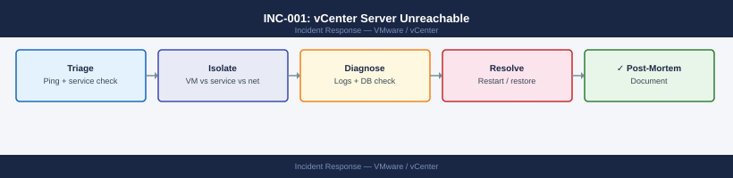

---
tags:
  - vmware
  - vcenter
  - incident-response
---
# INC-001: vCenter Server Unreachable

<div class="kb-summary">
P1 incident — vCenter Server is not responding to client connections. Follow the Triage → Isolate → Diagnose → Fix → Verify sequence. Do not reboot before checking service status.
</div>



**Severity:** P1  
**Typical resolution time:** 15–60 min (service restart) / 2–4 hr (VM restore) / 4–8 hr (backup restore)

---

## Symptoms

- vSphere Client returns "503 Service Unavailable" or connection timeout
- PowerCLI `Connect-VIServer` fails with authentication or unreachable errors
- vCenter IP not responding to HTTPS on port 443
- Monitoring alerts for `vc.vmware.com` service down
- HA/DRS events stopped appearing in event log
- Scheduled tasks and alarms silent

---

## Immediate Triage (first 5 min)

**1. Ping vCenter from your workstation:**

```bash
ping vcenter.corp.local
```

**2. Attempt HTTPS connectivity:**

```bash
curl -k -o /dev/null -s -w "%{http_code}" https://vcenter.corp.local
```

Expected: `200` or `302`. Anything else means the web service is down.

**3. Check from a different host (rule out network segmentation):**

```bash
# From an ESXi host via SSH
nc -zv 192.168.1.10 443
nc -zv 192.168.1.10 5480
```

**4. SSH to vCenter appliance and check service status:**

```bash
ssh root@vcenter.corp.local
service-control --status
```

Look for services in `stopped` state, especially `vpxd`, `vmware-vpostgres`, `vmware-rhttpproxy`.

---

## Isolate

Determine which of three scenarios applies before proceeding:

```text
Is the vCenter VM pingable?
  → NO  ──→ [A] vCenter VM is down (power off or host issue)
  → YES
      Is HTTPS (443) responding?
        → NO  ──→ [B] vCenter service is down (vpxd or rhttpproxy crashed)
        → YES
            Is the UI loading?
              → NO  ──→ [C] Database issue (vPostgres not responding)
              → YES ──→ Client-side or DNS issue — clear browser cache / check DNS
```

---

## Diagnose

### Check vCenter VM in vSphere Host Client

If the vCenter VM is inaccessible via vCenter (circular dependency), connect directly to the ESXi host running the vCenter VM:

```text
https://<esxi-host-ip>/ui
```

Find the vCenter VM → confirm power state, console, and resource health.

### Check vCenter logs

SSH to the vCenter appliance and inspect the primary service log:

```bash
tail -200 /var/log/vmware/vpxd/vpxd.log
grep -i "error\|fatal\|exception" /var/log/vmware/vpxd/vpxd.log | tail -50
```

Check the reverse proxy log if HTTPS is not responding:

```bash
tail -100 /var/log/vmware/rhttpproxy/rhttpproxy.log
```

Check database connectivity:

```bash
/opt/vmware/vpostgres/current/bin/psql -U vc -d VCDB -c "SELECT 1;"
```

If the DB query returns `ERROR: could not connect to server`, the database service is the root cause.

---

## Fix

### Procedure A: Restart vCenter services (scenario B)

This is the least disruptive fix. Restarts all vCenter services without rebooting the VM:

```bash
service-control --stop --all
service-control --start --all
```

Monitor startup progress:

```bash
service-control --status
watch -n 5 'service-control --status | grep -E "stopped|running"'
```

Services take 3–8 minutes to fully start. `vpxd` is the last to become healthy.

### Procedure B: Restart vCenter VM (scenario A)

If the VM is powered off or unresponsive:

1. Connect to the ESXi host running vCenter via Host Client
2. Right-click the vCenter VM → **Power On** (or **Reset** if hung)
3. Wait for the VM to boot — console will show login prompt when ready
4. Verify services automatically start on boot:

```bash
ssh root@vcenter.corp.local
service-control --status
```

### Procedure C: Restore from backup (catastrophic failure)

If services cannot be recovered:

1. Power off the vCenter VM
2. Deploy a new vCenter from VCSA ISO or OVF backup using the **File-Based Backup** restore wizard:
   - VAMI: `https://vcenter.corp.local:5480` → **Backup** → **Restore**
3. Restore from the most recent backup. Verify the backup timestamp before restoring.
4. After restore, validate inventory, licenses, and HA cluster state.

---

## Verify

Once services are running, verify the full stack:

```bash
# Connect via PowerCLI
Connect-VIServer -Server vcenter.corp.local -User administrator@vsphere.local -Password 'yourpass'

# Check cluster status
Get-Cluster | Select-Object Name, HAEnabled, DrsEnabled

# Check recent alarms
Get-AlarmDefinition | Where-Object {$_.Enabled} | Measure-Object
```

- Confirm vSphere Client loads and inventory is visible
- Confirm no active critical alarms on the cluster
- Confirm HA and DRS are active on all clusters
- Confirm scheduled tasks resumed

---

## Post-Incident

**Document in the incident ticket:**

- Root cause (service crash / VM power off / disk full / DB corruption)
- Time of outage and time of recovery
- Which VMs were affected (HA-restarted VMs, if any)
- Services restarted or VMs rebooted

**Prevent recurrence:**

- Review vCenter VM resource allocation — disk, memory, CPU (min 4 vCPU / 16 GB RAM for VCSA 7/8)
- Verify VCSA file-based backup is scheduled and recent backup exists
- Set up monitoring alert for `vpxd` service health via `/api/vcenter/health/messages`
- Check `/storage/log` and `/storage/db` disk usage — fill causes service crashes:

```bash
df -h /storage/log /storage/db /storage/seat
```

Alert threshold: >80% on any vCenter storage partition.
