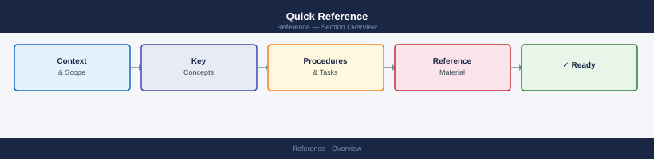

---
tags:
  - vsphere
  - operations
---
# Quick Reference

Quick-reference material for VMware infrastructure: cheat sheets, interaction maps, decision trees, glossaries, and version matrices.

<a class="kb-card" href="cheat-sheets/">
<strong>Cheat Sheets</strong> 
Top-10 CLI and PowerCLI commands for each VMware product on a single page.
</a>
<a class="kb-card" href="interaction-map/">
<strong>Interaction Maps</strong> 
How VMware products connect — compute, network, storage, management, and automation domains.
</a>
<a class="kb-card" href="decision-trees/">
<strong>Decision Trees</strong> 
Flowcharts for vSAN policy, NSX topology, DR tool selection, and Aria product selection.
</a>
<a class="kb-card" href="glossary/">
<strong>Glossary</strong> 
155+ terms covering VMware products, networking, storage, security, Kubernetes, and observability.
</a>
<a class="kb-card" href="versions/">
<strong>Version Matrix</strong> 
Minimum product versions for 65+ features across vSphere, vSAN, NSX, VCF, Aria Suite, and Tanzu.
</a>

