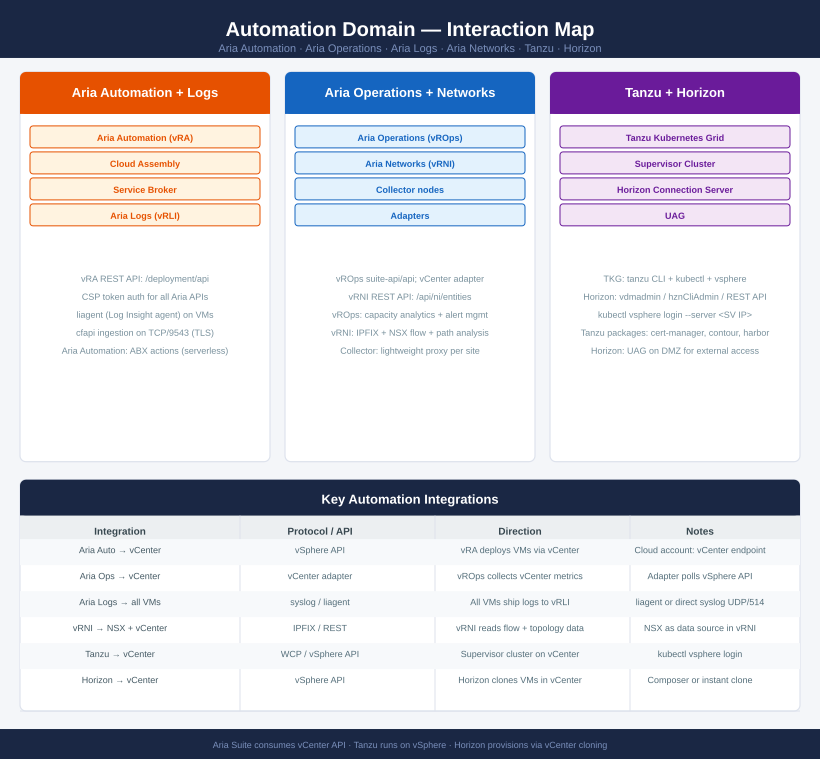
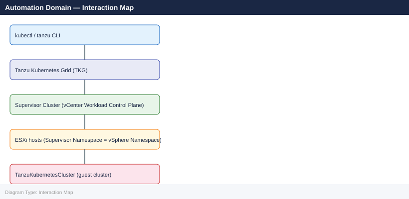
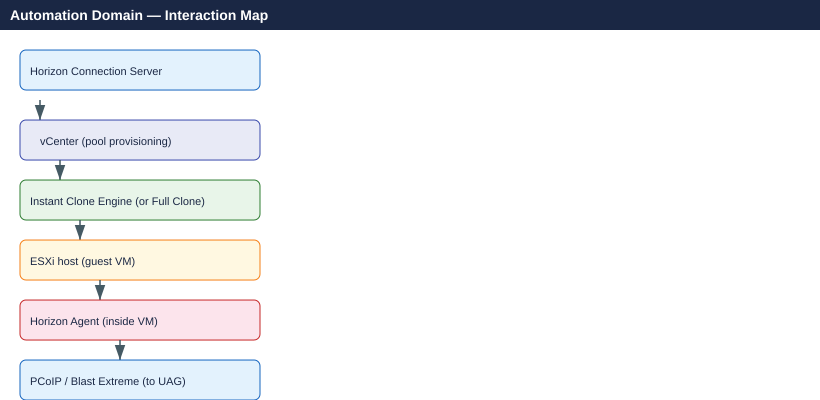

---
tags:
  - aria-automation
  - aria-operations
  - tanzu
  - horizon
  - automation
  - architecture
---
# Automation Domain — Interaction Map

<div class="kb-summary">
How Aria Automation, Aria Operations, Aria Logs, Aria Networks, Tanzu, and Horizon connect to the vSphere and NSX layers — APIs, data flows, and authentication.
</div>



```d2
direction: right

center: "Interaction Map" {shape: hexagon}
integration_summary: "Integration summary" {shape: rectangle}
aria_product_api_authentication: "Aria product API authentication" {shape: rectangle}
tanzu_architecture_layers: "Tanzu architecture layers" {shape: rectangle}
horizon_provisioning_flow: "Horizon provisioning flow" {shape: rectangle}

center -> integration_summary
center -> aria_product_api_authentication
center -> tanzu_architecture_layers
center -> horizon_provisioning_flow
```

## Integration summary

| From | To | Protocol / API | Notes |
|---|---|---|---|
| Aria Automation | vCenter | vSphere API (cloud account) | vRA deploys VMs by calling vCenter |
| Aria Automation | NSX | NSX Policy REST API | vRA creates segments and security groups |
| Aria Operations | vCenter | vCenter adapter (suite-api) | Polls vSphere metrics every 5 min (default) |
| Aria Operations | NSX | NSX adapter | Collects NSX Manager health and inventory |
| Aria Logs | All VMs | syslog UDP/514 or liagent :9543 | Every VM ships logs; liagent provides structured fields |
| Aria Networks | NSX | IPFIX + NSX REST API | Flow data via IPFIX; topology via NSX Policy API |
| Aria Networks | vCenter | vCenter REST API | VM inventory and network adapter mapping |
| Tanzu | vCenter | WCP / vSphere API | Supervisor cluster runs on vCenter; `kubectl vsphere` |
| Horizon | vCenter | vSphere API | Horizon clones/provisions VMs via vCenter |

## Aria product API authentication

All Aria products use a **CSP (Cloud Services Platform) token** or a product-local session:

```bash
# Get CSP token (used by all Aria APIs)
TOKEN=$(curl -sk -X POST https://vra/csp/gateway/am/api/login \
  -H 'Content-Type: application/json' \
  -d '{"username":"admin","password":"VMware1!"}' \
  | python3 -c "import sys,json; print(json.load(sys.stdin)['token'])")

# Use token for any Aria API
curl -sk -H "Authorization: Bearer $TOKEN" \
  https://vra/deployment/api/deployments
```

## Tanzu architecture layers



For **TKGs** (vSphere with Tanzu): the Supervisor runs directly on vSphere; no separate management cluster needed.

## Horizon provisioning flow



## See also

- [Aria Automation Cheat Sheet](../cheat-sheets/aria-automation/)
- [Aria Operations Cheat Sheet](../cheat-sheets/aria-operations/)
- [Tanzu Cheat Sheet](../cheat-sheets/tanzu/)
- [Horizon Cheat Sheet](../cheat-sheets/horizon/)
- [Back to Interaction Map](index.md)
