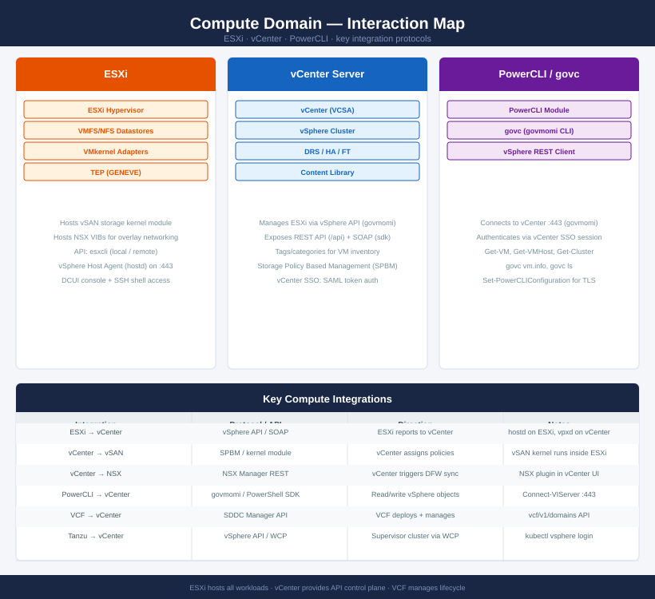

---
tags:
  - esxi
  - vcenter
  - compute
  - architecture
---
# Compute Domain — Interaction Map

<div class="kb-summary">
How ESXi, vCenter, and PowerCLI interact — vSphere API protocols, hostd, govmomi, and integration with NSX, vSAN, VCF, and Tanzu.
</div>



## Integration summary

| From | To | Protocol / API | Notes |
|---|---|---|---|
| ESXi | vCenter | vSphere API (hostd on :443) | ESXi host agent reports state to vpxd |
| vCenter | ESXi | vSphere API (vpxd → hostd) | vCenter pushes config, DRS decisions |
| vCenter | vSAN | SPBM / kernel module | Policies assigned at vCenter; enforced in ESXi |
| vCenter | NSX | NSX Manager REST | NSX plugin registers with vCenter; DFW sync |
| PowerCLI | vCenter | govmomi / SDK over :443 | `Connect-VIServer`; SSO session token |
| VCF | vCenter | SDDC Manager REST API | VCF deploys, patches, and manages vCenter lifecycle |
| Tanzu | vCenter | WCP / vSphere API | Supervisor cluster registers with vCenter; `kubectl vsphere login` |

## Key API endpoints

```bash
# vCenter REST API (new, preferred)
GET https://vcenter/api/vcenter/vm
GET https://vcenter/api/vcenter/host

# vCenter SOAP API (legacy, used by older tools)
https://vcenter/sdk

# ESXi host agent (direct host access)
https://esxi-host/sdk                         # hostd API
```

## See also

- [ESXi Cheat Sheet](../cheat-sheets/esxi/)
- [vCenter Cheat Sheet](../cheat-sheets/vcenter/)
- [PowerCLI Cheat Sheet](../cheat-sheets/powercli/)
- [Back to Interaction Map](index.md)
