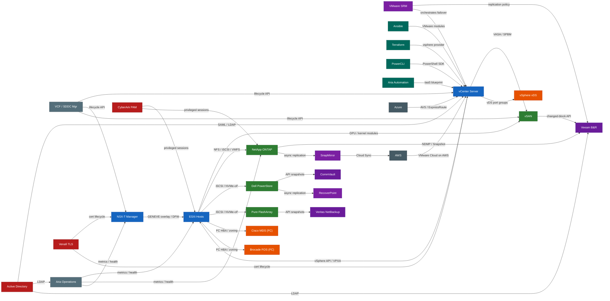

---
tags:
  - vsphere
  - architecture
  - interaction-map
  - vmware
  - netapp
  - dell
---
# VMware Product Interaction Map

How VMware's 15 core products connect — compute, storage, network, management, and automation layers with key integration protocols.

The five domains stack vertically: **Management** (VCF, Aria Suite Lifecycle) orchestrates everything below it. **Compute** (ESXi, vCenter, PowerCLI) is the execution layer. **Storage** (vSAN, vSphere Replication, VxRail) runs inside ESXi or as managed HCI. **Network** (NSX, vDS) runs as ESXi kernel modules and edge VMs. **Automation** (Aria Suite, Tanzu, Horizon) consumes all layers through APIs.

## Domain interaction maps

<a class="kb-card" href="compute/">
<strong>Compute</strong> 
ESXi, vCenter, and PowerCLI — vSphere API, hostd, and govmomi protocol details.
</a>
<a class="kb-card" href="network/">
<strong>Network</strong> 
NSX and vDS — GENEVE overlay, BGP/ECMP uplinks, and DFW integration points.
</a>
<a class="kb-card" href="storage/">
<strong>Storage</strong> 
vSAN, vSphere Replication, and VxRail — kernel modules, SPBM, and replication protocols.
</a>
<a class="kb-card" href="management/">
<strong>Management</strong> 
VCF, Aria Suite Lifecycle, and vCenter SSO — lifecycle APIs and auth federation.
</a>
<a class="kb-card" href="automation/">
<strong>Automation</strong> 
Aria Suite, Tanzu, and Horizon — how each product consumes the vSphere and NSX APIs.
</a>

## Key principles

- **VCF manages all layers**: a single SDDC Manager API call can deploy a full workload domain (vCenter + NSX + vSAN).
- **vSAN and NSX are kernel-native**: no separate appliances — both run as VIBs/modules inside each ESXi host.
- **vCenter SSO federates auth**: NSX Manager, Aria Operations, vRA, and Horizon all authenticate via vCenter SSO SAML tokens.
- **Aria Suite Lifecycle deploys Aria**: vROps, vRLI, vRNI, and vRA are all installed and upgraded through LCM — never manually.
- **Tanzu and Horizon sit at the top**: both provision infrastructure by calling the vSphere and vCenter APIs underneath.

## Full Stack Interaction Map

The diagram below covers all major platform categories — VMware, storage arrays, SAN fabric, backup/DR, automation, security, identity, and cloud — and the integration paths between them.

## Integration Points by Layer

| Layer | Products | Connects To |
|-------|----------|-------------|
| **Compute** | ESXi, vCenter, NSX-T | Storage (NFS/iSCSI/NVMe-oF/vSAN), SAN (FC HBA), Management (vSphere API), Automation (REST/SDK), Identity (SAML/LDAP) |
| **Storage** | vSAN, NetApp ONTAP, Dell PowerStore, Pure FlashArray | Compute (VASA/SPBM/VMFS), SAN (FC/iSCSI), Backup (NDMP/snapshot API), DR (async replication), Management (VASA provider) |
| **SAN / Network** | Cisco MDS, Brocade FOS, vSphere vDS | Compute (FC zoning/HBA), Storage (FC fabric), Management (DCNM/REST API) |
| **Backup / DR** | Veeam, CommVault, NetBackup, SRM, SnapMirror, RecoverPoint | Compute (vSphere API, CBT), Storage (snapshot offload/NDMP), Cloud (offsite target), Identity (AD auth) |
| **Automation** | Ansible, Terraform, PowerCLI, Aria Automation | Compute (vSphere/REST API), Storage (array REST API), Network (NSX REST API), Management (SDDC Manager API) |
| **Management** | VCF, Aria Operations, Aria Automation | Compute, Storage, Network (full lifecycle and metrics across all layers) |
| **Security / Identity** | Active Directory, CyberArk PAM, Venafi | Compute (privileged access / cert push), Storage (array admin auth), Network (NSX cert management), Backup (AD auth) |
| **Cloud** | AWS, Azure | On-prem vCenter (VMware Cloud on AWS / AVS), Storage (SnapMirror Cloud), DR (cloud failover target) |

## See also

- [Cheat Sheets](../cheat-sheets/) — top-10 CLI commands per product
- [VCF Architecture](../../virtualization/vmware/vmware-cloud-foundation/architecture/)
- [NSX Architecture](../../virtualization/vmware/nsx/architecture/)
- [vSAN Architecture](../../virtualization/vmware/vsan/architecture/)
