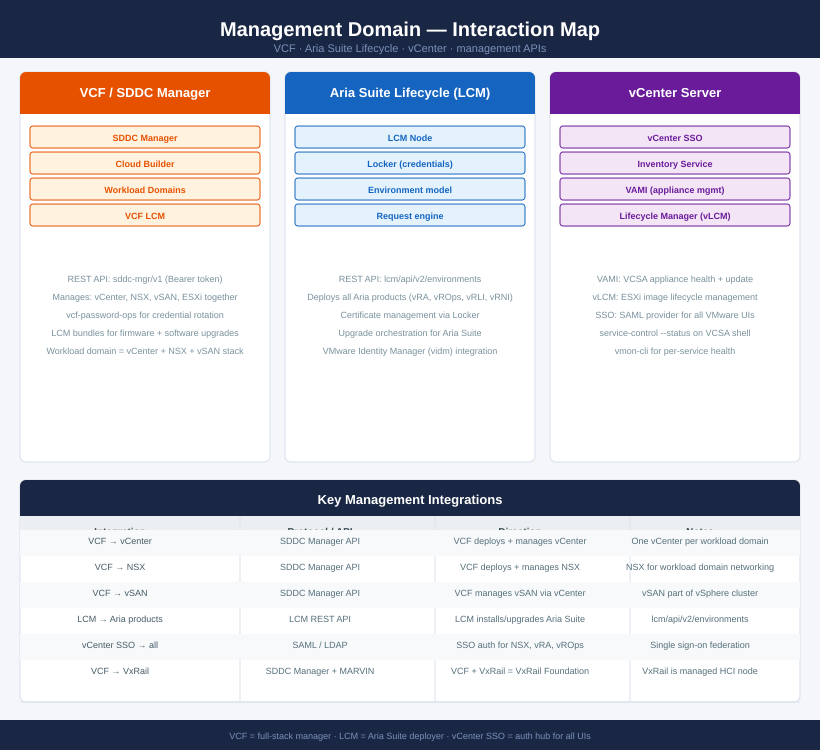

---
tags:
  - vcf
  - vcenter
  - aria-suite-lifecycle
  - operations
  - architecture
---
# Management Domain — Interaction Map

<div class="kb-summary">
How VCF, Aria Suite Lifecycle, and vCenter SSO interact — lifecycle APIs, credential management, authentication federation, and workload domain orchestration.
</div>



## Integration summary

| From | To | Protocol / API | Notes |
|---|---|---|---|
| VCF | vCenter | SDDC Manager REST (v1) | VCF deploys and manages vCenter per workload domain |
| VCF | NSX | SDDC Manager REST (v1) | VCF deploys and manages NSX Manager per domain |
| VCF | vSAN | via vCenter SPBM | vSAN is part of the vSphere cluster VCF creates |
| VCF | VxRail | SDDC Manager + MARVIN API | VCF Foundation edition uses VxRail as managed nodes |
| Aria LCM | Aria products | LCM REST (lcm/api/v2) | LCM deploys, upgrades, and manages certs for all Aria |
| vCenter SSO | All VMware UIs | SAML 2.0 tokens | NSX, vRA, vROps, Horizon all federate auth via SSO |
| VCF | Passwords | vcf-password-ops CLI | Credential rotation for all VCF-managed components |

## VCF workload domain model

```text
SDDC Manager
  └── Management Domain (always first)
  │     ├── vCenter (management)
  │     ├── NSX Manager cluster (shared or per-domain)
  │     └── vSAN cluster
  └── Workload Domain 1..N
        ├── vCenter (per domain)
        ├── NSX (shared from mgmt or dedicated)
        └── vSAN cluster
```

Each workload domain has its own vCenter. SDDC Manager is the single pane of glass for lifecycle operations across all domains.

## Aria Suite Lifecycle deployment order

When LCM deploys the full Aria Suite, the order matters:

1. **Identity Manager (Workspace ONE Access)** — deployed first; provides SSO for Aria products
2. **Aria Operations** — deployed against vCenter adapter
3. **Aria Logs** — deployed; configured to ship its own logs to itself
4. **Aria Automation** — deployed last; depends on Identity Manager
5. **Aria Networks** — can be deployed independently; needs NSX and vCenter data sources

## See also

- [VCF Cheat Sheet](../cheat-sheets/vcf/)
- [Aria Suite Lifecycle Cheat Sheet](../cheat-sheets/aria-suite-lifecycle/)
- [VCF Architecture](../../virtualization/vmware/vmware-cloud-foundation/architecture/)
- [Back to Interaction Map](index.md)
