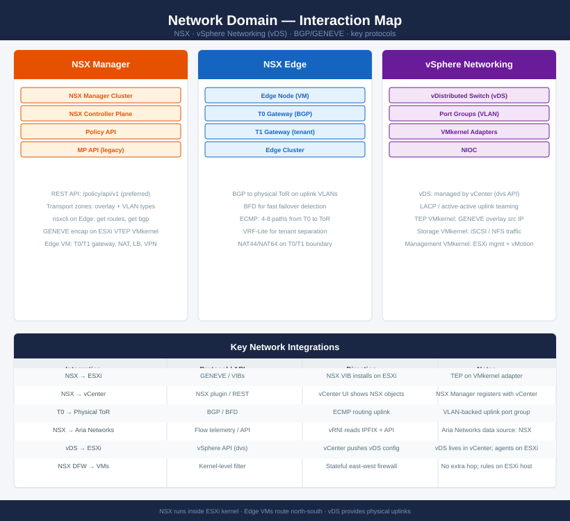
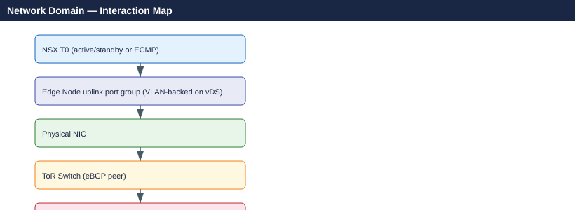

---
tags:
  - nsx
  - networking
  - architecture
---
# Network Domain — Interaction Map

<div class="kb-summary">
How NSX and vSphere networking (vDS) interact — GENEVE overlay, BGP uplinks to physical switches, DFW, and integration with ESXi and vCenter.
</div>



## Integration summary

| From | To | Protocol / API | Notes |
|---|---|---|---|
| NSX Manager | ESXi | GENEVE / VIBs | NSX VIBs install on ESXi; TEP VMkernel carries overlay |
| NSX Manager | vCenter | NSX Manager REST + plugin | NSX plugin registers with vCenter; inventory sync |
| NSX T0 | Physical ToR | BGP + BFD | ECMP uplinks over VLAN-backed port group on vDS |
| NSX DFW | VMs | Kernel filter (in ESXi) | Stateful east-west firewall; no traffic hairpin |
| NSX | Aria Networks | IPFIX + REST API | vRNI reads NSX flow data and topology |
| vDS | ESXi | vSphere API (dvs API) | vCenter pushes vDS config to ESXi agents |

## GENEVE encapsulation path

```text
VM → vNIC → vDS port group → ESXi VTEP VMkernel → GENEVE UDP/6081 → Physical NIC → ToR
```

The **VTEP** (Tunnel Endpoint) is a dedicated VMkernel adapter on each ESXi host. NSX Manager assigns TEP IPs from a configured IP pool during transport node configuration.

## BGP uplink topology



BFD (Bidirectional Forwarding Detection) runs between Edge uplinks and ToR for sub-second failover detection.

## See also

- [NSX Cheat Sheet](../../cheat-sheets/nsx/)
- [NSX Architecture](../../virtualization/vmware/nsx/architecture/)
- [Back to Interaction Map](index.md)
