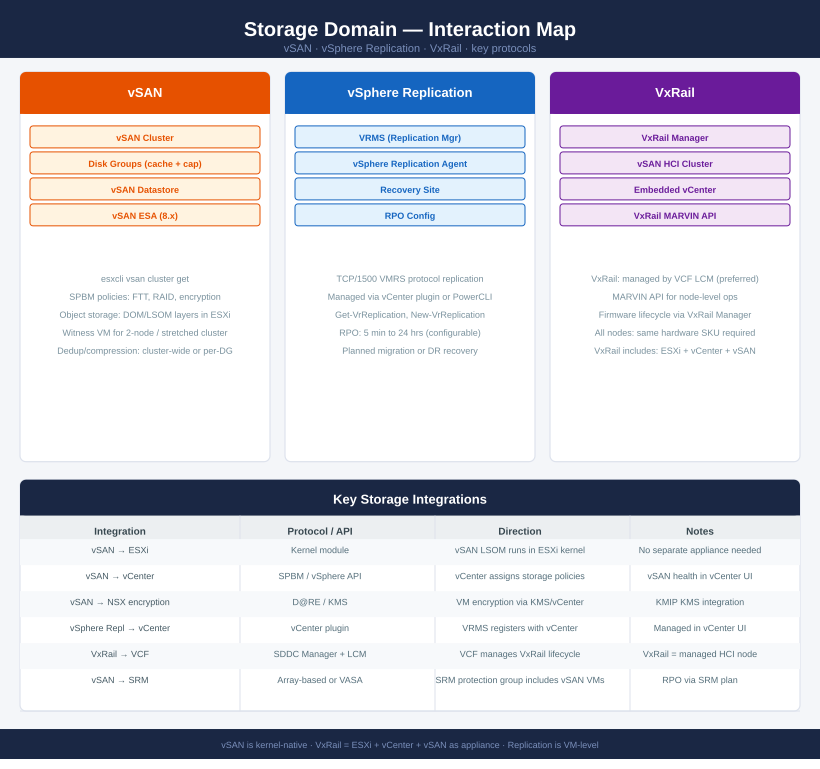

---
tags:
  - vsan
  - storage
  - architecture
---
# Storage Domain — Interaction Map

*Applies to: All products*

<div class="kb-summary">
How vSAN, vSphere Replication, and VxRail integrate — kernel modules, SPBM policies, replication protocols, and VCF-managed HCI lifecycle.
</div>



## Integration summary

| From | To | Protocol / API | Notes |
|---|---|---|---|
| vSAN | ESXi | Kernel module (LSOM/DOM) | vSAN runs inside ESXi; no external appliance |
| vSAN | vCenter | SPBM / vSphere API | vCenter assigns storage policies; health visible in UI |
| vSphere Replication | vCenter | vCenter plugin / PowerCLI | VRMS registers with vCenter; managed via plugin |
| vSphere Replication | Remote site | TCP/1500 VMRS protocol | Replication traffic between VRMS instances |
| VxRail | VCF | SDDC Manager + MARVIN API | VCF manages VxRail lifecycle; MARVIN for node ops |
| vSAN | SRM | VASA / array-based replication | SRM protection groups include vSAN-backed VMs |

## vSAN object storage model

```text
VM Write
  → DOM (Distributed Object Manager) — vCenter orchestrates placement
    → LSOM (Local Log-Structured Object Manager) — runs per ESXi host
      → Disk Groups: 1 cache device + 1-7 capacity devices per host
```

FTT (Failures to Tolerate) and RAID level are set per VM via SPBM storage policy. A policy change triggers live migration of components across hosts.

## VxRail vs standalone vSAN

| Aspect | VxRail | Standalone vSAN |
|---|---|---|
| Hardware | Dell-validated nodes only | Any HCL-listed server |
| Management | VxRail Manager + VCF | vCenter only |
| Lifecycle | VCF LCM (firmware + software) | Manual or vLCM |
| vCenter | Embedded (per cluster) | External vCenter |

## See also

- [vSAN Cheat Sheet](../../cheat-sheets/vsan/)
- [vSAN Architecture](../../../virtualization/vmware/vsan/architecture/)
- [Back to Interaction Map](index.md)
