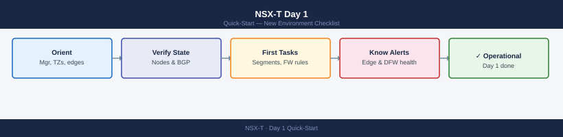

---
tags:
  - vmware
  - nsx
  - quick-start
---
# NSX-T Day 1 — New Environment Checklist

<div class="kb-summary">
What to do in your first hour with a new NSX-T environment. Covers manager orientation, transport layer health, edge cluster status, and the first network tasks.
</div>



---

## 1. Orient

Start in the NSX Manager UI and build a mental map of the overlay network.

| What | Where in NSX Manager |
|------|----------------------|
| Manager version | **System** → **Overview** → Appliance Details |
| Transport zones | **Networking** → **Network Settings** → **Transport Zones** |
| Edge clusters | **System** → **Fabric** → **Edge Clusters** |
| Segment list | **Networking** → **Segments** — note count and attached gateways |
| T0 / T1 gateways | **Networking** → **Tier-0 Gateways** / **Tier-1 Gateways** |
| DFW rule count | **Security** → **Distributed Firewall** — note section and rule count |

Key questions to answer:

- How many NSX Manager nodes? Is the cluster in STABLE state?
- Are there multiple transport zones (overlay and VLAN)?
- How many edge nodes and edge clusters? Are they mapped to T0 gateways?
- Is BGP configured on T0? Who are the upstream peers?

---

## 2. First Health Checks

### NSX Manager Cluster

```text
System → Appliances
```

All manager nodes should show **Node Status: UP** and **Manager Role: Active or Standby**. A degraded node breaks API HA.

### Transport Node Status

```text
System → Fabric → Nodes → Host Transport Nodes
```

All hosts should show:

- **Configuration State: Success**
- **Node Status: Up**

Any host showing `Failed` or `In Progress` has an incomplete NSX preparation — this blocks overlay traffic on that host.

### Edge Node Health

```text
System → Fabric → Nodes → Edge Transport Nodes
```

Each edge node should show **Node Status: Up**. Check the datapath uplink status — a missing uplink means north-south traffic may be broken.

### DFW Rule Count

```text
Security → Distributed Firewall → Statistics
```

Note total rule count. If this is unexpectedly low (&lt; 10 rules) on a production environment, confirm all sections and policies are loaded.

### BGP Peer State

```text
Networking → Tier-0 Gateways → <T0 name> → Routing → BGP
```

All configured BGP peers should show **Established**. An `Idle` or `Active` state means north-south routing is broken for that peer.

---

## 3. Common First Tasks

### Create a Segment

1. Navigate to **Networking** → **Segments** → **Add Segment**
2. Set **Connectivity**: Tier-1 gateway (for east-west) or Tier-0 (for direct L3)
3. Set **Transport Zone**: overlay transport zone
4. Set **Subnets**: gateway IP/prefix (e.g. `10.10.10.1/24`)
5. Save and verify segment shows **Admin State: Up**

Verify connectivity from a connected VM:

```bash
ping <gateway-ip>
```


```text title="Expected output"
PING 192.168.1.1 (192.168.1.1) 56(84) bytes of data.
64 bytes from 192.168.1.1: icmp_seq=1 ttl=64 time=2.34 ms
64 bytes from 192.168.1.1: icmp_seq=2 ttl=64 time=1.89 ms
64 bytes from 192.168.1.1: icmp_seq=3 ttl=64 time=2.12 ms
64 bytes from 192.168.1.1: icmp_seq=4 ttl=64 time=1.95 ms
^C
--- 192.168.1.1 statistics ---
4 packets transmitted, 4 received, 0% packet loss, time 3005ms
rtt min/avg/max/stddev = 1.89/2.07/2.34/0.18 ms
```

!!! warning "Common errors"
    **`ping: <gateway-ip>: Name or service not known`** — Replace `<gateway-ip>` with the actual gateway IP address (e.g., `192.168.1.1`).
    **`From <host-ip> icmp_seq=1 Destination Host Unreachable`** — Verify the gateway IP is correct and reachable on your network, and check that your network interface is up with `ip link show`.
    **`ping: socket: Operation not permitted`** — Run the command with appropriate privileges or check if ICMP is blocked by a firewall rule.
### Add a Firewall Rule

1. Navigate to **Security** → **Distributed Firewall**
2. Select or create a **Policy** (policy = section container)
3. Click **Add Rule**
4. Set: Name, Source (group), Destination (group), Service, Action (Allow/Drop/Reject)
5. **Publish** — rules are not active until published

!!! warning "Publish immediately reloads rules on all hosts"
    Publishing applies the ruleset across all prepared hosts. Verify rule intent before publishing in production.

### Check DFW Statistics

```text
Security → Distributed Firewall → select rule → Statistics
```

Per-rule packet/byte counters confirm whether traffic is matching. Zero counters on a rule expected to have traffic indicates a topology or grouping issue.

---

## See Also

- [NSX Cheat Sheet](../../cheat-sheets/nsx/) — top CLI and API commands
- [NSX-T Architecture Overview](../../virtualization/vmware/nsx/architecture/)
- [NSX-T Health Check Runbook](../../virtualization/vmware/nsx/health-checks/)
- [vSphere Day 1](../vsphere-day1/) — start here if vSphere is also new
