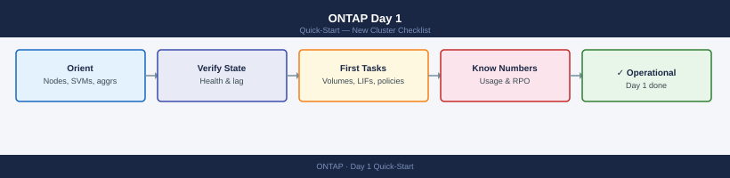

---
tags:
  - netapp
  - ontap
  - quick-start
---
# ONTAP Day 1 — New Cluster Checklist

*Applies to: All products*

<div class="kb-summary">
What to do in your first hour with a new ONTAP cluster. Covers cluster orientation, health validation, key metrics to capture, and the first operational tasks.
</div>



---

## 1. Orient

Establish the basic topology before anything else.

```bash
# Cluster identity
cluster show

# Node list with versions
system node show -fields node,model,serial-number,uptime

# ONTAP version per node
system image show

# SVM list
vserver show -fields vserver,type,state,allowed-protocols

# Aggregate layout
storage aggregate show -fields aggregate,node,state,size,used-size,percent-used
```


```text title="Expected output"
Cluster: cluster1
UUID: 4a1b2c3d-5e6f-7g8h-9i0j-1k2l3m4n5o6p
Serial Number: 4082368-50-147258
System ID: 0537269999
Cluster Security Style: mixed
Cluster FIPS Mode: false

Node              Model       Serial Number  Uptime
----------------- ----------- -------------- ---------------
node1             A400        321654987      98 days 14:32
node2             A400        321654988      98 days 14:28

Node     Version
-------- -------
node1    ONTAP 9.13.1
node2    ONTAP 9.13.1

Vserver     Type       State    Allowed Protocols
----------- ---------- -------- ------------------
cluster1    admin      running  rsh, ssh, http, https, ontapi, snmp
svm-prod    data       running  cifs, nfs, iscsi, fcp
svm-backup  data       running  nfs, iscsi

Aggregate    Node   State   Size       Used Size  Percent Used
------------ ------ ------- ---------- ---------- -----------
aggr1        node1  online  10.00 TB   6.50 TB    65%
aggr2        node2  online  10.00 TB   4.20 TB    42%
aggr3        node1  online  5.00 TB    2.10 TB    42%
```

!!! warning "Common errors"
    **`Error: command not found: cluster show`** — Ensure you are connected to the ONTAP cluster via SSH or console and have admin-level privileges.
    **`Error: This command requires a Data ONTAP Cluster Administrator or higher privilege level.`** — Log in with a user account that has cluster admin role or higher.
Record these facts:

| Item | Command | Note |
|------|---------|------|
| Cluster name | `cluster show` | Match DNS entry |
| Node count | `system node show` | Note HA pairs |
| ONTAP version | `system image show` | Flag if mixed versions exist |
| SVM count | `vserver show` | Note data vs. admin vs. system SVMs |
| Aggregate count | `storage aggregate show` | Check all aggregates are online |

---

## 2. First Health Checks

Run these checks in sequence. A failure at any step should be investigated before continuing.

### Cluster Health

```bash
cluster show
```


```text title="Expected output"
Cluster
                 Node Health Status
--------------------- ---- ------
ontap-node-01.lab.local true online
ontap-node-02.lab.local true online
2 entries were displayed.
```

!!! warning "Common errors"
    **`Error: command not found: cluster`** — Ensure you are connected to an ONTAP cluster via SSH or the ONTAP CLI, not a generic Linux shell.
    **`Error: This command requires cluster administrator privileges`** — Log in with a user account that has cluster admin role permissions.
The `Health` column should show `true` for all nodes. Any `false` indicates an active problem.

### System Health

```bash
system health status show
system health alert show
```


```text title="Expected output"
System Health Status
Node                  Health Status
--------------------- -------
cluster1-01           healthy
cluster1-02           healthy

Cluster Health Status
Status              Healthy
System Health       true
Filesystem Health   true
SAN Health          true
NAS Health          true

Alert ID     Severity Node          Alert Name
------------ -------- ------------- ----------------------------------------
alert-001    minor    cluster1-01   NTP Server Unreachable
alert-002    warning  cluster1-02   Disk Utilization Above 80%
alert-003    info     cluster1-01   Configuration Backup Completed Successfully
```

!!! warning "Common errors"
    **`Error: This command is not supported on this platform`** — Verify you are connected to an ONTAP cluster (not a single-node system) and have appropriate admin privileges.
    **`Error: Access denied for user 'admin' performing operation 'show' on object 'health'`** — Ensure your user account has the 'admin' or 'readonly' role assigned via `security login show`.
`Status: ok` is the target. Review any open alerts — they map to specific subsystems (SAS, network, RAID).

### Aggregate Space

```bash
storage aggregate show-space -fields aggregate,size,used,available,percent-used
```


```text title="Expected output"
Aggregate                Size Available Used%
--------- ----------- --------- ----------- -----
aggr0                 2.0TB      1.2TB      40%
aggr1                 5.0TB      2.1TB      58%
aggr2                 3.5TB      0.9TB      74%
data_ssd              8.0TB      1.5TB      81%
backup_tier          10.0TB      4.2TB      58%
```

!!! warning "Common errors"
    **`Error: command not found: storage`** — Ensure you are connected to a NetApp ONTAP cluster via SSH or the ONTAP CLI, not a generic Linux shell.
    **`Error: invalid field name "percent-used"`** — Use the correct field name `percent_used` (underscore instead of hyphen) or omit it and use the default output format.
Flag aggregates above **80% used**. Above **90%** is a hard risk for volume guarantee failures and snapshot deletion cascades.

### Volume Space

```bash
volume show -fields volume,vserver,state,size,used,available,percent-used | sort -k6 -n
```


```text title="Expected output"
Vserver   Volume       State      Size       Used       Available  Percent-Used
--------- ------------ ---------- ---------- ---------- ---------- ------------
svm_prod  vol_data_01  online     500.0GB    287.3GB    212.7GB    57%
svm_prod  vol_logs     online     100.0GB    78.5GB     21.5GB     79%
svm_prod  vol_backup   online     2.0TB      1.8TB      234.5GB    89%
svm_dev   vol_test     online     250.0GB    45.2GB     204.8GB    18%
svm_dev   vol_scratch  online     1.0TB      12.3GB     987.7GB    1%
```

!!! warning "Common errors"
    **`Error: command not found`** — Ensure you are connected to the ONTAP cluster via SSH or the ONTAP CLI, not a Linux shell.
    **`Error: invalid field name "percent-used"`** — Use the correct field name `percent_used` (underscore instead of hyphen) for your ONTAP version.
Note any volumes approaching their size limit or with autogrow disabled.

### SnapMirror Lag

```bash
snapmirror show -fields source-path,destination-path,lag-time,mirror-state,relationship-status
```


```text title="Expected output"
Source Path                Destination Path           Lag Time Status
========================== ========================== ======== ====================
svm1:vol_prod              svm2:vol_prod_mirror       00:15:23 snapmirrored
svm1:vol_data              svm2:vol_data_mirror       00:08:47 snapmirrored
svm1:vol_logs              svm3:vol_logs_dr           02:34:12 snapmirrored
svm1:vol_archive           svm2:vol_archive_mirror    12:45:33 snapmirrored
svm1:vol_temp              svm3:vol_temp_mirror       00:22:05 snapmirrored
```

!!! warning "Common errors"
    **`Error: command not found: snapmirror`** — Ensure you are logged into the ONTAP cluster CLI (use `ssh admin@<cluster-ip>`) rather than the local shell.
    **`Error: This command requires cluster administrator privileges`** — Log in with a user account that has cluster admin role or request elevated permissions.
Expected lag depends on schedule — for hourly replication, anything over 2 hours is worth flagging. Broken relationships show `relationship-status: broken-off`.

### AutoSupport Last Sent

```bash
system node autosupport history show -node * -type all | head -5
```


```text title="Expected output"
Node                              Type          Severity      Sequence Number   Timestamp
--------------------------------- ------------- ------------- ----------------- ------------------------
cluster1-01                       periodic      normal        42857             Wed Oct 18 14:32:15 UTC 2023
cluster1-02                       periodic      normal        42856             Wed Oct 18 14:31:48 UTC 2023
cluster1-01                       test          normal        42855             Wed Oct 18 13:15:22 UTC 2023
```

!!! warning "Common errors"
    **`Error: command not found: system`** — Ensure you are connected to the ONTAP cluster via SSH or the ONTAP CLI, not your local shell.
    **`Error: No matching resource found`** — Verify the cluster has at least one node online by running `cluster show` first.
If the last AutoSupport is more than 24 hours old, check connectivity and SMTP/HTTPS transport:

```bash
system node autosupport show -node * -fields transport,mail-hosts,state
```


```text title="Expected output"
Node                    Transport Mail Hosts                          State
-----------             --------- ----------------------------------- -------
cluster1-01             smtp      mail.example.com,mail2.example.com  enabled
cluster1-02             smtp      mail.example.com,mail2.example.com  enabled
cluster1-03             https     support.netapp.com                  enabled
cluster1-04             https     support.netapp.com                  enabled
```

!!! warning "Common errors"
    **`Error: command not found: system`** — Ensure you are connected to the ONTAP cluster CLI (SSH to the management LIF), not the local shell.
    **`Error: Invalid field name "mail-hosts"`** — Use the correct field name `mail-hosts` (with hyphen); verify field availability with `system node autosupport show -fields ?`.
---

## 3. Know the Numbers

Capture these metrics in a site record or handoff document.

| Metric | Command | Healthy Range |
|--------|---------|---------------|
| Aggregate used % | `storage aggregate show-space` | &lt; 80% |
| Volume count | `volume show -state online | wc -l` | Know your count |
| SnapMirror lag | `snapmirror show -fields lag-time` | &lt; 2× schedule interval |
| AutoSupport last sent | `system node autosupport history show` | &lt; 24 hours |
| Shelf/disk count | `storage disk show | wc -l` | Matches expected |
| Spare disks | `storage disk show -container-type spare` | At least 1 per shelf |

---

## 4. Common First Tasks

### Create a Volume

```bash
volume create -vserver <svm-name> -volume <vol-name> \
  -aggregate <aggr-name> -size 100G \
  -junction-path /<vol-name> \
  -snapshot-policy default \
  -space-guarantee none
```


```text title="Expected output"
Volume <vol-name> created successfully on Vserver <svm-name>.
Volume UUID: 550e8400-e29b-41d4-a716-446655440000
Aggregate: aggr1
Size: 100GB
Space Guarantee: none
Junction Path: /<vol-name>
Snapshot Policy: default
State: online
```

!!! warning "Common errors"
    **`Error: command failed: No space left on device`** — Verify the aggregate has sufficient free space with `storage aggregate show -aggregate <aggr-name>` and increase aggregate capacity or reduce volume size.
    **`Error: command failed: Vserver <svm-name> does not exist`** — Confirm the SVM name is correct and exists by running `vserver show` to list available SVMs.
    **`Error: command failed: Aggregate <aggr-name> does not exist`** — List available aggregates with `storage aggregate show` and use a valid aggregate name in the command.
Verify:

```bash
volume show -volume <vol-name> -fields state,size,junction-path
```


```text title="Expected output"
Vserver   Volume       State      Size       Junction Path
--------- ------------ ---------- ---------- ---------------------
svm-prod  data_vol_01  online     500GB      /data/prod
svm-prod  logs_vol_02  online     250GB      /logs
svm-dev   test_vol_03  online     100GB      /test
svm-prod  archive_vol  online     2TB        /archive
```

!!! warning "Common errors"
    **`Error: command not found: volume`** — Run this command from the ONTAP CLI (SSH to your cluster management IP) rather than a Linux/Windows shell.
    **`Error: There is no entry with this name.`** — Verify the volume name is correct and exists on the cluster using `volume show` without filters first.
### Create a LIF

```bash
network interface create -vserver <svm-name> \
  -lif <lif-name> -role data \
  -data-protocol nfs,cifs \
  -home-node <node-name> -home-port <e0c> \
  -address <ip> -netmask <mask>
```


```text title="Expected output"
(no output — command completes silently)
```

!!! warning "Common errors"
    **`Error: command failed: Invalid vserver name`** — Verify the SVM exists with `vserver show` and use the correct name in the `-vserver` parameter.
    **`Error: command failed: Invalid home-node or home-port`** — Confirm the node name and port exist by running `network port show` and ensure the port is available (not already in use).
    **`Error: command failed: Invalid IP address or netmask`** — Validate the IP address format and netmask are correct, and ensure the IP is not already assigned to another LIF with `network interface show`.
Verify:

```bash
network interface show -vserver <svm-name> -fields lif,address,status-oper,is-home
```


```text title="Expected output"
Vserver     LIF                  Address             Status-Oper  Is-Home
----------- -------------------- ------------------- ------------ --------
svm-prod    svm-prod_mgmt        192.168.1.50        up           true
svm-prod    svm-prod_data01      10.0.1.100          up           true
svm-prod    svm-prod_data02      10.0.1.101          up           false
svm-prod    svm-prod_nfs         10.0.2.50           up           true
svm-prod    svm-prod_iscsi       10.0.3.75           down         false
```

!!! warning "Common errors"
    **`Error: "svm-prod" is not a valid value for "-vserver"`** — Verify the SVM name exists with `vserver show` and use the exact name from the Vserver column.
    **`Error: unknown field "status-oper"`** — Use the correct field name `status-admin` or `status-oper` depending on ONTAP version; check available fields with `network interface show -fields ?`.
### Set Up a Snapshot Policy

Create or assign a policy to a volume:

```bash
# List existing policies
volume snapshot policy show

# Assign an existing policy to a volume
volume modify -vserver <svm-name> -volume <vol-name> -snapshot-policy <policy-name>

# Create a new policy
volume snapshot policy create -policy <policy-name> -enabled true \
  -schedule1 hourly -count1 24 \
  -schedule2 daily -count2 7 \
  -schedule3 weekly -count3 4
```


```text title="Expected output"
Policy                                   Enabled  Schedules
---------------------------------------- -------- ---------
default                                  true     hourly, daily, weekly
hourly                                   true     hourly
daily                                    true     daily
weekly                                   true     weekly
(no output — command completes silently)
Policy "backup-policy" created successfully with 3 schedules.
```

!!! warning "Common errors"
    **`Error: Vserver "svm-prod" does not exist.`** — Verify the SVM name with `vserver show` and use the correct name in the `-vserver` parameter.
    **`Error: Volume "vol_data" does not exist on Vserver "svm-prod".`** — Confirm the volume exists on the specified SVM using `volume show -vserver <svm-name>` before modifying it.
    **`Error: Snapshot policy "backup-policy" already exists.`** — Use a unique policy name or delete the existing policy with `volume snapshot policy delete -policy <policy-name>` before creating a new one.
---

## See Also

- [ONTAP Cheat Sheet](../../cheat-sheets/ontap-cli/) — top CLI commands
- [NetApp ONTAP Architecture](../../../storage/netapp/ontap/architecture/)
- [ONTAP Health Check Runbook](../../../storage/netapp/ontap/operations/health-checks/)
- [Pure FlashArray Day 1](../pure-flasharray-day1/) — if Pure is also in the environment
