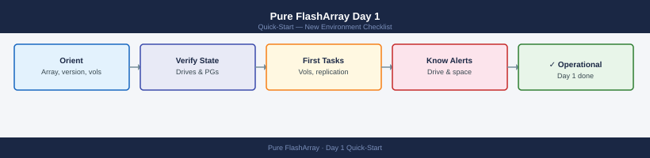

---
tags:
  - pure-storage
  - flasharray
  - quick-start
---
# Pure FlashArray Day 1 — New Environment Checklist

*Applies to: All products*

<div class="kb-summary">
What to do in your first hour with a new Pure Storage FlashArray. Covers array orientation, drive and hardware health, protection group schedules, SafeMode status, and the first operational tasks.
</div>



---

## 1. Orient

Start in the Purity GUI (https://`<array-ip>`) or via SSH as `pureuser`.

| What | Where |
|------|-------|
| Array name and model | **Dashboard** → top banner; or `purearray list` |
| Purity version | **Settings** → **System** → Software; or `purearray list --field version` |
| Capacity used/total | **Dashboard** → Capacity widget |
| Volume count | **Storage** → **Volumes** → count |
| Host connections | **Storage** → **Hosts** |
| Protection groups | **Protection** → **Protection Groups** |
| Pure1 connection | **Settings** → **System** → Pure1; should show **Connected** |

Key questions to answer:

- Is this array in an ActiveCluster pair or standalone?
- Is SafeMode enabled? (Requires Pure Support to disable — affects snapshot deletion)
- What replication target is configured for protection groups?
- Are hosts connected via FC, iSCSI, or NVMe-oF?

---

## 2. First Health Checks

### Array Health

```bash
purearray list
```


```text title="Expected output"
Name                          Address         Version   Revision
pure-fa-m20-01.corp.local     192.168.1.42    6.4.2     20230815-001
pure-fa-m20-02.corp.local     192.168.1.43    6.4.2     20230815-001
pure-fa-x70-r2.corp.local     192.168.1.44    6.3.8     20230712-002
```

!!! warning "Common errors"
    **`purearray: command not found`** — Install the Pure Storage CLI tools or add the installation directory to your PATH environment variable.
    **`Error: Unable to connect to array at 192.168.1.42`** — Verify network connectivity to the array management IP and confirm firewall rules allow access to port 443.
Key fields: `array_name`, `version`, `id`. No output means SSH connectivity issue.

```bash
purearray list --all
```


```text title="Expected output"
Name                          Capacity  Used      Snapshots  Data Reduction  Arrays
flasharray-prod-01            100.0T    47.3T     12.4T      2.8x            1
flasharray-dr-02              50.0T     18.9T     4.2T       2.1x            1
flasharray-test-03            25.0T     3.7T      0.8T       1.9x            1
flasharray-backup-04          75.0T     61.2T     8.5T       3.2x            1
```

!!! warning "Common errors"
    **`purearray: command not found`** — Install the Pure Storage CLI tools or add the installation directory to your PATH environment variable.
    **`Error: Unable to connect to array management interface`** — Verify network connectivity to the array management IP and ensure your credentials are configured in ~/.purerc or via environment variables.
Shows all array properties including `SafeMode` status.

### Drive Health

```text
GUI: Storage → Drives
```

All drives should show **Healthy**. Drives in **Failed**, **Unhealthy**, or **Evacuating** state need immediate attention — the array may be in a degraded RAID state.

CLI:

```bash
puredrive list
```


```text title="Expected output"
Name                           Serial                Size      Capacity  Status
flasharray-01-nvme-1           PDRV.CV1Q2R3S4T5U6V7  1.92TB    1.92TB    healthy
flasharray-01-nvme-2           PDRV.CV1Q2R3S4T5U6V8  1.92TB    1.92TB    healthy
flasharray-01-nvme-3           PDRV.CV1Q2R3S4T5U6V9  1.92TB    1.92TB    healthy
flasharray-01-nvme-4           PDRV.CV1Q2R3S4T5U6VA  1.92TB    1.92TB    healthy
flasharray-01-ssd-1            PDRV.SSD1Q2R3S4T5U6V  960GB     960GB     healthy
flasharray-01-ssd-2            PDRV.SSD1Q2R3S4T5U6W  960GB     960GB     healthy
```

!!! warning "Common errors"
    **`puredrive: command not found`** — Install the Pure Storage CLI tools or ensure the PATH includes the Pure management utilities directory.
    **`Error: Unable to connect to array at <ip>`** — Verify the array hostname/IP is reachable and that you have authenticated with `pureadmin login` or set valid credentials.
Sort by `status`. Any status other than `healthy` is actionable.

### Hardware Component Status

```bash
purehw list
```


```text title="Expected output"
Name                          Status    Model              Serial Number         Hardware Version
flasharray-prod-01            ok        FA-405R3           5001234567890ABCD     4.3.2
flasharray-prod-02            ok        FA-405R3           5001234567890ABCE     4.3.2
flasharray-dr-01              ok        FA-250R3           5001234567890ABCF     4.3.1
flasharray-test-01            warning   FA-250R3           5001234567890ABD0     4.3.1
```

!!! warning "Common errors"
    **`purehw: command not found`** — Install the Pure Storage CLI tools or ensure the PATH includes the directory containing the purehw binary.
    **`Error: Unable to connect to array management interface`** — Verify network connectivity to the FlashArray management interface and check firewall rules.
Check all hardware components — controllers, power supplies, fans, NVRAM. Any component showing `not_installed` that should be present, or `failed`, warrants a support case.

### Protection Group Schedules

```text
GUI: Protection → Protection Groups → select group → Schedule tab
```

Verify:

- Snapshot schedule is enabled and at the expected frequency
- Replication schedule is enabled (if replicating to a remote array or cloud)
- Retention policy matches your RPO/RTO requirements

CLI:

```bash
purepgroup list
purepgroup list --schedule
```


```text title="Expected output"
Name                          Volumes  Hosts  Snapshots
pg-prod-01                    12       8      24
pg-dev-02                     5        3      8
pg-backup-01                  18       6      42
pg-repl-01                    9        4      15

Name                          Volumes  Hosts  Snapshots  Schedule
pg-prod-01                    12       8      24         hourly
pg-dev-02                     5        3      8          daily
pg-backup-01                  18       6      42         weekly
pg-repl-01                    9        4      15         (none)
```

!!! warning "Common errors"
    **`Error: Invalid credentials or API token expired`** — Verify your Pure Storage API token is set in your environment or configuration file.
    **`Error: Connection refused to management IP`** — Confirm the FlashArray management IP is reachable and the Pure1 REST API service is running.
### SafeMode Status

SafeMode prevents snapshot deletion without Pure Support authorization — critical for ransomware protection.

```bash
purearray list --all | grep -i safemode
```


```text title="Expected output"
Name                          SafeMode  Safemode Enabled  Safemode Expires
flasharray-prod-01            Enabled   True              2025-03-15T18:30:00Z
flasharray-prod-02            Enabled   True              2025-03-20T14:22:00Z
flasharray-dr-01              Disabled  False             Never
flasharray-test-01            Enabled   True              2025-02-28T09:15:00Z
```

!!! warning "Common errors"
    **`purearray: command not found`** — Install the Pure Storage CLI tools or ensure the PATH includes the directory containing the purearray binary.
    **`grep: (standard input) is empty`** — Verify the FlashArray is reachable and the purearray CLI is authenticated with valid credentials.
If SafeMode is enabled, confirm who holds the authorization contact — disabling requires a support call.

### Pure1 Connection

```text
GUI: Settings → System → Pure1
```

The array should show **Connected** with a recent heartbeat timestamp. A disconnected array loses call-home alerting and proactive support.

---

## 3. Common First Tasks

### List Volumes with Space Consumption

```bash
purevol list --space
```


```text title="Expected output"
Name                                      Size  Provisioned  Physical  Data Reduction
docker-vol-01                            100GB      100GB      12.3GB           8.1x
k8s-pvc-mysql-data                       500GB      500GB      156.2GB          3.2x
backup-archive-2024                      2TB       2TB        1.8TB            1.1x
vm-datastore-prod                        1TB       1TB        287.5GB          3.5x
dev-test-volume                          250GB      250GB      8.9GB           28.1x
```

!!! warning "Common errors"
    **`Error: Invalid credentials or unable to connect to array`** — Verify the FlashArray management IP is reachable and your credentials are configured via `pureadmin login` or environment variables.
    **`Error: Command 'purevol' not found`** — Install the Pure Storage Python SDK with `pip install purestorage` or ensure the Pure CLI tools are in your system PATH.
Key columns: `name`, `size`, `total_used`, `data_reduction`, `unique`. Note any volume consuming significantly more unique space than expected (low data reduction ratio may indicate uncompressible data).

### Check Replication Lag

```bash
purepgroup list --replication
```


```text title="Expected output"
Name                          Targets                       Direction  Status
pg-prod-01                    flasharray-dr.example.com     Snap→Repl  enabled
pg-prod-02                    flasharray-dr.example.com     Snap→Repl  enabled
pg-backup-01                  flasharray-backup.example.com Snap→Repl  enabled
pg-dev-01                     flasharray-dr.example.com     Snap→Repl  disabled
pg-test-01                    flasharray-dr.example.com     Snap→Repl  enabled
```

!!! warning "Common errors"
    **`Error: Invalid credentials or unable to connect to array`** — Verify the FlashArray management IP is reachable and your API token is set via `export PURE_API_TOKEN=<token>`.
    **`Error: purepgroup: command not found`** — Install the Pure Storage Python SDK with `pip install purestorage` and ensure the CLI tools are in your PATH.
The `lag` field shows how far behind the remote copy is from the source. For synchronous replication (ActiveCluster), lag should be near-zero.

For asynchronous protection groups:

```bash
purepgroup list --transfer
```


```text title="Expected output"
Name                          Source              Destination         Progress
pg-prod-01                    flasharray-01       flasharray-02        100%
pg-backup-tier2               flasharray-03       flasharray-04        100%
pg-repl-secondary             flasharray-01       flasharray-02        87%
pg-archive-cold               flasharray-02       flasharray-03        0%
```

!!! warning "Common errors"
    **`Error: Invalid credentials or unable to connect to array`** — Verify your Pure Storage array credentials are configured via `pureadmin login` or check the PURE_IP and PURE_API_TOKEN environment variables.
    **`Error: No protection groups found with active transfers`** — This is expected if no replication or migration is currently in progress; run `purepgroup list` to see all protection groups regardless of transfer status.
Shows current in-flight replication transfer status and estimated completion.

### Verify Snapshot Schedule

```bash
purepgroup list --schedule
purepgroup listsnaps <pgroup-name>
```


```text title="Expected output"
Name                          Interval  Keep
protection-group-prod         hourly    24
protection-group-prod         daily     7
protection-group-prod         weekly    4
protection-group-dev          hourly    12
protection-group-dev          daily     3

Name                          Created                  Size
protection-group-prod.1       2024-01-15T08:30:22Z     2.3TB
protection-group-prod.2       2024-01-15T07:30:18Z     2.3TB
protection-group-prod.3       2024-01-15T06:30:15Z     2.3TB
protection-group-prod.4       2024-01-15T05:30:12Z     2.3TB
protection-group-prod.5       2024-01-15T04:30:09Z     2.3TB
...
```

!!! warning "Common errors"
    **`Error: Unknown protection group '<pgroup-name>'`** — Replace `<pgroup-name>` with an actual protection group name from the output of `purepgroup list`.
    **`Error: You do not have permission to perform this operation`** — Verify your Pure Storage API token or credentials have sufficient privileges for snapshot operations.
Confirm:

1. Snapshots exist for the expected time periods (hourly, daily, weekly)
2. The oldest retained snapshot matches the retention policy
3. No `ERROR` status on any snapshot

### Add a Host and Connect a Volume

```bash
# Create host entry
purehost create <hostname> --iqnlist <iqn> # iSCSI
# or
purehost create <hostname> --wwnlist <wwn> # FC

# Connect volume to host
purehost connect <hostname> --vol <volume-name>

# Verify
purehost list --connection
```


```text title="Expected output"
Name             IQN                                          
host-prod-01     iqn.1991-05.com.example:host-prod-01.storage
(no output — command completes silently)
Name             Volume           LUN  
host-prod-01     data-vol-001     1    
host-prod-01     backup-vol-002   2
```

!!! warning "Common errors"
    **`Error: Host 'host-prod-01' already exists`** — Use `purehost list` to verify the hostname doesn't already exist, or delete it first with `purehost delete <hostname>`.
    **`Error: Volume '<volume-name>' not found`** — Confirm the volume name is correct with `purehost list --vol` and ensure it exists on the array.
    **`Error: Host '<hostname>' not found`** — Verify the hostname was created successfully in the previous step and check spelling with `purehost list`.
---

## See Also

- [Pure FlashArray Cheat Sheet](../../cheat-sheets/pure-flasharray-cli/) — top CLI commands
- [Pure FlashArray Architecture](../../../storage/products/pure/flasharray/architecture/)
- [Pure FlashArray Health Check Runbook](../../../storage/products/pure/flasharray/operations/health-checks/)
- [ONTAP Day 1](../ontap-day1/) — if NetApp is also in the environment
