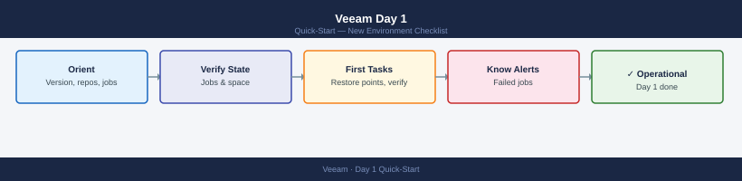

---
tags:
  - veeam
  - backup
  - quick-start
---
# Veeam Day 1 — New Environment Checklist

*Applies to: All products*

<div class="kb-summary">
What to do in your first hour with a new Veeam Backup & Replication environment. Covers server orientation, job health, repository capacity, and the first hands-on tasks.
</div>



---

## 1. Orient

Open the Veeam Backup & Replication console and build a map of the environment.

| What | Where in Console |
|------|-----------------|
| VBR version | **Help** → **About** |
| Managed servers | **Backup Infrastructure** → **Managed Servers** |
| Backup repositories | **Backup Infrastructure** → **Backup Repositories** |
| Scale-out repositories | **Backup Infrastructure** → **Scale-out Repositories** |
| Active jobs | **Home** → **Jobs** → filter by **Running** |
| All jobs (status overview) | **Home** → **Jobs** → **Backup** — sort by Last Result |
| Tape libraries | **Backup Infrastructure** → **Tape Infrastructure** |

Key questions to answer:

- What version of VBR? (Latest supported version for the protected infrastructure?)
- How many backup repositories and what type (Windows, Linux, SMB, object storage)?
- Are there Scale-out Backup Repositories (SOBR) with capacity tier offload configured?
- What is the backup copy topology — local only, or remote copy jobs?
- Are there any replication jobs (VM-to-VM) in addition to backup jobs?

---

## 2. First Health Checks

### Last Job Status

```text
Home → Jobs → Backup
```

Sort by **Last Result**. Any job showing **Failed** or **Warning** needs investigation before assuming the environment is healthy.

For each failed job:

1. Right-click → **Statistics** → review the last session log
2. Note the error category: connectivity (proxy/repo), VMware (snapshot), or storage (space)
3. Check if the job has been failing for multiple consecutive runs — this indicates a persistent issue, not a transient one

### Repository Free Space

```text
Backup Infrastructure → Backup Repositories → select each → General tab
```

| Threshold | Action |
|-----------|--------|
| &lt; 20% free | Alert — run capacity planning |
| &lt; 10% free | Critical — risk of job failures; clean up or expand |
| &lt; 5% free | Emergency — jobs will start failing |

For SOBR, check both the performance tier and the capacity tier separately.

### Backup Copy Job Health

```text
Home → Jobs → Backup Copy
```

Backup copy jobs maintain off-site restore points. A failed backup copy job means you have no offsite copy — treat the same urgency as a primary job failure.

### Tape Library Status

```text
Backup Infrastructure → Tape Infrastructure → Tape Libraries
```

If tape is used, verify:

- Library shows **Online**
- Tape drives are not stuck in **Locked** or **Ejected** state
- Media pool has available free tapes

---

## 3. Common First Tasks

### Check Latest Restore Point Per VM

Use the **Restore Points** view to confirm coverage:

```text
Home → Restore Points
```

Filter or search by VM name. Check:

- Latest restore point date (should be within your RPO window)
- Restore point type (full vs. incremental)
- Repository location

For a quick CLI check via PowerShell:

```powershell
Add-PSSnapin -Name VeeamPSSnapIn
Get-VBRBackup | ForEach-Object {
    $backup = $_
    Get-VBRRestorePoint -Backup $backup | Group-Object -Property Name |
    ForEach-Object {
        $latest = $_.Group | Sort-Object CreationTime -Descending | Select-Object -First 1
        [PSCustomObject]@{
            VM          = $_.Name
            LatestRP    = $latest.CreationTime
            Type        = $latest.GetBackupType()
            JobName     = $backup.JobName
        }
    }
} | Sort-Object LatestRP | Format-Table -AutoSize
```

### Run a Backup Job On-Demand

1. Navigate to **Home** → **Jobs** → **Backup**
2. Right-click the job → **Start**
3. Monitor progress in **Home** → **Running**
4. Review session log on completion: right-click job → **Statistics**

### Verify a Restore (SureBackup or Instant Recovery)

**Instant Recovery** — verifies the restore point is bootable:

1. Right-click a restore point in **Home** → **Restore Points**
2. Select **Instant Recovery to VMware vSphere**
3. Choose target host/datastore (use an isolated network for testing)
4. Power on the recovered VM and verify application startup
5. Remove the recovered VM from the Veeam console when done

**SureBackup** (automated, if configured):

```text
Home → Jobs → SureBackup → right-click → Start
```

SureBackup boots VMs in an isolated sandbox and runs application verification tests automatically. Review the last SureBackup report:

```text
Home → Last 24 Hours → select SureBackup session → Statistics
```

---

## See Also

- [Veeam Cheat Sheet](../../cheat-sheets/veeam-powershell/) — top CLI and PowerShell commands
- [Veeam Architecture Overview](../../../backup/products/veeam/architecture/)
- [Veeam Health Check Runbook](../../../backup/products/veeam/operations/health-checks/)
- [vSphere Day 1](../vsphere-day1/) — start here if vSphere is also new
