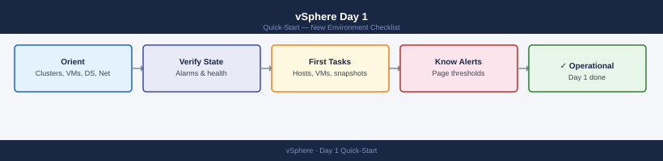

---
tags:
  - vmware
  - vsphere
  - vcenter
  - quick-start
---
# vSphere Day 1 — New Environment Checklist

*Applies to: All products*

<div class="kb-summary">
What to do in your first hour with a new vSphere environment. Complete these steps in order to reach a safe, understood baseline before making any changes.
</div>



---

## 1. Orient

Get your bearings in the vCenter UI before touching anything.

| What | Where in vCenter UI |
|------|---------------------|
| Cluster inventory | **Hosts and Clusters** view → expand datacenter tree |
| VM list | **VMs and Templates** view → group by folder or tag |
| Datastores | **Storage** view → list view shows type, capacity, used % |
| Networking | **Networking** view → expand to see DVS, portgroups, uplinks |
| vSAN status | **Hosts and Clusters** → select cluster → **Configure** → **vSAN** → **Health** |
| Existing alarms | **Alarms** tab on any object; top-level summary under **Home** → **Alarms** |

Key questions to answer before proceeding:

- How many clusters? How many hosts per cluster?
- Is vSAN in use? What version?
- What is the naming convention for VMs, datastores, and portgroups?
- Is DRS and HA enabled on each cluster?

---

## 2. First Health Checks

Run through these in order. Stop if you find anything red.

### vCenter Alarms

Navigate to the top-level vCenter object. Select **Monitor** → **Issues** → **Triggered Alarms**. Any alarm here applies environment-wide.

### Host Connection State

```text
Hosts and Clusters → select cluster → Hosts tab
```

All hosts should show **Connected** in green. Hosts in **Disconnected** or **Not Responding** state need immediate investigation before any workload changes.

### Datastore Usage

```text
Storage view → list all datastores → sort by Used column
```

Flag any datastore above **80% used**. Above **85%** is a critical threshold that may trigger storage DRS or VM failures.

### vSAN Health (if applicable)

```text
Hosts and Clusters → cluster → Configure → vSAN → Health
```

All health checks should be green. Red or yellow items in **Physical Disk**, **Network**, or **Data** categories need investigation before proceeding.

### vCenter Services

Check appliance services are healthy:

```text
https://<vcenter-fqdn>:5480
```

Login with appliance credentials → **Services** → verify all core services show **Running**.

---

## 3. Key Commands

Five PowerCLI one-liners to run on any new environment. Connect first:

```powershell
Connect-VIServer -Server <vcenter-fqdn>
```

**List all hosts with CPU and memory:**

```powershell
Get-VMHost | Select-Object Name,
    @{N='CPU_GHz';E={[math]::Round($_.CpuTotalMhz/1000,1)}},
    @{N='RAM_GB';E={[math]::Round($_.MemoryTotalGB,0)}},
    @{N='RAM_Used_GB';E={[math]::Round($_.MemoryUsageGB,0)}},
    ConnectionState | Sort-Object Name | Format-Table -AutoSize
```

**List all VMs with power state:**

```powershell
Get-VM | Select-Object Name, PowerState, NumCpu, MemoryGB,
    @{N='Host';E={$_.VMHost.Name}},
    @{N='Datastore';E={(Get-Datastore -VM $_).Name -join ','}} |
    Sort-Object Name | Format-Table -AutoSize
```

**List datastores with free space:**

```powershell
Get-Datastore | Select-Object Name, Type,
    @{N='Cap_GB';E={[math]::Round($_.CapacityGB,0)}},
    @{N='Free_GB';E={[math]::Round($_.FreeSpaceGB,0)}},
    @{N='Used_Pct';E={[math]::Round((1-$_.FreeSpaceGB/$_.CapacityGB)*100,1)}} |
    Sort-Object Used_Pct -Descending | Format-Table -AutoSize
```

**Check vCenter services via API:**

```powershell
$si = Get-View ServiceInstance
$sm = Get-View $si.Content.ServiceManager
$sm.ServiceInfo | Select-Object Key, Label, State | Format-Table -AutoSize
```

**Export full inventory to CSV:**

```powershell
Get-VM | Select-Object Name, PowerState, NumCpu, MemoryGB,
    @{N='Host';E={$_.VMHost.Name}},
    @{N='Cluster';E={(Get-Cluster -VM $_).Name}},
    @{N='Datastore';E={(Get-Datastore -VM $_).Name -join ';'}},
    @{N='GuestOS';E={$_.Guest.OSFullName}} |
    Export-Csv -Path ".\vm-inventory-$(Get-Date -Format 'yyyyMMdd').csv" -NoTypeInformation
```

---

## 4. Know Your Alerts

The following conditions warrant an immediate page or investigation. Agree with the team on notification channels before going live.

| Condition | Threshold | Action |
|-----------|-----------|--------|
| Host disconnected | Any | Page on-call; assess VM impact |
| Datastore usage | &gt; 85% | Page storage team; evaluate cleanup or expansion |
| HA failover event | Any | Investigate root cause; check replacement capacity |
| vSAN health red | Any component | Page immediately; risk of data loss |
| vCenter alarm storm | &gt; 10 triggered alarms | Triage for systemic issue before resolving individually |
| DRS migration failure | Repeated | Check host capacity; may indicate resource exhaustion |

Set up email or SNMP trap forwarding from vCenter: **Administration** → **Configuration** → **SMTP** / **SNMP**.

---

## 5. Common First Tasks

### Add a Host to a Cluster

1. Right-click the cluster → **Add Hosts**
2. Enter FQDN or IP; provide root credentials
3. Accept SSL thumbprint
4. Review summary; confirm host is compatible with cluster EVC mode
5. Verify host shows **Connected** post-add

### Create a VM

1. Right-click the cluster or resource pool → **New Virtual Machine**
2. Follow wizard: name, folder, compute resource, storage, compatibility, guest OS, hardware
3. Mount ISO from datastore or content library
4. Power on and install OS

### Take a Snapshot

```text
Right-click VM → Snapshots → Take Snapshot
```

- Name: include ticket/date (e.g. `CHG-1234-20260621`)
- Uncheck **Snapshot the virtual machine's memory** unless live memory capture is needed
- Snapshots are not backups — plan removal within 24–72 hours

### Configure DRS and HA

```text
Hosts and Clusters → cluster → Configure → vSphere DRS / vSphere HA
```

Recommended baseline settings:

| Feature | Setting |
|---------|---------|
| DRS | Enabled, Fully Automated, migration threshold: 3 |
| HA | Enabled, Host Monitoring: Enabled |
| HA Admission Control | Reserve 1 host worth of resources |
| VM Restart Priority | Medium (adjust per VM criticality) |

---

## See Also

- [vSphere Cheat Sheet](../cheat-sheets/vsphere/) — top CLI and PowerCLI commands
- [vSphere Architecture Overview](../../virtualization/vmware/vsphere/architecture/)
- [vSphere Health Check Runbook](../../virtualization/vmware/vsphere/health-checks/)
- [NSX-T Day 1](../nsx-day1/) — if NSX is in the environment
