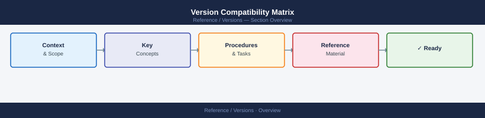

---
tags:
  - vsphere
  - vsan
  - nsx
  - vcf
  - tanzu
  - operations
---
# Version Compatibility Matrix

<div class="kb-summary">
Minimum product versions for 65+ features across vSphere Compute/HA, Storage/vSAN, NSX/Networking, VCF, Aria Suite, and Tanzu. Use this page to check whether a feature is available before upgrading.
</div>



Jump: [Compute / HA / DRS](#compute--ha--drs) · [Storage / vSAN](#storage--vsan) · [NSX / Networking](#nsx--networking) · [VCF](#vcf) · [Aria Suite](#aria-suite) · [Tanzu](#tanzu) · [Release timeline](#release-timeline)

---

```d2
direction: right

center: "Versions" {shape: hexagon}
compute_ha_drs: "Compute / HA / DRS" {shape: rectangle}
storage_vsan: "Storage / vSAN" {shape: rectangle}
nsx_networking: "NSX / Networking" {shape: rectangle}
vcf: "VCF" {shape: rectangle}
aria_suite: "Aria Suite" {shape: rectangle}
tanzu: "Tanzu" {shape: rectangle}

center -> compute_ha_drs
center -> storage_vsan
center -> nsx_networking
center -> vcf
center -> aria_suite
center -> tanzu
```

## Compute / HA / DRS

Minimum **ESXi** and **vCenter** version required. Both must meet the minimum unless noted.

| Feature | Min ESXi | Min vCenter | Notes |
|---|---|---|---|
| vSphere HA | 4.0 | 4.0 | Restarts VMs on host failure; requires shared storage |
| vSphere DRS | 4.0 | 4.0 | Live vMotion-based load balancing across cluster hosts |
| Live vMotion | 4.0 | 4.0 | Zero-downtime VM migration between hosts; shared storage required |
| Storage vMotion | 4.0 | 4.0 | Live VM disk migration; no shared storage required for source/dest |
| Fault Tolerance (FT) | 4.0 | 4.0 | Synchronous shadow VM; max 4 vCPUs; specific workloads only |
| EVC (Enhanced vMotion Compatibility) | 4.0 | 4.0 | CPU feature masking enabling cross-generation vMotion |
| vSphere Proactive HA | 6.5 | 6.5 | DRS evacuates hosts before hardware failure (vendor Health API) |
| vCHA (vCenter High Availability) | 6.5 | 6.5 | Active/passive/witness vCenter cluster; ~3 min failover |
| TPM 2.0 / Secure Boot | 6.7 | 6.7 | Measured boot with hardware attestation; requires physical TPM 2.0 |
| vSphere Trust Authority | 7.0 | 7.0 | Remote attestation cluster for encrypted VM key release |
| vLCM Image-Based Management | 7.0 | 7.0 | Desired-state ESXi images with firmware; replaces Update Manager |
| DRS ML-based rebalancing | 7.0 | 7.0 | Continuous workload analysis replacing threshold-based scoring |
| Native Key Provider | 7.0 U2 | 7.0 U2 | VM and vSAN encryption without an external KMS appliance |

---

## Storage / vSAN

`—` in the vSAN column means the feature applies to non-vSAN storage and the vSAN version is not relevant.

| Feature | Min ESXi | Min vCenter | Min vSAN | Notes |
|---|---|---|---|---|
| vSAN (hybrid) | 5.5 | 5.5 | 5.5 | Original release; SSD cache + HDD capacity disk groups (OSA) |
| vSAN All-Flash | 6.1 | 6.1 | 6.1 | SSD cache + SSD capacity; lower latency than hybrid |
| vSAN 2-node cluster | 6.1 | 6.1 | 6.1 | Two data hosts + witness VM at a third site |
| vSAN Stretched Cluster | 6.1 | 6.1 | 6.1 | Spans two sites; synchronous replication; ≤5 ms RTT |
| vSAN Dedup + Compression (OSA) | 6.2 | 6.2 | 6.2 | All-flash disk groups only; cluster-wide; incompatible with D@RE |
| vSAN Erasure Coding RAID-5/6 | 6.2 | 6.2 | 6.2 | RAID-5: FTT=1, ≥4 hosts, 1.33×; RAID-6: FTT=2, ≥6 hosts, 1.5× |
| vSAN D@RE Encryption | 6.6 | 6.6 | 6.6 | Data-at-rest encryption; requires KMIP KMS; incompatible with dedup on OSA |
| VMFS 6 (auto-UNMAP) | 6.5 | 6.5 | — | Automatic space reclamation on thin-provisioned VMFS volumes |
| First Class Disk (FCD) | 6.5 | 6.5 | — | Managed disk object for K8s PV backing via vSphere CSI |
| Storage I/O Control (SIOC) | 4.1 | 4.1 | — | Per-VM I/O shares on shared VMFS/NFS datastores during congestion |
| vSAN File Service (NFS/SMB) | 7.0 | 7.0 | 7.0 | File shares from vSAN; backs K8s ReadWriteMany PVCs |
| NVMe/TCP datastore | 7.0 | 7.0 | — | NVMe over TCP fabric datastores; near-local NVMe latency |
| vSAN HCI Mesh | 7.0 U1 | 7.0 U1 | 7.0 U1 | Cross-cluster vSAN iSCSI; compute cluster mounts remote vSAN |
| vSAN Express Storage Architecture (ESA) | 8.0 | 8.0 | 8.0 | NVMe-only; single storage pool; per-object compression; no dedup |
| vSAN Max (disaggregated) | 8.0 U1 | 8.0 U1 | 8.0 U1 | Storage-only vSAN cluster serving remote compute clusters |

---

## NSX / Networking

Min ESXi is the minimum for using that NSX-T feature on vSphere transport nodes. NSX-T can also run on bare-metal KVM hosts.

| Feature | Min ESXi | Min NSX-T | Notes |
|---|---|---|---|
| NSX-T Distributed Switching (N-VDS) | 6.7 | 2.4 | Host switch replacing vDS; required for Geneve TEP traffic |
| NSX-T Distributed Firewall (DFW) | 6.7 | 2.4 | Stateful L4/L7 firewall at vNIC level; kernel-resident |
| NSX-T T0 / T1 Gateways | 6.7 | 2.4 | Logical routers replacing NSX-V ESG and DLR |
| NSX-T BGP on T0 (eBGP to ToR) | 6.7 | 2.4 | Required for ECMP Active/Active T0 HA mode |
| NSX-T VDS Integration (replace N-VDS) | 7.0 | 3.0 | Standard vDS replaces N-VDS; simplifies transport node prep |
| NSX Federation (multi-site policy) | 7.0 | 3.0 | Global Manager syncing DFW policy across multiple NSX sites |
| NSX Distributed IDS/IPS | 7.0 | 3.0 | Signature-based intrusion detection in the ESXi kernel |
| NSX-T IPv6 DFW | 7.0 | 3.1 | IPv6 address matching and stateful tracking in DFW rules |
| NSX-T VRF-Lite on T0 | 7.0 | 3.1 | Multiple routing tables on a shared T0; logical tenant isolation |
| NSX-T OSPF on T0 | 7.0 | 3.2 | OSPF peering on T0 uplinks (in addition to BGP) |
| NSX Gateway Firewall (physical traffic) | 7.0 | 3.2 | Stateful firewall on T0/T1 Edge uplinks for north-south traffic |
| NSX DPU Offload (SmartNIC) | 7.0 U3 | 3.2 | DFW and data plane offloaded to DPU; frees host CPU |

---

## VCF

VCF version determines the bundled vSphere, vSAN, and NSX-T component versions. The table shows the minimum VCF version at which each capability became generally available.

| Feature / Capability | Min VCF | Bundled vSphere | Bundled NSX-T | Notes |
|---|---|---|---|---|
| Initial VCF GA (management domain) | 2.0 | 6.5 | 2.0 | NSX-V initially; NSX-T added in VCF 3.7 |
| VCF with NSX-T (fully integrated) | 4.0 | 7.0 | 3.0 | NSX-V removed; NSX-T mandatory from VCF 4.0 |
| VI Workload Domain | 4.0 | 7.0 | 3.0 | Additional vCenter + ESXi cluster managed by SDDC Manager |
| VCF on VxRail | 4.0 | 7.0 | 3.0 | Dell validated HCI nodes as VCF compute |
| Principal Storage (FC / NFS / vVols) | 4.2 | 7.0 U2 | 3.1 | Workload domains using external storage instead of vSAN |
| VCF Stretched Cluster | 4.3 | 7.0 U2 | 3.1 | Management and workload domains spanning two sites |
| Tanzu Workload Domain | 4.2 | 7.0 U2 | 3.1 | Supervisor Cluster provisioned and managed via SDDC Manager |
| VCF 5.0 (vSphere 8 stack) | 5.0 | 8.0 | 4.1 | vSAN ESA support; DPU offload; updated Aria Suite versions |
| VCF Multi-AZ (rack awareness) | 5.0 | 8.0 | 4.1 | Fault domains mapped to separate racks within a single site |
| VCF Automation (Aria Auto integration) | 5.0 | 8.0 | 4.1 | SDDC Manager exposes VCF domains to Aria Automation cloud accounts |

---

## Aria Suite

Version column refers to the Aria (formerly vRealize) product version. vSphere dependency noted where it applies.

| Product / Feature | Min Version | Min vSphere | Notes |
|---|---|---|---|
| Aria Operations (vROps) core monitoring | 6.0 | 6.0 | Adapter-based; vCenter adapter included out of the box |
| Aria Operations Predictive DRS integration | 6.4 | 6.5 | Pushes recommendations to DRS; requires Predictive DRS license |
| Aria Operations Kubernetes monitoring | 8.6 | 7.0 | Collects metrics from Supervisor and TKG clusters |
| Aria Operations capacity analytics | 8.0 | 6.7 | Workload balancing, rightsizing, and what-if capacity modelling |
| Aria Logs (Log Insight) core log search | 1.0 | 5.1 | Syslog + liagent collection; structured query language |
| Aria Logs Kubernetes log collection | 8.6 | 7.0 | K8s pod and namespace log forwarding |
| Aria Automation (vRA) 8.x REST API | 8.0 | 7.0 | Replaced SOAP-based vRA 7.x; blueprints via YAML/YAML2 |
| Aria Automation Terraform integration | 8.3 | 7.0 | Native Terraform provider execution within Aria Automation |
| Aria Networks (vRNI) NSX-T flow analysis | 4.0 | 6.7 | Ingests NSX-T flow data, security groups, and DFW rules |
| Aria Networks AWS / Azure support | 4.0 | — | Public cloud flow and security group ingestion |
| Aria Suite Lifecycle (LCM) | 1.0 | 6.5 | Centralised deploy, upgrade, and cert management for Aria Suite |
| Aria branding (formerly vRealize) | 8.10 | 7.0 | vRealize Suite renamed to Aria Suite; product APIs unchanged |

---

## Tanzu

Min vSphere refers to vCenter and ESXi. Where NSX-T is listed as optional, VDS-based networking can be used instead.

| Feature | Min vSphere | Min NSX-T | Notes |
|---|---|---|---|
| vSphere with Tanzu Supervisor GA | 7.0 | 3.0 | Embeds Kubernetes control plane in vCenter cluster |
| vSphere Pod Service (native containers) | 7.0 | 3.0 | Containers run directly in ESXi VMkernel alongside VMs |
| TKGS — TanzuKubernetesCluster CRD | 7.0 | 3.0 | Guest K8s clusters provisioned via Kubernetes API |
| vSphere with Tanzu + VDS (no NSX) | 7.0 U1 | — | HAProxy replaces NSX LB; limited to one AZ |
| TKG 1.x standalone (Cluster API) | 7.0 | 2.5 optional | Standalone K8s; NSX-T optional for pod networking |
| Tanzu Mission Control (TMC) SaaS GA | 7.0 | — | Manages TKG, TKGS, EKS, AKS from a SaaS control plane |
| TKG 2.0 (Cluster API v1 / ClusterClass) | 8.0 | 4.0 optional | Unified TKG based on upstream Cluster API v1 |
| Tanzu Kubernetes Grid Integrated (TKGI) | 6.7 U3 | 2.4 | Enterprise K8s with NSX-T; formerly PKS; EOL announced |
| Tanzu Workload Domain in VCF | VCF 4.2 | 3.1 | Supervisor managed by SDDC Manager within a VCF domain |

---

## Release timeline

Quick reference for major VMware release milestones.

| Product | Version | GA Date | Key additions |
|---|---|---|---|
| vSphere | 6.5 | Oct 2016 | vCHA, VMFS 6, HTML5 client, vSAN Encryption |
| vSphere | 6.7 | Apr 2018 | TPM 2.0, ELM (no PSC), vSAN Dedup improvements |
| vSphere | 7.0 | Apr 2020 | vSphere with Tanzu, vLCM, DRS ML, vSAN File Service |
| vSphere | 7.0 U1 | Oct 2020 | vSAN HCI Mesh, Tanzu with VDS, vSAN 2-node HCI Mesh |
| vSphere | 7.0 U2 | Mar 2021 | Native Key Provider, VCF Principal Storage |
| vSphere | 8.0 | Oct 2022 | vSAN ESA, DPU support, DRS improvements, vSphere 8 stack |
| vSphere | 8.0 U1 | Apr 2023 | vSAN Max, VCF Multi-AZ, ARM support improvements |
| NSX-T | 2.4 | Nov 2018 | Production T0/T1, DFW, N-VDS; first release without NSX-V dependency |
| NSX-T | 3.0 | Sep 2020 | VDS integration, Federation, Distributed IDS, VCF 4.0 alignment |
| NSX-T | 3.1 | Jan 2021 | VRF-Lite, IPv6 DFW, VCF 4.2 alignment |
| NSX-T | 3.2 | Oct 2021 | OSPF, Gateway Firewall, DPU Offload, VCF 4.3 alignment |
| NSX-T | 4.1 | Oct 2022 | vSphere 8 / VCF 5.0 alignment; NSX-T renamed to NSX |
| VCF | 4.0 | Sep 2020 | Mandatory NSX-T, vSphere 7.0, NSX-V removed |
| VCF | 5.0 | Oct 2022 | vSphere 8.0 stack, vSAN ESA, Multi-AZ, DPU support |
| vSAN | 6.2 | Mar 2016 | Dedup+Compression, Erasure Coding (RAID-5/6) |
| vSAN | 6.6 | Apr 2017 | D@RE Encryption (KMIP KMS), iSCSI targets |
| vSAN | 7.0 | Apr 2020 | File Service, NVMe/TCP, HCI Mesh (U1) |
| vSAN | 8.0 | Oct 2022 | Express Storage Architecture (ESA), NVMe-only pool |

---

*65+ features · Last updated: 2026-06-18*
