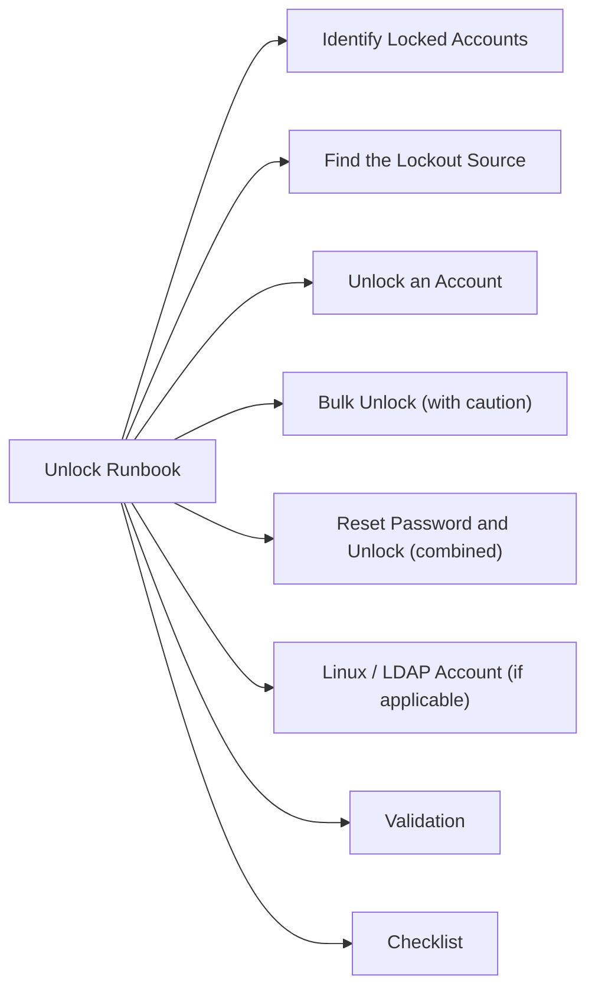

# Account Unlock Runbook



## Identify Locked Accounts

```powershell
# Find all locked-out accounts
Search-ADAccount -LockedOut | Select-Object Name, SamAccountName, LockedOut, LastLogonDate

# Check a specific account
Get-ADUser -Identity <username> -Properties LockedOut, BadLogonCount, BadPasswordTime, LockedOut, LastLogonDate
```

## Find the Lockout Source

```powershell
# On the PDC Emulator — query Security event log for lockout events (4740)
Get-WinEvent -ComputerName (Get-ADDomain).PDCEmulator -FilterHashtable @{
    LogName = 'Security'
    Id      = 4740
} | Where-Object { $_.Properties[0].Value -eq '<username>' } | Select-Object TimeCreated, Message | Select-Object -First 10
```

Key fields in Event 4740:
- **Caller Computer Name** — the source machine generating the bad password
- **Account Name** — the locked-out account

## Unlock an Account

```powershell
# Unlock single account
Unlock-ADAccount -Identity <username>

# Confirm unlock
Get-ADUser -Identity <username> -Properties LockedOut | Select-Object Name, LockedOut
```

## Bulk Unlock (with caution)

```powershell
# Unlock all locked accounts — use only after reviewing list
Search-ADAccount -LockedOut | Unlock-ADAccount
```

## Reset Password and Unlock (combined)

```powershell
Set-ADAccountPassword -Identity <username> -Reset -NewPassword (ConvertTo-SecureString "<NewPass>" -AsPlainText -Force)
Unlock-ADAccount -Identity <username>
```

## Linux / LDAP Account (if applicable)

```bash
# Check account status (PAM / pam_tally2)
pam_tally2 --user <username>

# Unlock
pam_tally2 --user <username> --reset

# faillock (RHEL 8+)
faillock --user <username>
faillock --user <username> --reset
```

## Validation

```powershell
# Confirm unlocked and can authenticate
Get-ADUser -Identity <username> -Properties LockedOut, BadLogonCount | Select-Object Name, LockedOut, BadLogonCount

# Test authentication (requires PSCredential)
$cred = Get-Credential -UserName "<domain>\<username>" -Message "Test auth"
(New-Object DirectoryServices.DirectoryEntry("LDAP://DC=domain,DC=com", $cred.UserName, $cred.GetNetworkCredential().Password)).distinguishedName
```

## Checklist

- [ ] Requester identity confirmed
- [ ] Account ownership verified (not a shared/service account without approval)
- [ ] Lockout source identified
- [ ] Root cause noted (stale cached credentials, scheduled task, bad app config, etc.)
- [ ] Account unlocked
- [ ] User confirmed able to authenticate
- [ ] Ticket updated with lockout source

## Common Causes

| Cause | Check | Action |
|---|---|---|
| Stale cached credentials | Mobile device / remote session | Clear saved credentials on device |
| Scheduled task with old password | Task Scheduler / cron | Update task credentials |
| Service account bad password | Services console / SC config | Update service password |
| Mapped drive with old creds | `net use` output | Remove and re-add drive mapping |
| Repeated failed MFA push | Azure AD Sign-In logs | Check for unauthorized attempts |
