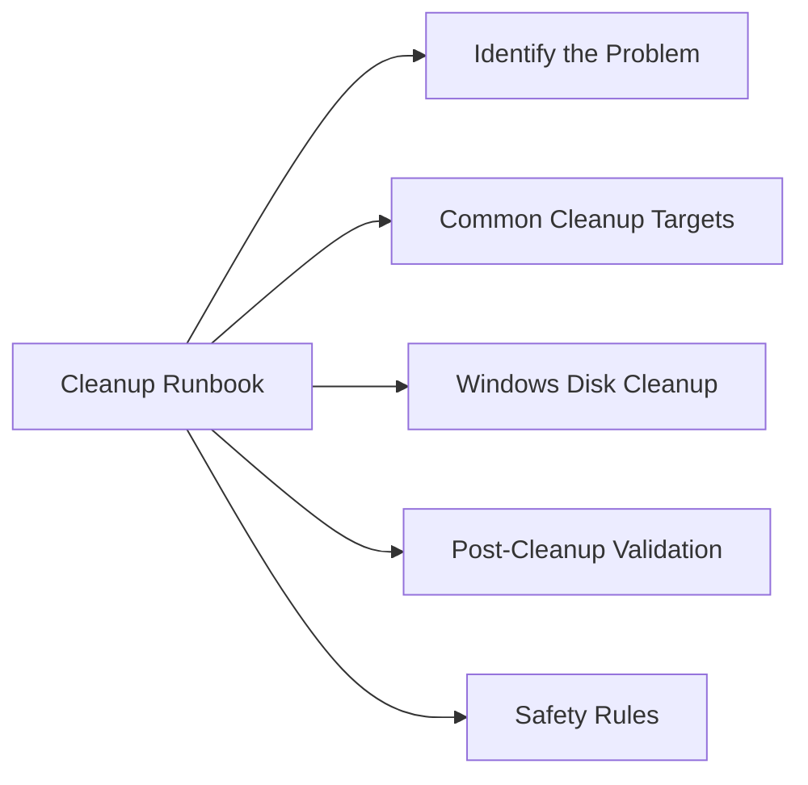

# Disk Space Cleanup Runbook



## Identify the Problem

```bash
# Filesystem usage overview
df -h

# Find top consumers by directory
du -sh /* 2>/dev/null | sort -rh | head -20
du -sh /var/* 2>/dev/null | sort -rh | head -10
du -sh /home/* 2>/dev/null | sort -rh | head -10
```

## Common Cleanup Targets

### Old Log Files

```bash
# Find compressed logs older than 30 days
find /var/log -type f -name '*.gz' -mtime +30 -ls

# Delete them (after review)
find /var/log -type f -name '*.gz' -mtime +30 -delete

# Check journald size
journalctl --disk-usage

# Vacuum old journal entries
journalctl --vacuum-time=30d
journalctl --vacuum-size=500M
```

### Package Cache (Linux)

```bash
# RHEL/CentOS
yum clean all
dnf clean all

# Ubuntu/Debian
apt-get clean
apt-get autoremove
```

### Old Kernel Packages

```bash
# Show installed kernels (keep at least current + 1)
rpm -q kernel
dpkg --list 'linux-image*'

# Remove old kernels (RHEL)
dnf remove --oldinstallonly --setopt installonly_limit=2 kernel
```

### Core Dumps

```bash
find / -name "core" -type f -mtime +7 -ls
find /var/crash -type f -ls
```

### Temp Files

```bash
find /tmp -type f -mtime +7 -ls
find /var/tmp -type f -mtime +30 -ls
```

## Windows Disk Cleanup

```powershell
# Show disk usage by volume
Get-Volume | Select DriveLetter, FileSystemLabel, Size, SizeRemaining

# Clean Windows Update cache
Stop-Service wuauserv
Remove-Item C:\Windows\SoftwareDistribution\Download\* -Recurse -Force
Start-Service wuauserv

# Temp files
Remove-Item $env:TEMP\* -Recurse -Force -ErrorAction SilentlyContinue
```

## Post-Cleanup Validation

```bash
df -h         # confirm free space improved
ls -lt /var/log/ | head -20    # confirm logs still present and current
# Confirm application still running and logging correctly
```

## Safety Rules

- Never delete files in `/proc`, `/sys`, `/dev`
- Never delete active database files or application data without approval
- Document all files removed with reason
