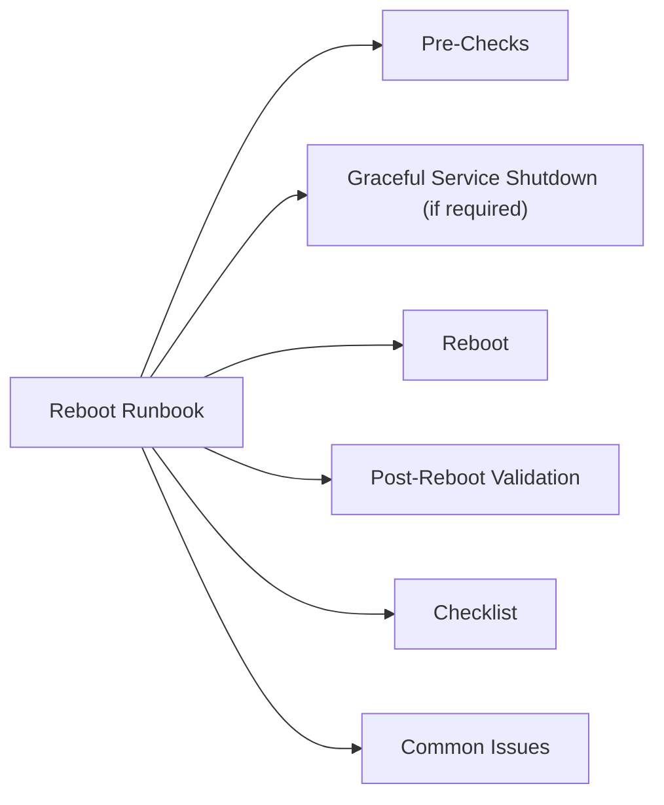

# Server Reboot Runbook



## Pre-Checks

```bash
# Who is logged in
who
w

# System load and uptime
uptime

# Failed services
systemctl --failed

# Active jobs (backup agents, scheduled tasks)
ps aux | grep -E "backup|job|agent"
```

Notify application owners and confirm maintenance window approval before proceeding.

## Graceful Service Shutdown (if required)

```bash
systemctl stop <service>
systemctl status <service>    # confirm stopped
```

## Reboot

**Linux:**
```bash
sudo reboot
# Scheduled with warning:
sudo shutdown -r +5 "Rebooting for maintenance"
```

**Windows:**
```powershell
Restart-Computer -Force
# Scheduled:
shutdown /r /t 300 /c "Rebooting for maintenance"
```

**VMware VM (PowerCLI):**
```powershell
Restart-VMGuest -VM <vmname>
```

## Post-Reboot Validation

```bash
# Confirm server is responding
ping -c 4 <server_ip>

# Boot time
uptime
who -b

# Failed services
systemctl --failed

# Check critical services
systemctl status <service1> <service2>

# Review boot errors
journalctl -b -p err
```

**Windows:**
```powershell
# Check any auto-start service not running
Get-Service | Where-Object { $_.Status -ne 'Running' -and $_.StartType -eq 'Automatic' }

# Recent system errors
Get-EventLog -LogName System -EntryType Error -Newest 20
```

## Checklist

- [ ] Change approval confirmed
- [ ] Active users notified and logged off
- [ ] Application services gracefully stopped
- [ ] Reboot initiated
- [ ] Server responds to ping
- [ ] All services running
- [ ] Application health confirmed
- [ ] Monitoring alert cleared

## Common Issues

| Issue | Check | Action |
|---|---|---|
| Server doesn't respond | Console/iDRAC | Check BMC console for boot errors |
| Service fails after reboot | `systemctl --failed` | Investigate; manual start if needed |
| Boot loop or fsck running | Console | Wait for fsck to complete; investigate disk |
