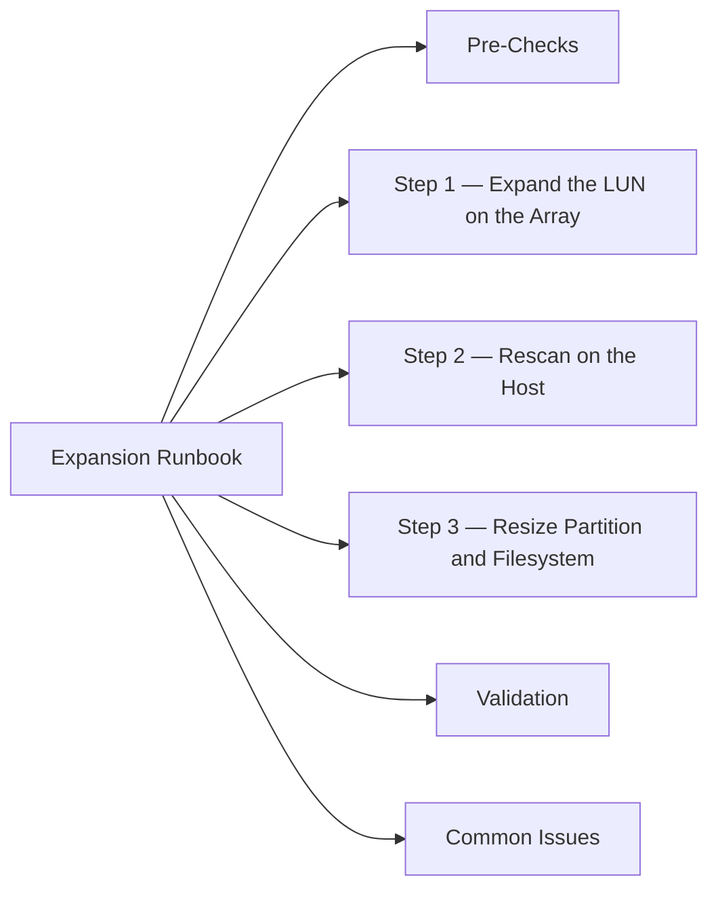

# Storage Volume Expansion Runbook

Controlled process for expanding a storage volume and resizing the filesystem on the host.



## Pre-Checks

```bash
# Current host disk state
df -h
lsblk
multipath -ll          # confirm all paths healthy

# Check array pool capacity (confirm space available)
# On the array management console or CLI before expanding
```

## Step 1 — Expand the LUN on the Array

**NetApp ONTAP:**
```bash
volume size -vserver <svm> -volume <vol> -new-size <size>
```

**Pure FlashArray:**
```bash
purecli volume setattr <volume_name> --size <new_size>
```

**Dell Unity:**
```bash
uemcli -d <ip> /stor/config/lun -id <lun_id> set -size <new_size>
```

**Dell PowerMax (Solutions Enabler):**
```bash
symconfigure -sid <sid> commit -noprompt \
    "modify dev <dev_id>, size=<new_size_cyl>;"
```

## Step 2 — Rescan on the Host

**Linux:**
```bash
# Rescan SCSI bus
echo 1 > /sys/class/scsi_device/<host:bus:target:lun>/device/rescan

# Or rescan all
for host in /sys/class/scsi_host/host*/; do
    echo "- - -" > ${host}scan
done

# Refresh multipath
multipathd reconfigure
multipath -ll
```

**Windows:**
```powershell
Update-HostStorageCache
Get-Disk | Where-Object Size -GT 0
```

## Step 3 — Resize Partition and Filesystem

**Linux (LVM):**
```bash
# Resize physical volume (if using multipath device)
pvresize /dev/mapper/<mpathX>

# Extend logical volume
lvextend -l +100%FREE /dev/<vg>/<lv>

# Resize filesystem
resize2fs /dev/<vg>/<lv>          # ext4
xfs_growfs /dev/<vg>/<lv>         # xfs
```

**Windows:**
```powershell
# Expand partition to max available
$disk = Get-Disk -Number <n>
$part = Get-Partition -DiskNumber $disk.Number
Resize-Partition -DiskNumber $disk.Number -PartitionNumber $part.PartitionNumber -Size ($part | Get-PartitionSupportedSize).SizeMax
```

## Validation

```bash
df -h                     # confirm new size visible
lsblk                     # confirm partition expanded
multipath -ll             # confirm no path issues post-rescan
```

## Common Issues

| Issue | Check | Action |
|---|---|---|
| Rescan shows old size | Rescan not complete | Re-run rescan; check multipath |
| pvresize fails | PV device name | Verify `/dev/mapper/` path |
| Filesystem won't grow | Partition not extended first | Extend partition before filesystem |
| Windows disk shows unallocated | Partition not extended | Use `Resize-Partition` |
