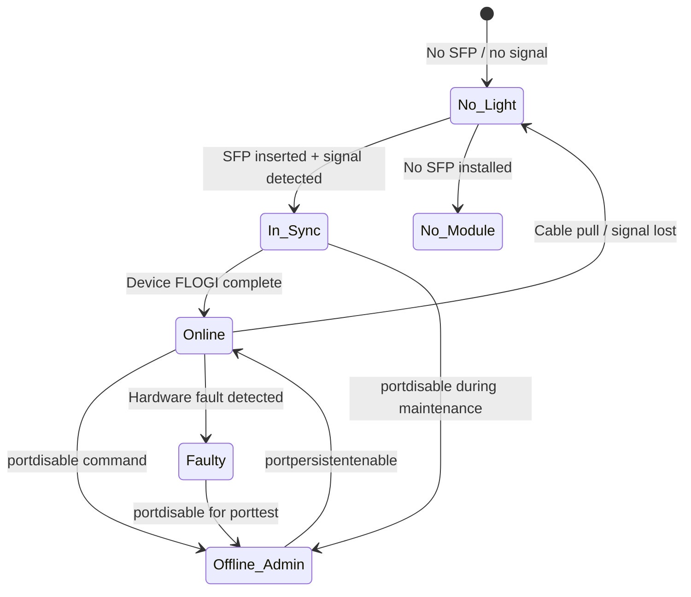
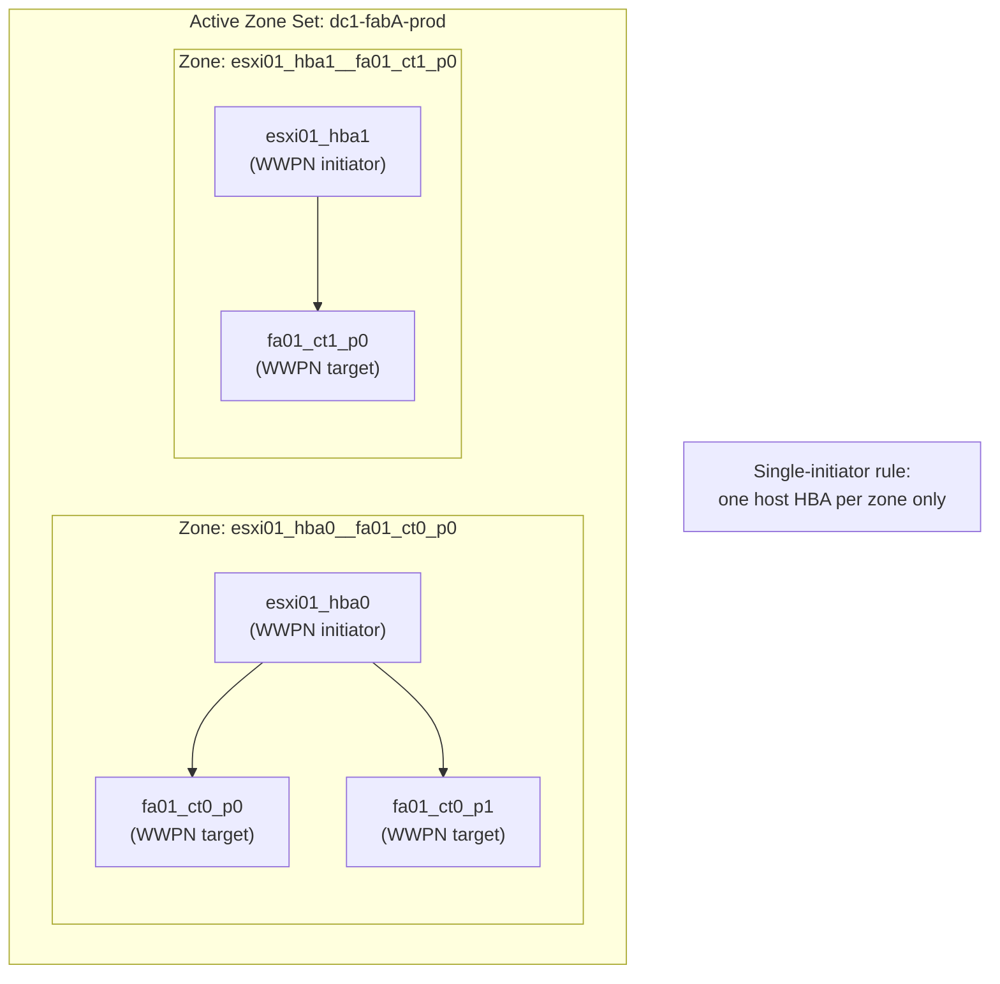

# FabricOS — Components

> Part of the [Architecture](../) reference.

---

## Port State Machine



## Port Types

| Port Type | Role |
|---|---|
| E_Port | ISL — connects to another switch |
| F_Port | Fabric port — connects to host HBA or storage target |
| N_Port | Node port — on the host or storage device |
| D_Port | Diagnostic port — used for link health tests |
| EX_Port | Extended E_Port — used for FC Routing between fabrics |

```bash
# Check port type and state
portshow <port-number>

# Check all ports
switchshow

# Show detailed port statistics
portstatsshow <port-number>
```

---

## Zone Membership Model



## Zoning

Zoning controls initiator-to-target access. Best practice: **single-initiator / single-target** zones.

```bash
# Show active zone configuration
cfgshow      # Full zone database (all zones, zone sets)
zoneshow     # Active zone configuration only

# Check if a specific WWPN is zoned
zoneshow | grep <wwpn>

# Show all aliases
alishow

# Show zone database size (relevant for large fabrics)
cfgsave      # Saves zone database to persistent storage
cfgsize      # Shows current zone database size vs limit
```

Activating a zone set replaces the currently active zone set on the fabric — always verify before activating to avoid removing existing zones.

---

## Fabric Health Checks

```bash
# Overall fabric health
fabricshow

# Port error summary (check for CRC, loss of sync, etc.)
porterrshow

# Show fabric routing table
topologyshow

# Show name server (all logged-in devices)
nsshow

# Check switch temperature and hardware health
sensorshow
tempshow
psshow   # Power supply status
fanshow  # Fan status
```

---

## ISLs

ISLs (Inter-Switch Links) connect Brocade switches within a fabric to form the fabric topology. Trunk groups aggregate multiple physical ISL ports for bandwidth and resilience.

```bash
# ISL status and utilisation
islshow

# Trunk group status
trunkshow

# ISL topology
topologyshow
```

| Parameter | Standard |
|---|---|
| Minimum ISLs per switch pair | 2 (trunk group) |
| ISL speed | Equal to or greater than connected host/array port speed |
| Trunk group configuration | `porttrunkarea` configured on ISL ports |
| FSPF cost | Default (auto) unless explicit traffic engineering is required |

---

## Ports

Brocade switch ports are managed per slot/port notation (e.g., `0/1`). Port types, states, and speeds are configurable per port.

```bash
# Show port state and connected device
portshow <slot/port>

# Show port statistics
portstatsshow <slot/port>

# Error summary across all ports
porterrshow

# Enable / disable a port
portdisable <slot/port>
portenable <slot/port>

# Set port speed
portcfgspeed <slot/port> <speed>
# speed: 0=auto, 4, 8, 16, 32 (Gbps)
```

| State | Meaning |
|---|---|
| Online | Healthy, device logged in |
| No_Light | No SFP or no signal |
| No_Module | No SFP installed |
| Offline (Admin) | Administratively disabled |
| In_Sync | Link up but no device logged in |
| Faulty | Hardware fault |
