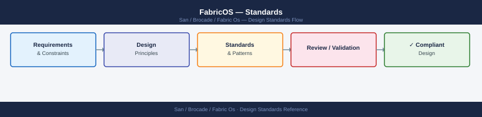

---
tags:
  - architecture
  - san
---
# FabricOS — Standards

FabricOS design standards: ISL oversubscription limits, trunking requirements, fabric-wide consistency settings, and zoning naming conventions.

*Applies to: Brocade FOS 9.x*

---

## Switch Naming

---

## Security Standards

| Control | Standard |
|---|---|
| SNMP | SNMPv3 only; community strings in vault; quarterly rotation |
| Management access | SSH only; Telnet disabled; `sshutil disable telnet` |
| RADIUS/TACACS+ | All fabrics must use central AAA; local accounts for break-glass only |
| Audit logging | `auditcfg --set 1` — all logins and config changes logged |

---

## Firmware Standards

- All switches in a fabric must run the same Fabric OS version (FOS)
- New FOS versions applied to Fabric B first, validated, then Fabric A
- Minimum: stay within 1 major FOS version of Broadcom's current release
- Check FOS EOL: [support.broadcom.com](https://support.broadcom.com) → Product Lifecycle

---

## See also

- [Fabric Os — How It Works](how-it-works/)
- [Fabric Os — Integrations](integrations/)
- [Fabric Os — Deploy](../deploy/)
