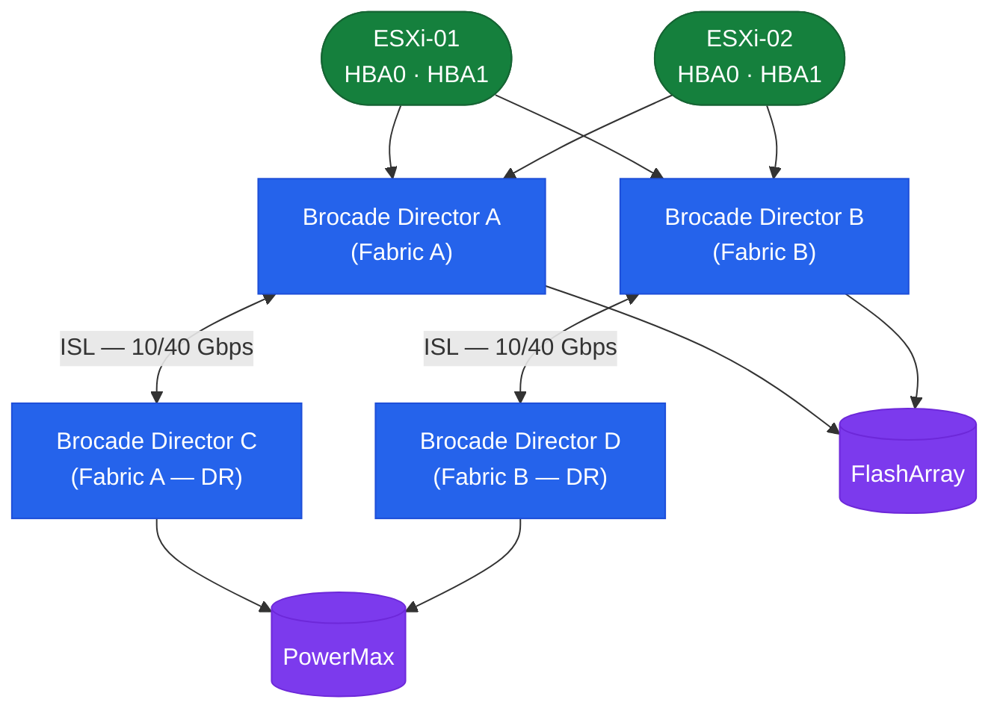
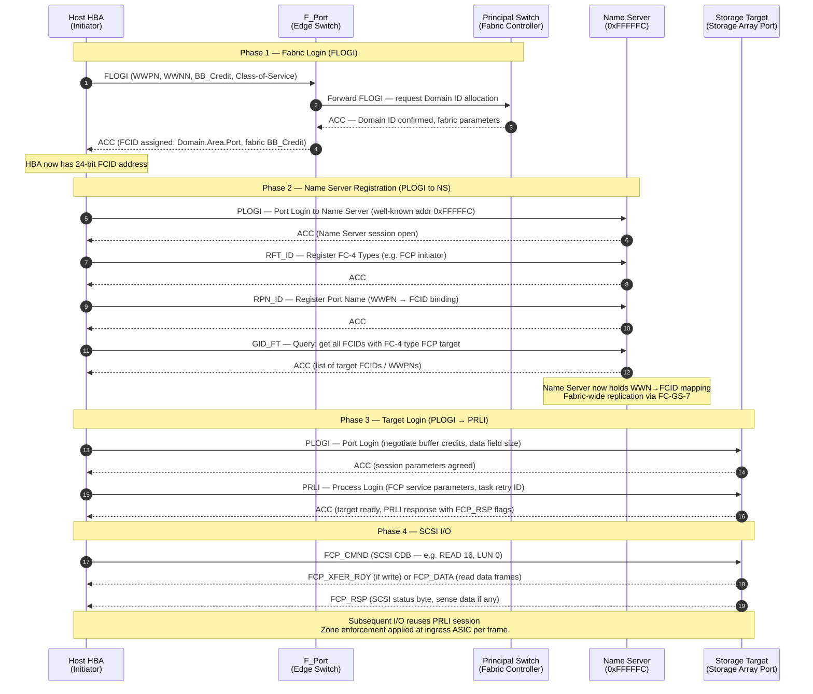

---
tags:
  - architecture
  - san
---
# Brocade Fabric OS — How It Works


<div class="kb-summary">
How It Works reference covering Overview, SAN Fabric Topology, Principal Switch and Domain ID, Name Server and Fabric Services, Zoning and 4 more sections.

*Applies to: Brocade FOS 9.x*
</div>

## Overview

Fabric OS (FOS) runs on Brocade/Broadcom SAN switches. Fabrics are deployed in a core-edge topology with ISLs (trunked) connecting edge switches to core directors. One switch per fabric is elected as the **principal switch**, which owns the fabric name server and manages domain ID assignments.

## SAN Fabric Topology


```text
┌────────────────────────────────── Brocade Fabric OS — How It Works ───────────────────────────────────┐
│                                                                                                       │
│   ┌───────────────────────────────────────────────────────────────────────────────────────────────┐   │
│   │        FOS operational flow: fabric init, device login, zone enforcement, frame routing       │   │
│   │     Fabric init: switches exchange E_Port BRCDs, elect principal switch, assign domain IDs    │   │
│   │      Device login: HBA sends FLOGI, fabric assigns FCID, FCNS records WWN-to-FCID mapping     │   │
│   │       Zone enforcement: each frame checked against active zone set at ingress port ASIC       │   │
│   │     Frame routing: FSPF computes least-cost path; ISL trunk distributes load across links     │   │
│   └───────────────────────────────────────────────────────────────────────────────────────────────┘   │
│                                                                                                       │
│    Fabric init -> device login (FLOGI/PLOGI) -> zone check -> FSPF routing -> delivery                │
│                                                                                                       │
│                  ▼                                ▼                                ▼                  │
│                                                                                                       │
│   ┌─────────────────────────────┐  ┌─────────────────────────────┐  ┌─────────────────────────────┐   │
│   │         Fabric Init         │  │         Device Login        │  │        Frame Routing        │   │
│   │        E_Port detect        │  │        FLOGI from HBA       │  │         FSPF lookup         │   │
│   │       Principal elect       │  │        FCID assigned        │  │        ISL selection        │   │
│   │       Domain ID assign      │  │        FCNS register        │  │          Zone check         │   │
│   │         Zone DB push        │  │          PLOGI/PRLI         │  │         Credit flow         │   │
│   │        Fabric stable        │  │          I/O begins         │  │         Error detect        │   │
│   └─────────────────────────────┘  └─────────────────────────────┘  └─────────────────────────────┘   │
│                                                                                                       │
│    Zone enforcement happens in ASIC at ingress; denied frames dropped before routing                  │
│                                                                                                       │
│                  ▼                                ▼                                ▼                  │
│                                                                                                       │
│   ┌───────────────────────────────────────────────────────────────────────────────────────────────┐   │
│   │      Phase       │      Event       │     Initiator     │      Result      │      Notes       │   │
│   │       Init       │  BRCD exchange   │      Switches     │  Fabric formed   │      ISL up      │   │
│   │      Login       │      FLOGI       │        HBA        │  FCID assigned   │   FCNS updated   │   │
│   │     Routing      │    FSPF calc     │        FOS        │  Path selected   │    ISL trunk     │   │
│   └───────────────────────────────────────────────────────────────────────────────────────────────┘   │
│                                                                                                       │
│    Physical: HBA in server -> FC cable -> switch port -> ISL -> storage target port                   │
│                                                                                                       │
│    Key terms:                                                                                         │
│                                                                                                       │
│    FLOGI          = Fabric Login; first FC login HBA performs to join the fabric                      │
│    FCID           = Fabric Controller ID; 24-bit address assigned to device by fabric                 │
│    PLOGI          = Port Login; HBA-to-target login establishing parameters for I/O                   │
│    PRLI           = Process Login; FCP/NVMe service parameters negotiated after PLOGI                 │
│    E_Port         = Expansion port; ISL port connecting two FC switches                               │
│    Principal switch = Switch elected to manage domain IDs; owns zone DB distribution                  │
│    Domain ID      = Unique 8-bit number per switch in a fabric (1-239 valid range)                    │
│    FSPF           = Fabric Shortest Path First; link-state protocol for optimal routing               │
│    ISL trunk      = Multiple ISL links aggregated; FSPF load-balances frames across them              │
│    Zone check     = ASIC validates source/destination WWN pair against active zone set                │
│    Buffer credit  = Per-link flow control token; receiver grants credit to allow transmission         │
│    BRCD exchange  = Brocade-specific capability exchange over E_Port during fabric init               │
│                                                                                                       │
└───────────────────────────────────────────────────────────────────────────────────────────────────────┘
```

## FC Fabric Login Sequence

The sequence below shows the complete login flow from a cold HBA to active SCSI I/O. WWN assignment happens at FLOGI; the fabric controller (principal switch) records the mapping in the distributed Name Server before the initiator can discover or contact any target.



| Login Phase | Frame Type | Key Data Exchanged | Result |
|---|---|---|---|
| FLOGI | ELS (Extended Link Service) | WWPN, WWNN, BB_Credit request | FCID assigned by fabric |
| PLOGI to NS | ELS | Port login to 0xFFFFFC | Name Server session open |
| RFT_ID / RPN_ID | FC-GS (Generic Services) | FC-4 type + WWPN binding | WWN registered in Name Server |
| GID_FT | FC-GS query | Request target FCIDs | Initiator learns reachable targets |
| PLOGI to target | ELS | Buffer credits, data field size | Per-port session established |
| PRLI | ELS | FCP service parameters, task retry | Target ready for SCSI commands |
| FCP_CMND / FCP_RSP | FCP (FC-4 layer) | SCSI CDB, data, status | I/O completed |

## Name Server and Fabric Services

When a device logs into the fabric, it registers its WWPN, WWNN, and FC4 type with the name server. Other devices query the name server to discover targets.

```bash
nsshow        # devices registered in local name server
nsallshow     # name server across entire fabric (all domains)
nslookup <wwpn>
portloginshow # FLOGI database — all logged-in devices
```

## Zoning

| Zone Type | Definition | Use Case |
|---|---|---|
| Soft zoning (WWN) | Zone membership by WWPN | Preferred for production — portable across port moves |
| Hard zoning (port-based) | Zone membership by domain ID + port | Use only when WWN flexibility not required |
| Peer zone | Multiple initiators share targets without seeing each other | Multi-host shared-target environments |

**Single-initiator zone model (required):**
```yaml
Zone: esxi01_hba0__pure_ct0_p0
  Member: esxi01_hba0   (WWPN: 10:00:00:00:c9:12:34:56)   ← one initiator only
  Member: pure_ct0_p0   (WWPN: 52:4a:93:7c:00:00:00:01)   ← one or more targets
```

Never place two initiator WWPNs in the same zone. This creates a blast radius risk.

## ISL Trunking

Multiple physical ISL ports between the same pair of switches are grouped into a trunk (single logical high-bandwidth link). All links in a trunk must be same speed and between the same switch pair.

```bash
islshow                    # show ISL status
trunkshow                  # show trunk group membership and master port
portperfshow               # show ISL throughput
porttrunkarea --enable <slot/port>
```

## Virtual Fabrics

Virtual Fabrics (VF) partition a single physical chassis into multiple independent logical switches, each with its own Fabric ID (FID). Ports are assigned to exactly one logical switch at a time.

```bash
lscfg --show               # list logical switches and their FIDs
setContext <fid>           # switch CLI context to a specific FID
lscfg --config <fid> -port <slot/port>   # assign port to logical switch
```

## MAPS — Monitoring and Alerting Policy Suite

MAPS provides threshold-based automated health monitoring. It monitors port error counters, ISL utilization, C3 discard rates, BB credit zero (slow drain), switch environment, fabric events, and security events.

```bash
mapsdashboard --show    # current MAPS health dashboard
mapsdb --show           # all triggered MAPS alerts
mapspolicy --show       # active MAPS policy
```

## FCIP — Fibre Channel over IP

FCIP extends a Fibre Channel fabric over an IP WAN connection for long-distance replication (SRDF, RecoverPoint). Brocade 7810/7840 extension platforms provide FCIP gateway functionality. Target IP network latency: <5 ms one-way for synchronous replication.

```bash
fciptunnel --show       # FCIP tunnel status
fcipcircuit --show      # FCIP circuit status
fcipcircuit --show -perf
```

---

## See also

- [Fabric Os — Design Standards](design-standards/)
- [Fabric Os — Integrations](integrations/)
- [Fabric Os — Deploy](../deploy/)
