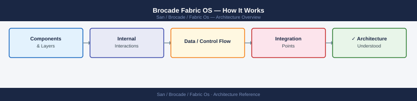
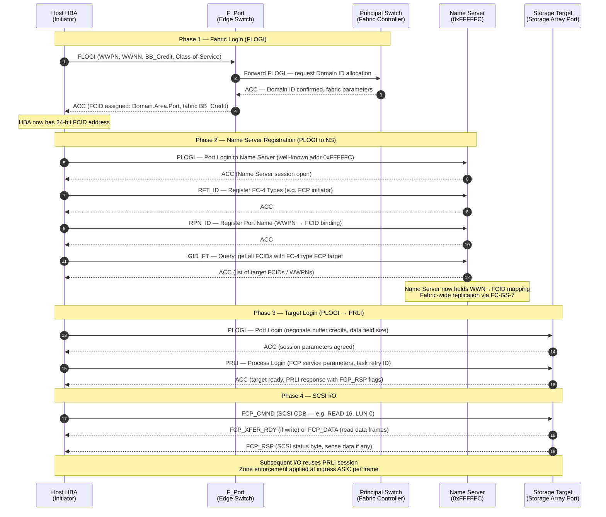

---
tags:
  - architecture
  - san
---
# Brocade Fabric OS — How It Works

<div class="kb-summary">
How It Works reference covering Overview, SAN Fabric Topology, Principal Switch and Domain ID, Name Server and Fabric Services, Zoning and 4 more sections.

*Applies to: Brocade FOS 9.x*
</div>


```d2
direction: right

hosts: Servers {
  h1: Server 1 (dual HBA) {shape: rectangle}
  h2: Server 2 (dual HBA) {shape: rectangle}
  h3: Server 3 (dual HBA) {shape: rectangle}
}

fabric_a: Fabric A (primary) {
  sw1: Switch A1\n(principal) {shape: rectangle}
  sw2: Switch A2 {shape: rectangle}
  sw1 -> sw2: ISL (E_Port)
}

fabric_b: Fabric B (redundant) {
  sw3: Switch B1\n(principal) {shape: rectangle}
  sw4: Switch B2 {shape: rectangle}
  sw3 -> sw4: ISL (E_Port)
}

storage: Storage Arrays {
  arr1: Array 1 (target ports) {shape: cylinder}
  arr2: Array 2 (target ports) {shape: cylinder}
}

hosts.h1 -> fabric_a.sw1: F_Port
hosts.h1 -> fabric_b.sw3: F_Port
hosts.h2 -> fabric_a.sw2: F_Port
hosts.h2 -> fabric_b.sw4: F_Port
hosts.h3 -> fabric_a.sw1: F_Port
hosts.h3 -> fabric_b.sw3: F_Port

fabric_a.sw1 -> storage.arr1: F_Port
fabric_a.sw2 -> storage.arr2: F_Port
fabric_b.sw3 -> storage.arr1: F_Port
fabric_b.sw4 -> storage.arr2: F_Port
```

## Overview

Fabric OS (FOS) runs on Brocade/Broadcom SAN switches. Fabrics are deployed in a core-edge topology with ISLs (trunked) connecting edge switches to core directors. One switch per fabric is elected as the **principal switch**, which owns the fabric name server and manages domain ID assignments.

## SAN Fabric Topology

## FC Fabric Login Sequence

The sequence below shows the complete login flow from a cold HBA to active SCSI I/O. WWN assignment happens at FLOGI; the fabric controller (principal switch) records the mapping in the distributed Name Server before the initiator can discover or contact any target.



| Login Phase | Frame Type | Key Data Exchanged | Result |
|---|---|---|---|
| FLOGI | ELS (Extended Link Service) | WWPN, WWNN, BB_Credit request | FCID assigned by fabric |
| PLOGI to NS | ELS | Port login to 0xFFFFFC | Name Server session open |
| RFT_ID / RPN_ID | FC-GS (Generic Services) | FC-4 type + WWPN binding | WWN registered in Name Server |
| GID_FT | FC-GS query | Request target FCIDs | Initiator learns reachable targets |
| PLOGI to target | ELS | Buffer credits, data field size | Per-port session established |
| PRLI | ELS | FCP service parameters, task retry | Target ready for SCSI commands |
| FCP_CMND / FCP_RSP | FCP (FC-4 layer) | SCSI CDB, data, status | I/O completed |

## Name Server and Fabric Services

When a device logs into the fabric, it registers its WWPN, WWNN, and FC4 type with the name server. Other devices query the name server to discover targets.

```bash
nsshow        # devices registered in local name server
nsallshow     # name server across entire fabric (all domains)
nslookup <wwpn>
portloginshow # FLOGI database — all logged-in devices
```


```text title="Expected output"
Node Name     Node Index  Fabric Index  IP Address      FC Port Count
brocade-sw01  0           0             192.168.1.100   16
brocade-sw02  1           1             192.168.1.101   16
brocade-sw03  2           2             192.168.1.102   16

Switch Name   Domain ID  Principal  IP Address      Status
brocade-sw01  1          Yes        192.168.1.100   Online
brocade-sw02  2          No         192.168.1.101   Online
brocade-sw03  3          No         192.168.1.102   Online

WWPN: 50:00:14:40:1b:2c:3d:4e
Symbolic Node Name: esx-host-01.prod.local
IP Address: 10.20.30.40
Port Index: 5

Port  Status  Speed  Connected Node Name        Connected WWPN
0     Online  16Gb  storage-array-01           50:00:09:73:48:2f:1a:5b
1     Online  16Gb  esx-host-02                50:00:14:40:1b:2c:3d:4f
2     Online  16Gb  esx-host-03                50:00:14:40:1b:2c:3d:50
3     Online  16Gb  tape-library-backup        50:00:0e:1e:59:3a:2b:6c
4     Offline  —    —                          —
...
```

!!! warning "Common errors"
    **`nslookup: command not found`** — Use `nsshow` or `nslookup wwpn` with the full WWPN format (50:xx:xx:xx:xx:xx:xx:xx) instead.
    **`portloginshow: Access denied`** — Run the command with admin credentials or ensure your user role has fabric-wide read permissions.
## Zoning

| Zone Type | Definition | Use Case |
|---|---|---|
| Soft zoning (WWN) | Zone membership by WWPN | Preferred for production — portable across port moves |
| Hard zoning (port-based) | Zone membership by domain ID + port | Use only when WWN flexibility not required |
| Peer zone | Multiple initiators share targets without seeing each other | Multi-host shared-target environments |

**Single-initiator zone model (required):**
```yaml
Zone: esxi01_hba0__pure_ct0_p0
  Member: esxi01_hba0   (WWPN: 10:00:00:00:c9:12:34:56)   ← one initiator only
  Member: pure_ct0_p0   (WWPN: 52:4a:93:7c:00:00:00:01)   ← one or more targets
```

Never place two initiator WWPNs in the same zone. This creates a blast radius risk.

## ISL Trunking

Multiple physical ISL ports between the same pair of switches are grouped into a trunk (single logical high-bandwidth link). All links in a trunk must be same speed and between the same switch pair.

```bash
islshow                    # show ISL status
trunkshow                  # show trunk group membership and master port
portperfshow               # show ISL throughput
porttrunkarea --enable <slot/port>
```


```text title="Expected output"
ISL Status:
  0/0: Online        Fabric_ID: 1  Speed: 16Gb  Distance: 2km
  0/1: Online        Fabric_ID: 1  Speed: 16Gb  Distance: 2km
  1/0: Online        Fabric_ID: 2  Speed: 8Gb   Distance: 5km
  1/1: Offline       Fabric_ID: 2  Speed: N/A   Distance: N/A

Trunk Group: TG_01
  Master Port: 0/0
  Member Ports: 0/0, 0/1, 0/2
  Status: Active

ISL Performance (last 10 seconds):
  Port 0/0: TX: 2.4 Gbps  RX: 2.3 Gbps  Frames: 1,245,632
  Port 0/1: TX: 1.8 Gbps  RX: 1.9 Gbps  Frames: 987,451
  Port 1/0: TX: 0.6 Gbps  RX: 0.7 Gbps  Frames: 342,108

Enabling trunk area on slot 1, port 0...
Operation completed successfully.
```

!!! warning "Common errors"
    **`porttrunkarea: Invalid slot/port format`** — Use the format `slot/port` (e.g., `1/0`) and verify the port exists with `islshow`.
    **`porttrunkarea: Port is not an ISL`** — Trunk area can only be enabled on ISL ports; confirm the port is online and connected to another switch.
## Virtual Fabrics

Virtual Fabrics (VF) partition a single physical chassis into multiple independent logical switches, each with its own Fabric ID (FID). Ports are assigned to exactly one logical switch at a time.

```bash
lscfg --show               # list logical switches and their FIDs
setContext <fid>           # switch CLI context to a specific FID
lscfg --config <fid> -port <slot/port>   # assign port to logical switch
```


```text title="Expected output"
Fabric OS v9.1.0 (build 2024.02.15)
Logical Switch Configuration:
FID  Name              Status    Member Ports
1    prod-fabric-01    Online    0/0-0/47
2    dr-fabric-02      Online    1/0-1/47
3    test-fabric-03    Offline   2/0-2/23
4    maint-fabric-04   Online    3/0-3/15
...

Current context: FID 1 (prod-fabric-01)
Context switched to FID 2 (dr-fabric-02)

Port 0/24 successfully assigned to FID 2
Configuration saved to flash memory
```

!!! warning "Common errors"
    **`error: invalid FID <fid> -- FID does not exist`** — Verify the FID exists with `lscfg --show` and use a valid numeric FID value.
    **`error: port <slot/port> already assigned to FID <fid>`** — Remove the port from its current FID using `lscfg --config <current_fid> -port <slot/port> -remove` before reassigning it.
    **`error: insufficient privileges to modify fabric configuration`** — Ensure your user account has admin or fabric-admin role; check with `userconfig --show`.
## MAPS — Monitoring and Alerting Policy Suite

MAPS provides threshold-based automated health monitoring. It monitors port error counters, ISL utilization, C3 discard rates, BB credit zero (slow drain), switch environment, fabric events, and security events.

```bash
mapsdashboard --show    # current MAPS health dashboard
mapsdb --show           # all triggered MAPS alerts
mapspolicy --show       # active MAPS policy
```


```text title="Expected output"
MAPS Health Dashboard:
  System Health: Healthy
  CPU Usage: 42%
  Memory Usage: 58%
  Temperature: 38°C
  Fan Status: OK
  Power Supply: OK
  Last Update: 2024-01-15 14:32:18 UTC

MAPS Triggered Alerts:
  Alert ID: 0x0042a1c8 | Severity: Warning | Rule: PortErrorThreshold | Port: 15 | Timestamp: 2024-01-15 13:45:22
  Alert ID: 0x0042a1d2 | Severity: Info | Rule: MemoryUsage | Threshold: 65% | Timestamp: 2024-01-15 12:18:55
  Alert ID: 0x0042a1e5 | Severity: Critical | Rule: FabricWildcardZone | Switch: switch-prod-02 | Timestamp: 2024-01-15 11:03:44

Active MAPS Policy:
  Policy Name: Production_Fabric_Policy
  Status: Enabled
  Rules Loaded: 47
  Last Modified: 2024-01-10 09:22:15 UTC
  Monitoring Interval: 30 seconds
```

!!! warning "Common errors"
    **`mapsdashboard: command not found`** — Verify MAPS is installed and the admin CLI is in your PATH, or use the full path `/opt/brocade/bin/mapsdashboard`.
    **`MAPS service is not running`** — Start the MAPS daemon with `systemctl start brocade-maps` or equivalent on your platform.
    **`Permission denied`** — Run the commands with appropriate admin privileges using `sudo` or ensure your user is in the `brocade-admin` group.
## FCIP — Fibre Channel over IP

FCIP extends a Fibre Channel fabric over an IP WAN connection for long-distance replication (SRDF, RecoverPoint). Brocade 7810/7840 extension platforms provide FCIP gateway functionality. Target IP network latency: <5 ms one-way for synchronous replication.

```bash
fciptunnel --show       # FCIP tunnel status
fcipcircuit --show      # FCIP circuit status
fcipcircuit --show -perf
```


```text title="Expected output"
Tunnel Name          Admin Status  Oper Status  Remote IP       Local IP        Compression
tunnel-1             Online        Online       192.168.100.45  192.168.100.10  None
tunnel-2             Online        Online       192.168.100.46  192.168.100.11  None

Circuit Name         Tunnel Name    Admin Status  Oper Status  Remote WWN
circuit-dc1-dc2      tunnel-1       Online        Online       50:00:09:73:00:12:34:56
circuit-dr-backup    tunnel-2       Online        Online       50:00:09:73:00:87:65:43

Circuit Name         Tunnel Name    Throughput(MB/s)  Latency(ms)  Packet Loss(%)  Frame Loss(%)
circuit-dc1-dc2      tunnel-1       487.3             2.1          0.0             0.0
circuit-dr-backup    tunnel-2       412.8             3.7          0.0             0.0
```

!!! warning "Common errors"
    **`fciptunnel: command not found`** — Verify Fabric OS version supports FCIP and load the appropriate license module with `licenseadd`.
    **`No tunnels configured`** — Create at least one FCIP tunnel using `fciptunnel --create` before querying status.
    **`Permission denied`** — Run commands with admin privileges using `sudo` or ensure your user account has fabric admin role assigned.
---

## See also

- [Fabric Os — Design Standards](../design-standards/)
- [Fabric Os — Integrations](../integrations/)
- [Fabric Os — Deploy](../../deploy/)
