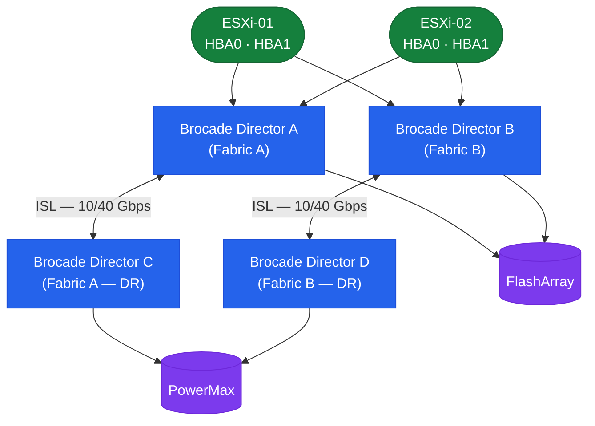

# Brocade Fabric OS — How It Works

## Overview

Fabric OS (FOS) runs on Brocade/Broadcom SAN switches. Fabrics are deployed in a core-edge topology with ISLs (trunked) connecting edge switches to core directors. One switch per fabric is elected as the **principal switch**, which owns the fabric name server and manages domain ID assignments.

## SAN Fabric Topology



## Platform Reference

| Platform | Type | Max Ports | Notes |
|---|---|---|---|
| G620 | Fixed | 64× 32G FC | Mid-range |
| G720 | Fixed | 64× 64G FC | High-performance fixed |
| X7-4 | Director | Up to 192 FC | 4-slot director |
| X7-8 | Director | Up to 384 FC | 8-slot director |
| 6510 | Fixed | 48× 16G FC | End-of-sale — plan migration |

Directors (X7-4 / X7-8) support non-disruptive firmware upgrades (HA chassis with dual CPs).

## Fabric Design

Standard dual-fabric design:

```text
Fabric A:  Host HBA Port 0 → G620-SW01 → Storage Target (Fabric A ports)
Fabric B:  Host HBA Port 1 → G620-SW02 → Storage Target (Fabric B ports)
```

Fabric A and Fabric B are completely independent — no cross-fabric cables. ISLs form trunk groups between switches within a fabric only.

## Principal Switch and Domain ID

One switch per fabric is the principal switch, elected by lowest WWN (default) or by priority. Domain IDs are unique per switch within a fabric (1–239). Static domain IDs are strongly recommended for production fabrics.

```bash
fabricshow                         # show all switches and domain IDs in fabric
switchshow | grep Domain           # show local domain ID
configure                          # set insistDomainId=1 for static domain ID
```

## Name Server and Fabric Services

When a device logs into the fabric, it registers its WWPN, WWNN, and FC4 type with the name server. Other devices query the name server to discover targets.

```bash
nsshow        # devices registered in local name server
nsallshow     # name server across entire fabric (all domains)
nslookup <wwpn>
portloginshow # FLOGI database — all logged-in devices
```

## Zoning

| Zone Type | Definition | Use Case |
|---|---|---|
| Soft zoning (WWN) | Zone membership by WWPN | Preferred for production — portable across port moves |
| Hard zoning (port-based) | Zone membership by domain ID + port | Use only when WWN flexibility not required |
| Peer zone | Multiple initiators share targets without seeing each other | Multi-host shared-target environments |

**Single-initiator zone model (required):**
```yaml
Zone: esxi01_hba0__pure_ct0_p0
  Member: esxi01_hba0   (WWPN: 10:00:00:00:c9:12:34:56)   ← one initiator only
  Member: pure_ct0_p0   (WWPN: 52:4a:93:7c:00:00:00:01)   ← one or more targets
```

Never place two initiator WWPNs in the same zone. This creates a blast radius risk.

## ISL Trunking

Multiple physical ISL ports between the same pair of switches are grouped into a trunk (single logical high-bandwidth link). All links in a trunk must be same speed and between the same switch pair.

```bash
islshow                    # show ISL status
trunkshow                  # show trunk group membership and master port
portperfshow               # show ISL throughput
porttrunkarea --enable <slot/port>
```

## Virtual Fabrics

Virtual Fabrics (VF) partition a single physical chassis into multiple independent logical switches, each with its own Fabric ID (FID). Ports are assigned to exactly one logical switch at a time.

```bash
lscfg --show               # list logical switches and their FIDs
setContext <fid>           # switch CLI context to a specific FID
lscfg --config <fid> -port <slot/port>   # assign port to logical switch
```

## MAPS — Monitoring and Alerting Policy Suite

MAPS provides threshold-based automated health monitoring. It monitors port error counters, ISL utilization, C3 discard rates, BB credit zero (slow drain), switch environment, fabric events, and security events.

```bash
mapsdashboard --show    # current MAPS health dashboard
mapsdb --show           # all triggered MAPS alerts
mapspolicy --show       # active MAPS policy
```

## FCIP — Fibre Channel over IP

FCIP extends a Fibre Channel fabric over an IP WAN connection for long-distance replication (SRDF, RecoverPoint). Brocade 7810/7840 extension platforms provide FCIP gateway functionality. Target IP network latency: <5 ms one-way for synchronous replication.

```bash
fciptunnel --show       # FCIP tunnel status
fcipcircuit --show      # FCIP circuit status
fcipcircuit --show -perf
```
