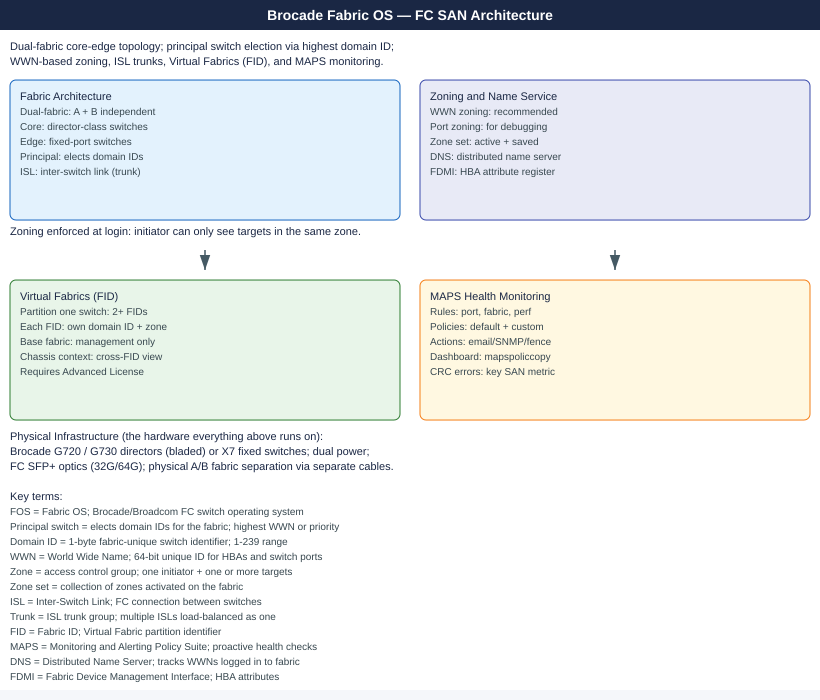

---
tags:
  - architecture
  - san
---
# Brocade Fabric OS — Architecture

Fabric OS runs on Brocade/Broadcom FC switches in dual-fabric core-edge topology. Principal switch election, distributed name server, WWN-based zoning, ISL trunks, Virtual Fabrics (FID partitioning), and MAPS health monitoring are the core platform mechanisms.

*Applies to: Brocade FOS 9.x*

<a class="kb-card" href="how-it-works/"><strong>How It Works</strong>How it works, integrations, and design standards.</a>
<a class="kb-card" href="integrations/"><strong>Integrations</strong>Integration with SANnav, vCenter, and storage arrays.</a>
<a class="kb-card" href="design-standards/"><strong>Design Standards</strong>Dual-fabric design, zoning model, domain ID, and ISL trunking standards.</a>

## Platform Reference

| Platform | Type | Max Ports | Notes |
|---|---|---|---|
| G620 | Fixed | 64× 32G FC | Mid-range |
| G720 | Fixed | 64× 64G FC | High-performance fixed |
| X7-4 | Director | Up to 192 FC | 4-slot director — dual CP, non-disruptive upgrades |
| X7-8 | Director | Up to 384 FC | 8-slot director — dual CP, non-disruptive upgrades |
| 6510 | Fixed | 48× 16G FC | End-of-sale — plan migration |

## Dual-Fabric Topology

