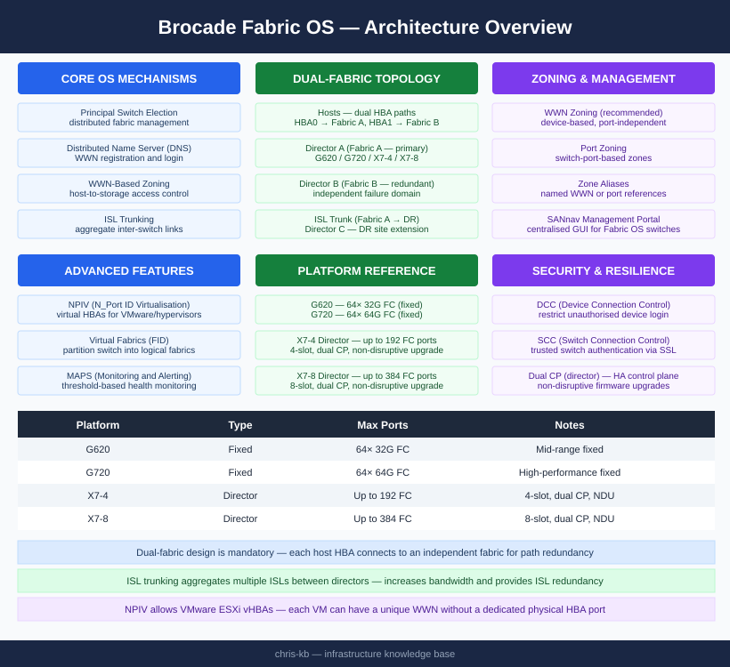

# Brocade Fabric OS — Architecture

<div class="kb-summary">
Fabric OS runs on Brocade/Broadcom FC switches in dual-fabric core-edge topology. Principal switch election, distributed name server, WWN-based zoning, ISL trunks, Virtual Fabrics (FID partitioning), and MAPS health monitoring are the core platform mechanisms.
</div>

```text
┌────────────────────────────────── Brocade Fabric OS — Architecture ───────────────────────────────────┐
│                                                                                                       │
│   ┌───────────────────────────────────────────────────────────────────────────────────────────────┐   │
│   │        FOS architecture: layered OS on embedded Linux with FC ASIC hardware abstraction       │   │
│   │       Data plane: FC frames switched in ASIC at line rate; no CPU involvement per frame       │   │
│   │         Control plane: FSPF routing, FCNS updates, zone DB distribution across fabric         │   │
│   │            Management plane: CLI daemon, REST server, SNMP agent, syslog forwarder            │   │
│   │            HA on directors: CP blade active/standby; failover <10 s non-disruptive            │   │
│   └───────────────────────────────────────────────────────────────────────────────────────────────┘   │
│                                                                                                       │
│    Hardware (ASIC) -> FOS kernel/drivers -> fabric services -> management interfaces                  │
│                                                                                                       │
│                  ▼                                ▼                                ▼                  │
│                                                                                                       │
│   ┌─────────────────────────────┐  ┌─────────────────────────────┐  ┌─────────────────────────────┐   │
│   │          HW / ASIC          │  │       Fabric Services       │  │          Management         │   │
│   │       FC frame switch       │  │          FCNS/FSPF          │  │          CLI (SSH)          │   │
│   │        SFP PHY layer        │  │         Zone DB dist        │  │           REST API          │   │
│   │         Port buffers        │  │        Domain ID mgmt       │  │          SNMP agent         │   │
│   │        CP blade (HA)        │  │        FCSM security        │  │          Syslog fwd         │   │
│   │         RAS sensors         │  │        MAPS alerting        │  │         SANnav link         │   │
│   └─────────────────────────────┘  └─────────────────────────────┘  └─────────────────────────────┘   │
│                                                                                                       │
│    CP blade failover is non-disruptive; FC frame forwarding continues during switchover               │
│                                                                                                       │
│                  ▼                                ▼                                ▼                  │
│                                                                                                       │
│   ┌───────────────────────────────────────────────────────────────────────────────────────────────┐   │
│   │      Layer       │    Component     │      Function     │      Plane       │      Notes       │   │
│   │        HW        │     FC ASIC      │  Frame switching  │       Data       │    Line-rate     │   │
│   │      Kernel      │    FOS Linux     │     Driver/OS     │     Control      │     Embedded     │   │
│   │     Services     │    FCNS/FSPF     │    Fabric ctrl    │     Control      │   Distributed    │   │
│   └───────────────────────────────────────────────────────────────────────────────────────────────┘   │
│                                                                                                       │
│    Physical: FC ASIC chips · CP/line blades on X7 directors · SFP optics · RAS sensors                │
│                                                                                                       │
│    Key terms:                                                                                         │
│                                                                                                       │
│    FC ASIC        = Custom silicon switching FC frames at line rate with no CPU overhead              │
│    CP blade       = Control Processor blade on X7 directors; runs FOS management plane                │
│    Data plane     = FC frame forwarding in hardware; unaffected by control plane events               │
│    Control plane  = FSPF routing, FCNS updates, zone DB sync; CPU-managed services                    │
│    FSPF           = Fabric Shortest Path First; computes optimal ISL paths                            │
│    RAS sensors    = Reliability/Availability/Serviceability sensors for temp, fan, PSU                │
│    HA failover    = CP blade switchover; non-disruptive to data-plane traffic                         │
│    Buffer credits = Per-port FC flow control mechanism; prevents frame loss on congested links        │
│    MAPS           = Monitoring and Alerting Policy Suite; threshold-based alerting engine             │
│    SFP PHY        = Physical layer transceiver; digital diagnostics accessible via FOS CLI            │
│    FOS Linux      = Embedded Linux kernel underpinning FabricOS user-space services                   │
│    Zone DB dist   = Zone configuration replicated from principal switch to all fabric switches        │
│                                                                                                       │
└───────────────────────────────────────────────────────────────────────────────────────────────────────┘
```


<div class="kb-grid kb-grid-3">
<a class="kb-card" href="how-it-works/"><strong>How It Works</strong><span>How it works, integrations, and design standards.</span></a>
<a class="kb-card" href="integrations/"><strong>Integrations</strong><span>Integration with SANnav, vCenter, and storage arrays.</span></a>
<a class="kb-card" href="design-standards/"><strong>Design Standards</strong><span>Dual-fabric design, zoning model, domain ID, and ISL trunking standards.</span></a>
</div>

## Platform Reference

| Platform | Type | Max Ports | Notes |
|---|---|---|---|
| G620 | Fixed | 64× 32G FC | Mid-range |
| G720 | Fixed | 64× 64G FC | High-performance fixed |
| X7-4 | Director | Up to 192 FC | 4-slot director — dual CP, non-disruptive upgrades |
| X7-8 | Director | Up to 384 FC | 8-slot director — dual CP, non-disruptive upgrades |
| 6510 | Fixed | 48× 16G FC | End-of-sale — plan migration |

## Dual-Fabric Topology


