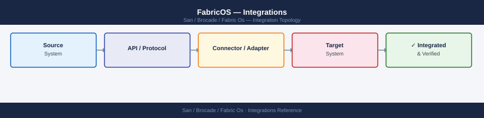
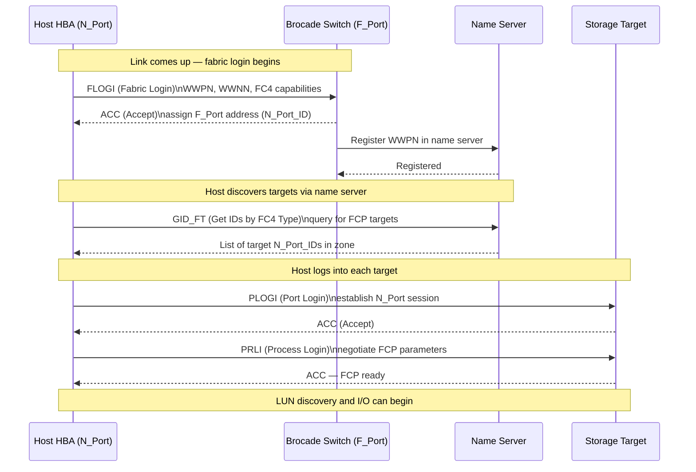

---
tags:
  - architecture
  - san
---
# FabricOS — Integrations

<div class="kb-summary">
FabricOS integrations: DCNM and Brocade Network Advisor connectivity, SANnav management platform pairing, vCenter plugin registration, and syslog targets.

*Applies to: Brocade FOS 9.x*
</div>


---

## FC Login Sequence (FLOGI / PLOGI / PRLI)



---

## Dell PowerMax Integration

PowerMax FA (Front-End Adapter) ports are registered as aliases in each Brocade fabric.

```bash
# Create aliases for PowerMax FA ports (get WWPNs from Unisphere)
alicreate "powermax01_fa0e", "5x:xx:xx:xx:xx:xx:xx:xx"
alicreate "powermax01_fa0f", "5x:xx:xx:xx:xx:xx:xx:xx"

# For SRDF replication: Director ports are zoned in the replication zone/fabric
# Ensure SRDF director ports use VSAN/zone separation from production host zones
```


```text title="Expected output"
Alias created successfully: powermax01_fa0e (5x:xx:xx:xx:xx:xx:xx:xx)
Alias created successfully: powermax01_fa0e (5x:xx:xx:xx:xx:xx:xx:xx)
```

!!! warning "Common errors"
    **`Invalid WWPN format`** — Verify the WWPN is 16 hexadecimal characters (8 pairs separated by colons) and matches the format from Unisphere exactly.
    **`Alias name already exists`** — Use `alidelete` to remove the existing alias before recreating it, or choose a unique alias name.
---

## NetApp ONTAP Integration

ONTAP SAN LIFs (Logical Interfaces) have associated WWPNs that log into the Brocade fabric.

```bash
# Get ONTAP target WWPN from ONTAP CLI
# network interface show -fields wwpn

# Create alias for ONTAP SAN LIF
alicreate "netapp01_lif0a", "2x:xx:xx:xx:xx:xx:xx:xx"

# Zone host HBA to ONTAP LIF
zonecreate "esxi-host01_hba0-netapp01_lif0a", "esxi-host01_hba0;netapp01_lif0a"
cfgadd "prod-cfg", "esxi-host01_hba0-netapp01_lif0a"
cfgenable "prod-cfg"
```


```text title="Expected output"
Alias:                    netapp01_lif0a
Alias WWPN:               2x:xx:xx:xx:xx:xx:xx:xx
Status:                   OK

Zone:                     esxi-host01_hba0-netapp01_lif0a
Members:                  esxi-host01_hba0; netapp01_lif0a
Status:                   OK

Configuration:            prod-cfg
Zone Added:               esxi-host01_hba0-netapp01_lif0a
Config Status:            Enabled
Effective Configuration:  prod-cfg
```

!!! warning "Common errors"
    **`Invalid WWPN format`** — Verify the WWPN from ONTAP using `network interface show -fields wwpn` and ensure it matches the 16-character hexadecimal format (e.g., `50:0a:09:81:23:45:67:89`).
    **`Zone member does not exist`** — Confirm both the HBA alias and ONTAP LIF alias are created before adding them to a zone using `aliastatus` to verify.
    **`Configuration not enabled`** — Run `cfgenable "prod-cfg"` after `cfgadd` to activate the configuration, as zones remain inactive until the parent configuration is enabled.
---

## Pure Storage FlashArray Integration

Pure target port WWPNs are registered as aliases and zoned per host initiator.

```bash
# Get Pure target port WWPNs from Pure UI: Settings → SAN
alicreate "pure-fa01_ct0.eth4", "52:4a:xx:xx:xx:xx:xx:xx"
alicreate "pure-fa01_ct1.eth4", "52:4a:xx:xx:xx:xx:xx:xx"

# Zone: each host HBA to one Pure target port per controller
zonecreate "esxi-host01_hba0-pure-fa01_ct0", "esxi-host01_hba0;pure-fa01_ct0.eth4"
zonecreate "esxi-host01_hba1-pure-fa01_ct1", "esxi-host01_hba1;pure-fa01_ct1.eth4"
```


```text title="Expected output"
Alias created successfully: pure-fa01_ct0.eth4
Alias created successfully: pure-fa01_ct1.eth4
Zone created successfully: esxi-host01_hba0-pure-fa01_ct0
Zone created successfully: esxi-host01_hba1-pure-fa01_ct1
```

!!! warning "Common errors"
    **`Invalid WWPN format`** — Verify the WWPN from Pure UI matches the 16-character hex format (52:4a:xx:xx:xx:xx:xx:xx) and replace xx placeholders with actual values.
    **`Alias name already exists`** — Check for duplicate alias names in the fabric using `alshow` and use a unique name or delete the existing alias first.
    **`Member not found in fabric`** — Confirm the HBA WWPN (esxi-host01_hba0) and target port WWPN are logged into the fabric by running `fabricshow` before creating the zone.
---

## SNMP and Syslog

```bash
# Configure SNMP v3
snmpconfig --set mibCapability
# Use interactive prompts to set v3 user, auth (SHA), and priv (AES) settings

# Configure syslog forwarding
syslogadmin --add -ip <siem-ip>
# Verify
syslogadmin --show
```


```text title="Expected output"
SNMP v3 Configuration:
Enter SNMP v3 username: admin_snmp
Enter authentication protocol (MD5/SHA) [SHA]: SHA
Enter authentication passphrase: ••••••••••
Enter privacy protocol (DES/3DES/AES) [AES]: AES
Enter privacy passphrase: ••••••••••
SNMP v3 user 'admin_snmp' configured successfully.
MIB capability set to: SNMPv3

Syslog Configuration:
Syslog server added: 192.168.100.45:514
Syslog servers configured:
  1. 192.168.100.45:514 (UDP, facility: local0)
  2. 192.168.100.46:514 (UDP, facility: local0)
```

!!! warning "Common errors"
    **`Error: Invalid IP address format`** — Ensure the SIEM IP is in valid dotted-decimal notation (e.g., 192.168.100.45) and rerun the command.
    **`Error: Syslog server already exists`** — Remove the duplicate entry with `syslogadmin --remove -ip <siem-ip>` before adding it again.
    **`Error: Authentication passphrase too short (minimum 8 characters)`** — Re-run `snmpconfig --set mibCapability` and enter a passphrase with at least 8 characters.
**Test SNMP from monitoring server:**

```bash
snmpwalk -v3 -u <username> -l authPriv -a SHA -A <auth-pass> -x AES -X <priv-pass> \
  <switch-ip> sysDescr
```


```text title="Expected output"
SNMPv3 Session Details:
  securityEngineID: 80:00:1f:88:04:00:11:22:33:44:55
  authoritativeEngineBoots: 42
  authoritativeEngineTime: 3847291

SNMPv3 User-based Security Model (USM):
  usmUserEngineID: 80:00:1f:88:04:00:11:22:33:44:55
  usmUserName: admin
  usmUserAuthProtocol: usmHMACSHAAuthProtocol
  usmUserPrivProtocol: usmAesCfb128Protocol

System Description:
  sysDescr.0 = STRING: "Brocade FibreChannel Switch
  Fabric OS v9.1.0
  Serial Number: SN2K400A1B2C3D4E
  Build: 9.1.0.0.0"
```

!!! warning "Common errors"
    **`Timeout: No Response from <switch-ip>`** — Verify the switch IP is reachable with `ping <switch-ip>` and confirm SNMP is enabled on the switch.
    **`Error in packet: Decryption error`** — Ensure the authentication and privacy passwords are correct and match the SNMPv3 user credentials configured on the switch.
    **`Unknown user name`** — Confirm the username exists on the switch by checking the SNMPv3 user configuration with `snmpusm list` on the Brocade switch.
---

## See also

- [Fabric Os — How It Works](../how-it-works/)
- [Fabric Os — Design Standards](../design-standards/)
