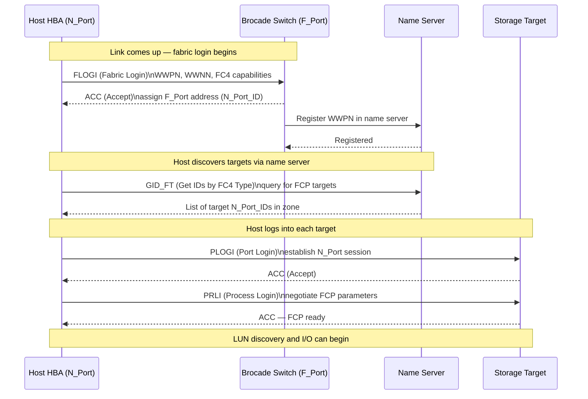

---
tags:
  - architecture
  - san
---
# FabricOS — Integrations

<div class="kb-summary">
FabricOS integrations: DCNM and Brocade Network Advisor connectivity, SANnav management platform pairing, vCenter plugin registration, and syslog targets.

*Applies to: Brocade FOS 9.x*
</div>


---

## FC Login Sequence (FLOGI / PLOGI / PRLI)



---

## Dell PowerMax Integration

PowerMax FA (Front-End Adapter) ports are registered as aliases in each Brocade fabric.

```bash
# Create aliases for PowerMax FA ports (get WWPNs from Unisphere)
alicreate "powermax01_fa0e", "5x:xx:xx:xx:xx:xx:xx:xx"
alicreate "powermax01_fa0f", "5x:xx:xx:xx:xx:xx:xx:xx"

# For SRDF replication: Director ports are zoned in the replication zone/fabric
# Ensure SRDF director ports use VSAN/zone separation from production host zones
```

---

## NetApp ONTAP Integration

ONTAP SAN LIFs (Logical Interfaces) have associated WWPNs that log into the Brocade fabric.

```bash
# Get ONTAP target WWPN from ONTAP CLI
# network interface show -fields wwpn

# Create alias for ONTAP SAN LIF
alicreate "netapp01_lif0a", "2x:xx:xx:xx:xx:xx:xx:xx"

# Zone host HBA to ONTAP LIF
zonecreate "esxi-host01_hba0-netapp01_lif0a", "esxi-host01_hba0;netapp01_lif0a"
cfgadd "prod-cfg", "esxi-host01_hba0-netapp01_lif0a"
cfgenable "prod-cfg"
```

---

## Pure Storage FlashArray Integration

Pure target port WWPNs are registered as aliases and zoned per host initiator.

```bash
# Get Pure target port WWPNs from Pure UI: Settings → SAN
alicreate "pure-fa01_ct0.eth4", "52:4a:xx:xx:xx:xx:xx:xx"
alicreate "pure-fa01_ct1.eth4", "52:4a:xx:xx:xx:xx:xx:xx"

# Zone: each host HBA to one Pure target port per controller
zonecreate "esxi-host01_hba0-pure-fa01_ct0", "esxi-host01_hba0;pure-fa01_ct0.eth4"
zonecreate "esxi-host01_hba1-pure-fa01_ct1", "esxi-host01_hba1;pure-fa01_ct1.eth4"
```

---

## SNMP and Syslog

```bash
# Configure SNMP v3
snmpconfig --set mibCapability
# Use interactive prompts to set v3 user, auth (SHA), and priv (AES) settings

# Configure syslog forwarding
syslogadmin --add -ip <siem-ip>
# Verify
syslogadmin --show
```

**Test SNMP from monitoring server:**

```bash
snmpwalk -v3 -u <username> -l authPriv -a SHA -A <auth-pass> -x AES -X <priv-pass> \
  <switch-ip> sysDescr
```

---

## See also

- [Fabric Os — How It Works](how-it-works/)
- [Fabric Os — Design Standards](design-standards/)
