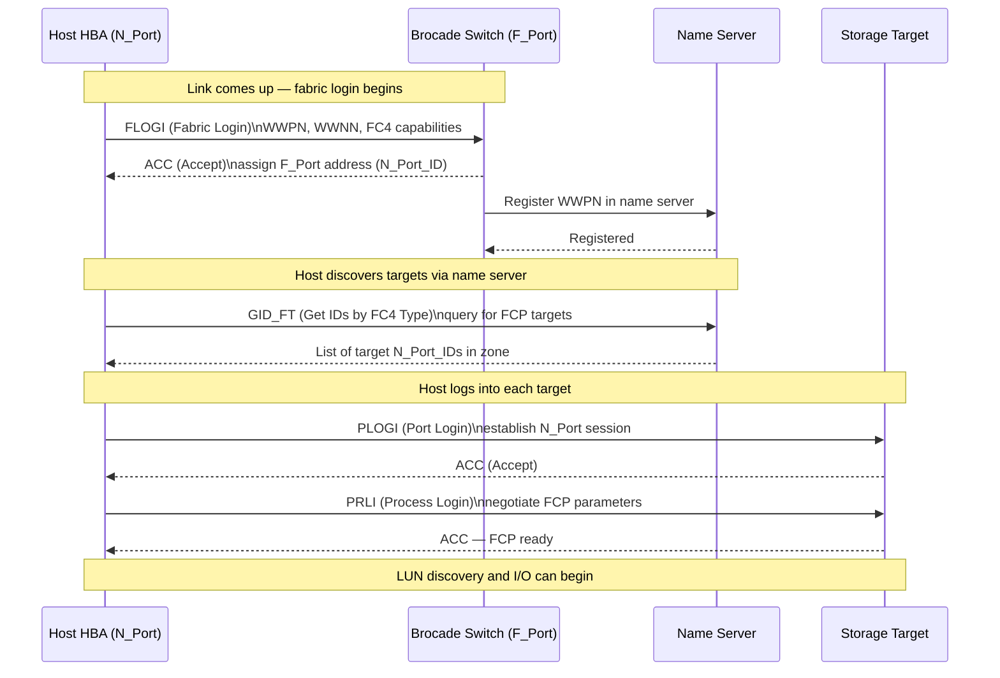

# FabricOS — Integrations

> Part of the [Architecture](../index.md) reference.

---

## FC Login Sequence (FLOGI / PLOGI / PRLI)


┌────────────────────────────────── FabricOS — External Integrations ───────────────────────────────────┐
│                                                                                                       │
│   ┌───────────────────────────────────────────────────────────────────────────────────────────────┐   │
│   │       FabricOS integrates with management platforms via SSH, REST API, SNMP, and Syslog       │   │
│   │         SANnav connects via SSH/REST to discover topology, zones, and port health data        │   │
│   │        SNMP v3 sends traps to NMS (SolarWinds, Nagios); MIB: FCMGMT-MIB + Brocade MIBs        │   │
│   │          REST API (FOS 8.2+): HTTPS JSON; auth via session token; used for automation         │   │
│   └───────────────────────────────────────────────────────────────────────────────────────────────┘   │
│                                                                                                       │
│    Integration categories for FabricOS management:                                                    │
│                                                                                                       │
│                  ▼                                ▼                                ▼                  │
│                                                                                                       │
│   ┌─────────────────────────────┐  ┌─────────────────────────────┐  ┌─────────────────────────────┐   │
│   │        Mgmt Platforms       │  │           Alerting          │  │          Automation         │   │
│   │      SANnav (SSH/REST)      │  │        SNMP v3 traps        │  │           REST API          │   │
│   │     Brocade Network Adv     │  │        Syslog to SIEM       │  │       Ansible modules       │   │
│   │        vCenter plugin       │  │         Email (MAPS)        │  │        Python scripts       │   │
│   │        DCFM (legacy)        │  │        Pager/webhook        │  │          Terraform          │   │
│   │         LDAP/AD auth        │  │       Threshold alerts      │  │        CI/CD pipeline       │   │
│   └─────────────────────────────┘  └─────────────────────────────┘  └─────────────────────────────┘   │
│                                                                                                       │
│    REST API base URL: https://<switch-ip>/rest/v1; requires FOS 8.2 or later                          │
│                                                                                                       │
│                  ▼                                ▼                                ▼                  │
│                                                                                                       │
│   ┌───────────────────────────────────────────────────────────────────────────────────────────────┐   │
│   │   Integration    │     Protocol     │    Auth method    │     Use case     │      Notes       │   │
│   │      SANnav      │    SSH + REST    │    Password/key   │    Full mgmt     │    Pull model    │   │
│   │     SNMP v3      │   UDP 161/162    │      AuthPriv     │    NMS alerts    │   Brocade MIBs   │   │
│   │      Syslog      │   UDP/TCP 514    │      None/TLS     │    SIEM logs     │ Facility local7  │   │
│   │     REST API     │    HTTPS 443     │   Session token   │    Automation    │  JSON payloads   │   │
│   └───────────────────────────────────────────────────────────────────────────────────────────────┘   │
│                                                                                                       │
│    Physical: out-of-band Ethernet mgmt port · in-band FC connectivity · SFPs · cabling                │
│                                                                                                       │
│    Key terms:                                                                                         │
│                                                                                                       │
│    REST API        = FabricOS HTTP interface for programmatic switch management (FOS 8.2+)            │
│    SNMP v3         = Secure SNMP with auth (SHA) and privacy (AES) encryption                         │
│    FCMGMT-MIB      = IETF MIB for FC management; defines standard FC OIDs                             │
│    SANnav          = Brocade GUI platform; connects via SSH+REST to all managed switches              │
│    Syslog          = Switch event log forwarded to external SIEM (Splunk, QRadar)                     │
│    LDAP auth       = Switch authenticates admin users against Active Directory via LDAP               │
│    Ansible module  = brocade_fibrechannel community modules for zone/port automation                  │
│    vCenter plugin  = Brocade plugin shows FC path from VM HBA to storage LUN                          │
│    Session token   = REST API login returns a token; included in subsequent API headers               │
│    DCFM            = Data Center Fabric Manager; legacy predecessor to SANnav                         │
│    AuthPriv        = SNMP v3 mode with both authentication and payload encryption                     │
│    Webhook         = MAPS can POST JSON alert payload to an HTTP endpoint                             │
│                                                                                                       │
└───────────────────────────────────────────────────────────────────────────────────────────────────────┘
```

**Verify the host sees the storage after zoning:**

```bash
zoneshow "esxi-host01_hba0-powermax01_fa0"
```

---

## Dell PowerMax Integration

PowerMax FA (Front-End Adapter) ports are registered as aliases in each Brocade fabric.

```bash
# Create aliases for PowerMax FA ports (get WWPNs from Unisphere)
alicreate "powermax01_fa0e", "5x:xx:xx:xx:xx:xx:xx:xx"
alicreate "powermax01_fa0f", "5x:xx:xx:xx:xx:xx:xx:xx"

# For SRDF replication: Director ports are zoned in the replication zone/fabric
# Ensure SRDF director ports use VSAN/zone separation from production host zones
```

---

## NetApp ONTAP Integration

ONTAP SAN LIFs (Logical Interfaces) have associated WWPNs that log into the Brocade fabric.

```bash
# Get ONTAP target WWPN from ONTAP CLI
# network interface show -fields wwpn

# Create alias for ONTAP SAN LIF
alicreate "netapp01_lif0a", "2x:xx:xx:xx:xx:xx:xx:xx"

# Zone host HBA to ONTAP LIF
zonecreate "esxi-host01_hba0-netapp01_lif0a", "esxi-host01_hba0;netapp01_lif0a"
cfgadd "prod-cfg", "esxi-host01_hba0-netapp01_lif0a"
cfgenable "prod-cfg"
```

---

## Pure Storage FlashArray Integration

Pure target port WWPNs are registered as aliases and zoned per host initiator.

```bash
# Get Pure target port WWPNs from Pure UI: Settings → SAN
alicreate "pure-fa01_ct0.eth4", "52:4a:xx:xx:xx:xx:xx:xx"
alicreate "pure-fa01_ct1.eth4", "52:4a:xx:xx:xx:xx:xx:xx"

# Zone: each host HBA to one Pure target port per controller
zonecreate "esxi-host01_hba0-pure-fa01_ct0", "esxi-host01_hba0;pure-fa01_ct0.eth4"
zonecreate "esxi-host01_hba1-pure-fa01_ct1", "esxi-host01_hba1;pure-fa01_ct1.eth4"
```

---

## SNMP and Syslog

```bash
# Configure SNMP v3
snmpconfig --set mibCapability
# Use interactive prompts to set v3 user, auth (SHA), and priv (AES) settings

# Configure syslog forwarding
syslogadmin --add -ip <siem-ip>
# Verify
syslogadmin --show
```

**Test SNMP from monitoring server:**

```bash
snmpwalk -v3 -u <username> -l authPriv -a SHA -A <auth-pass> -x AES -X <priv-pass> \
  <switch-ip> sysDescr
```
