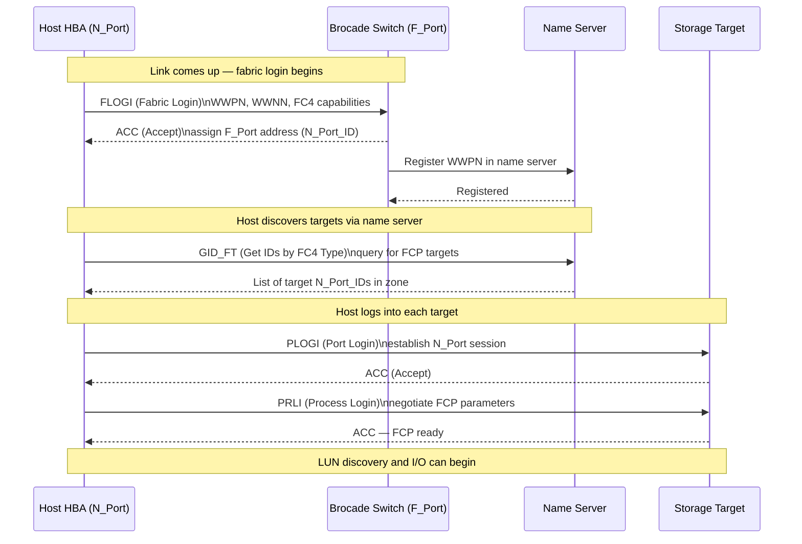

# FabricOS — Integrations


<div class="kb-summary">
> Part of the [Architecture](../index.md) reference.
</div>

---

## FC Login Sequence (FLOGI / PLOGI / PRLI)


┌────────────────────────────────── Brocade Fabric OS — Integrations ───────────────────────────────────┐
│                                                                                                       │
│   ┌───────────────────────────────────────────────────────────────────────────────────────────────┐   │
│   │     FOS integrates with management tools, monitoring platforms, and automation frameworks     │   │
│   │       SANnav: primary GUI management via SSH + REST API; fabric discovery and monitoring      │   │
│   │       SNMP v3: NMS integration for trap forwarding; Brocade MIBs cover port/fabric OIDs       │   │
│   │             LDAP/AD: centralised authentication; role mapping via group membership            │   │
│   │          REST API: JSON-based programmatic management for Ansible and CI/CD pipelines         │   │
│   └───────────────────────────────────────────────────────────────────────────────────────────────┘   │
│                                                                                                       │
│    Management tools -> monitoring/alerting -> identity -> automation integrations                     │
│                                                                                                       │
│                  ▼                                ▼                                ▼                  │
│                                                                                                       │
│   ┌─────────────────────────────┐  ┌─────────────────────────────┐  ┌─────────────────────────────┐   │
│   │          Management         │  │          Monitoring         │  │          Automation         │   │
│   │          SANnav GUI         │  │        SNMP v3 traps        │  │           REST API          │   │
│   │           SSH CLI           │  │        Syslog (SIEM)        │  │       Ansible modules       │   │
│   │         LDAP/AD auth        │  │         MAPS alerts         │  │        Python scripts       │   │
│   │        vCenter plugin       │  │         Email alerts        │  │        CI/CD pipeline       │   │
│   │           NTP sync          │  │          Dashboard          │  │          Terraform          │   │
│   └─────────────────────────────┘  └─────────────────────────────┘  └─────────────────────────────┘   │
│                                                                                                       │
│    All integrations use out-of-band Ethernet management; FC data plane unaffected                     │
│                                                                                                       │
│                  ▼                                ▼                                ▼                  │
│                                                                                                       │
│   ┌───────────────────────────────────────────────────────────────────────────────────────────────┐   │
│   │   Integration    │     Protocol     │        Auth       │     Use case     │      Notes       │   │
│   │      SANnav      │     SSH+REST     │    Password/key   │    Full mgmt     │   Primary tool   │   │
│   │     SNMP v3      │     UDP 162      │      AuthPriv     │    NMS traps     │   Brocade MIBs   │   │
│   │     REST API     │    HTTPS 443     │   Session token   │    Automation    │     FOS 8.2+     │   │
│   └───────────────────────────────────────────────────────────────────────────────────────────────┘   │
│                                                                                                       │
│    Physical: mgmt Ethernet port on each switch · OOB management network · NTP server                  │
│                                                                                                       │
│    Key terms:                                                                                         │
│                                                                                                       │
│    SANnav         = Brocade SAN management GUI; primary operational tool for FOS switches             │
│    REST API       = HTTPS-based FOS management API; returns JSON; requires FOS 8.2+                   │
│    SNMP v3        = SNMPv3 with authentication (SHA) and encryption (AES) for secure traps            │
│    Brocade MIBs   = SNMP MIB files defining Brocade-specific OIDs for port/fabric telemetry           │
│    LDAP/AD        = Switch authenticates admin users against Active Directory                         │
│    MAPS           = Monitoring and Alerting Policy Suite; configures thresholds and actions           │
│    Syslog         = Switch event log forwarded to SIEM (Splunk, QRadar) for correlation               │
│    Ansible module = brocade_fibrechannel Ansible collection for zone/port automation                  │
│    vCenter plugin = Shows FC path visibility from VM HBA through fabric to storage                    │
│    Session token  = REST API Bearer token returned on login; used in subsequent API calls             │
│    NTP sync       = Switch clock synchronised to NTP for accurate log timestamps                      │
│    OOB mgmt       = Out-of-band management via dedicated Ethernet port; separate from FC              │
│                                                                                                       │
└───────────────────────────────────────────────────────────────────────────────────────────────────────┘
```
┌────────────────────────────────── Brocade Fabric OS — Integrations ───────────────────────────────────┐
│                                                                                                       │
│   ┌───────────────────────────────────────────────────────────────────────────────────────────────┐   │
│   │     FOS integrates with management tools, monitoring platforms, and automation frameworks     │   │
│   │       SANnav: primary GUI management via SSH + REST API; fabric discovery and monitoring      │   │
│   │       SNMP v3: NMS integration for trap forwarding; Brocade MIBs cover port/fabric OIDs       │   │
│   │             LDAP/AD: centralised authentication; role mapping via group membership            │   │
│   │          REST API: JSON-based programmatic management for Ansible and CI/CD pipelines         │   │
│   └───────────────────────────────────────────────────────────────────────────────────────────────┘   │
│                                                                                                       │
│    Management tools -> monitoring/alerting -> identity -> automation integrations                     │
│                                                                                                       │
│                  ▼                                ▼                                ▼                  │
│                                                                                                       │
│   ┌─────────────────────────────┐  ┌─────────────────────────────┐  ┌─────────────────────────────┐   │
│   │          Management         │  │          Monitoring         │  │          Automation         │   │
│   │          SANnav GUI         │  │        SNMP v3 traps        │  │           REST API          │   │
│   │           SSH CLI           │  │        Syslog (SIEM)        │  │       Ansible modules       │   │
│   │         LDAP/AD auth        │  │         MAPS alerts         │  │        Python scripts       │   │
│   │        vCenter plugin       │  │         Email alerts        │  │        CI/CD pipeline       │   │
│   │           NTP sync          │  │          Dashboard          │  │          Terraform          │   │
│   └─────────────────────────────┘  └─────────────────────────────┘  └─────────────────────────────┘   │
│                                                                                                       │
│    All integrations use out-of-band Ethernet management; FC data plane unaffected                     │
│                                                                                                       │
│                  ▼                                ▼                                ▼                  │
│                                                                                                       │
│   ┌───────────────────────────────────────────────────────────────────────────────────────────────┐   │
│   │   Integration    │     Protocol     │        Auth       │     Use case     │      Notes       │   │
│   │      SANnav      │     SSH+REST     │    Password/key   │    Full mgmt     │   Primary tool   │   │
│   │     SNMP v3      │     UDP 162      │      AuthPriv     │    NMS traps     │   Brocade MIBs   │   │
│   │     REST API     │    HTTPS 443     │   Session token   │    Automation    │     FOS 8.2+     │   │
│   └───────────────────────────────────────────────────────────────────────────────────────────────┘   │
│                                                                                                       │
│    Physical: mgmt Ethernet port on each switch · OOB management network · NTP server                  │
│                                                                                                       │
│    Key terms:                                                                                         │
│                                                                                                       │
│    SANnav         = Brocade SAN management GUI; primary operational tool for FOS switches             │
│    REST API       = HTTPS-based FOS management API; returns JSON; requires FOS 8.2+                   │
│    SNMP v3        = SNMPv3 with authentication (SHA) and encryption (AES) for secure traps            │
│    Brocade MIBs   = SNMP MIB files defining Brocade-specific OIDs for port/fabric telemetry           │
│    LDAP/AD        = Switch authenticates admin users against Active Directory                         │
│    MAPS           = Monitoring and Alerting Policy Suite; configures thresholds and actions           │
│    Syslog         = Switch event log forwarded to SIEM (Splunk, QRadar) for correlation               │
│    Ansible module = brocade_fibrechannel Ansible collection for zone/port automation                  │
│    vCenter plugin = Shows FC path visibility from VM HBA through fabric to storage                    │
│    Session token  = REST API Bearer token returned on login; used in subsequent API calls             │
│    NTP sync       = Switch clock synchronised to NTP for accurate log timestamps                      │
│    OOB mgmt       = Out-of-band management via dedicated Ethernet port; separate from FC              │
│                                                                                                       │
└───────────────────────────────────────────────────────────────────────────────────────────────────────┘
```

---

## Dell PowerMax Integration

PowerMax FA (Front-End Adapter) ports are registered as aliases in each Brocade fabric.

```bash
# Create aliases for PowerMax FA ports (get WWPNs from Unisphere)
alicreate "powermax01_fa0e", "5x:xx:xx:xx:xx:xx:xx:xx"
alicreate "powermax01_fa0f", "5x:xx:xx:xx:xx:xx:xx:xx"

# For SRDF replication: Director ports are zoned in the replication zone/fabric
# Ensure SRDF director ports use VSAN/zone separation from production host zones
```

---

## NetApp ONTAP Integration

ONTAP SAN LIFs (Logical Interfaces) have associated WWPNs that log into the Brocade fabric.

```bash
# Get ONTAP target WWPN from ONTAP CLI
# network interface show -fields wwpn

# Create alias for ONTAP SAN LIF
alicreate "netapp01_lif0a", "2x:xx:xx:xx:xx:xx:xx:xx"

# Zone host HBA to ONTAP LIF
zonecreate "esxi-host01_hba0-netapp01_lif0a", "esxi-host01_hba0;netapp01_lif0a"
cfgadd "prod-cfg", "esxi-host01_hba0-netapp01_lif0a"
cfgenable "prod-cfg"
```

---

## Pure Storage FlashArray Integration

Pure target port WWPNs are registered as aliases and zoned per host initiator.

```bash
# Get Pure target port WWPNs from Pure UI: Settings → SAN
alicreate "pure-fa01_ct0.eth4", "52:4a:xx:xx:xx:xx:xx:xx"
alicreate "pure-fa01_ct1.eth4", "52:4a:xx:xx:xx:xx:xx:xx"

# Zone: each host HBA to one Pure target port per controller
zonecreate "esxi-host01_hba0-pure-fa01_ct0", "esxi-host01_hba0;pure-fa01_ct0.eth4"
zonecreate "esxi-host01_hba1-pure-fa01_ct1", "esxi-host01_hba1;pure-fa01_ct1.eth4"
```

---

## SNMP and Syslog

```bash
# Configure SNMP v3
snmpconfig --set mibCapability
# Use interactive prompts to set v3 user, auth (SHA), and priv (AES) settings

# Configure syslog forwarding
syslogadmin --add -ip <siem-ip>
# Verify
syslogadmin --show
```

**Test SNMP from monitoring server:**

```bash
snmpwalk -v3 -u <username> -l authPriv -a SHA -A <auth-pass> -x AES -X <priv-pass> \
  <switch-ip> sysDescr
```
