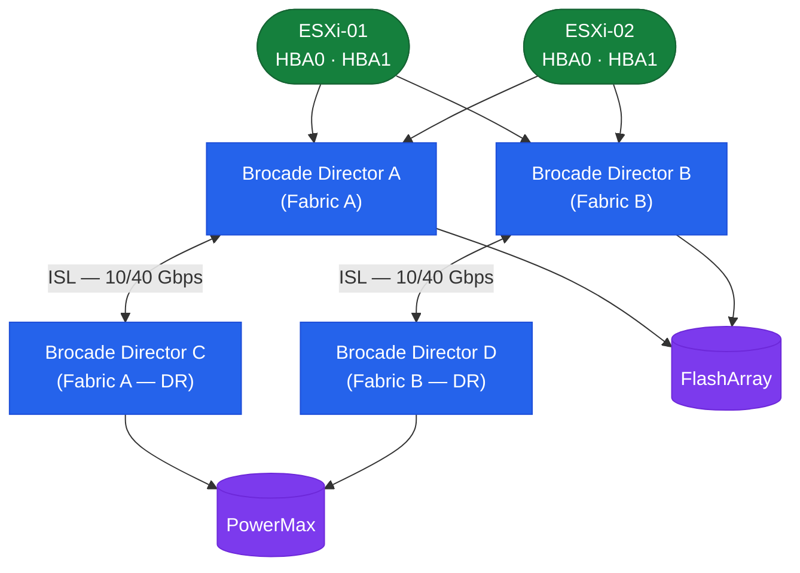

# FabricOS — Overview

> Part of the [Architecture](../) reference.

---

## SAN Fabric Topology



---

## Overview

Fabric OS (FOS) runs on Brocade/Broadcom SAN switches. Fabrics are deployed in a core-edge topology with ISLs (trunked) connecting edge switches to core directors. One switch per fabric is elected as the **principal switch**, which owns the fabric name server and manages domain ID assignments.

---

## Platform Reference

| Platform | Type | Max Ports | Notes |
|---|---|---|---|
| G620 | Fixed | 64x 32G FC | Mid-range |
| G720 | Fixed | 64x 64G FC | High-performance fixed |
| X7-4 | Director | Up to 192 FC | 4-slot director |
| X7-8 | Director | Up to 384 FC | 8-slot director |
| 6510 | Fixed | 48x 16G FC | End-of-sale — plan migration |

Directors (X7-4 / X7-8) support non-disruptive firmware upgrades (HA chassis with dual CPs).

---

## Fabric Design

Standard dual-fabric design:

```
Fabric A:  Host HBA Port 0 → G620-SW01 → Storage Target (Fabric A ports)
Fabric B:  Host HBA Port 1 → G620-SW02 → Storage Target (Fabric B ports)
```

Each fabric is independent. ISLs form trunk groups between switches within a fabric — not between Fabric A and Fabric B.

**Trunk groups:** Brocade ISL trunks group multiple physical ISL links into a single logical ISL for bandwidth aggregation and resilience. All links in a trunk must be same speed and between the same pair of switches.

---

## Principal Switch and Domain ID

One switch per fabric is the principal switch, elected by lowest WWN (by default) or by priority setting.

```bash
# Show current principal switch
fabricshow
# The principal switch has a ">" marker

# Show domain ID assignment
switchshow | grep Domain

# Show all switches in the fabric with domain IDs
fabricshow
```

Domain IDs are unique per switch within a fabric (1–239). They are assigned dynamically unless statically configured. Static domain IDs are strongly recommended for production fabrics to prevent reconfiguration after a fabric partition and rejoin.

```bash
# Set a static domain ID (requires fabric re-segmentation momentarily)
configure
# At "Domain:" prompt, enter the desired domain ID
# At "Fabric parameters" prompt, set "insistDomainId" to 1
```
