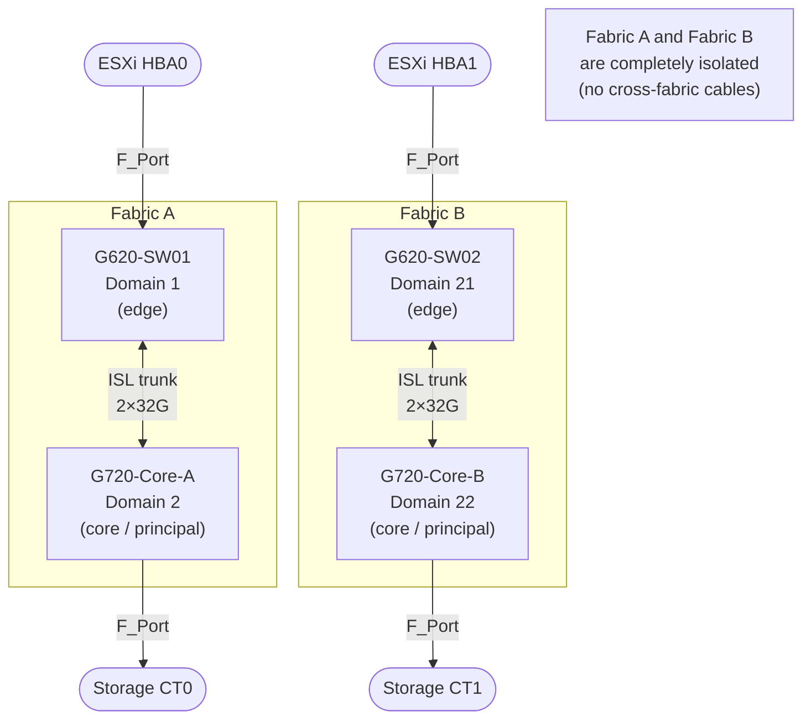
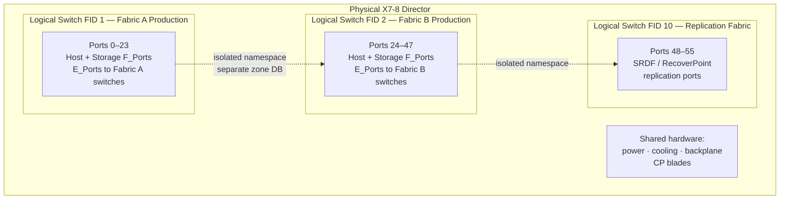

# FabricOS — Overview

> Part of the [Architecture](../) reference.

---

## SAN Fabric Topology


---

## Overview

Fabric OS (FOS) runs on Brocade/Broadcom SAN switches. Fabrics are deployed in a core-edge topology with ISLs (trunked) connecting edge switches to core directors. One switch per fabric is elected as the **principal switch**, which owns the fabric name server and manages domain ID assignments.

---

## Platform Reference

| Platform | Type | Max Ports | Notes |
|---|---|---|---|
| G620 | Fixed | 64x 32G FC | Mid-range |
| G720 | Fixed | 64x 64G FC | High-performance fixed |
| X7-4 | Director | Up to 192 FC | 4-slot director |
| X7-8 | Director | Up to 384 FC | 8-slot director |
| 6510 | Fixed | 48x 16G FC | End-of-sale — plan migration |

Directors (X7-4 / X7-8) support non-disruptive firmware upgrades (HA chassis with dual CPs).

---

## Fabric Design

Standard dual-fabric design:

```
Fabric A:  Host HBA Port 0 → G620-SW01 → Storage Target (Fabric A ports)
Fabric B:  Host HBA Port 1 → G620-SW02 → Storage Target (Fabric B ports)
```

Each fabric is independent. ISLs form trunk groups between switches within a fabric — not between Fabric A and Fabric B.

**Trunk groups:** Brocade ISL trunks group multiple physical ISL links into a single logical ISL for bandwidth aggregation and resilience. All links in a trunk must be same speed and between the same pair of switches.

---

## Dual-Fabric Design with ISL Trunking



## Principal Switch and Domain ID

One switch per fabric is the principal switch, elected by lowest WWN (by default) or by priority setting.

```bash
# Show current principal switch
fabricshow
# The principal switch has a ">" marker

# Show domain ID assignment
switchshow | grep Domain

# Show all switches in the fabric with domain IDs
fabricshow
```

Domain IDs are unique per switch within a fabric (1–239). They are assigned dynamically unless statically configured. Static domain IDs are strongly recommended for production fabrics to prevent reconfiguration after a fabric partition and rejoin.

```bash
# Set a static domain ID (requires fabric re-segmentation momentarily)
configure
# At "Domain:" prompt, enter the desired domain ID
# At "Fabric parameters" prompt, set "insistDomainId" to 1
```

---

## Name Server and Fabric Services

The name server is a distributed fabric service that runs on every switch but is coordinated by the principal switch. When a device (host HBA or storage target) logs into the fabric, it registers its WWPN, WWNN, FC4 type, and port symbolic name with the name server. Other devices query the name server to discover targets.

```bash
# Show all devices registered in the local switch name server
nsshow

# Show name server across the entire fabric (all domains)
nsallshow

# Look up a specific device by WWPN
nslookup <wwpn>

# Show FLOGI (Fabric Login) database — devices that have logged in
portloginshow
```

The FDMI (Fabric Device Management Interface) service stores additional device metadata — HBA model, driver version, OS version — that SANnav and other management tools use for inventory.

---

## Zoning

Zoning is enforced by the fabric — not by the connected devices. The active zone set is distributed to all switches in the fabric by the principal switch when `cfgenable` is run. Each switch enforces the zone policy for frames passing through its ports.

**Zone types:**

| Zone Type | Definition | Use Case |
|---|---|---|
| Soft zoning (WWN) | Zone membership by WWPN | Preferred for production — portable across port moves |
| Hard zoning (port-based) | Zone membership by domain ID and port number | Use only when WWN flexibility is not required |
| Peer zone | Multiple initiators share targets without seeing each other | Multi-host shared-target environments |

**Zoning model — single-initiator:**

```
Zone: esxi01_hba0__pure_ct0_p0
  Member: esxi01_hba0   (WWPN: 10:00:00:00:c9:12:34:56)  <- one initiator only
  Member: pure_ct0_p0   (WWPN: 52:4a:93:7c:00:00:00:01)  <- one or more targets

Zone: esxi01_hba1__pure_ct1_p0
  Member: esxi01_hba1   (WWPN: 10:00:00:00:c9:12:34:57)  <- separate zone for HBA1
  Member: pure_ct1_p0   (WWPN: 52:4a:93:7c:00:00:00:11)
```

Never place two initiator WWPNs in the same zone. This creates a blast radius risk — if one host has a software fault and probes aggressively, it can disturb the other host in the same zone.

---

## ISL Trunking

ISLs (Inter-Switch Links) connect Brocade switches within a fabric. Multiple physical ISL ports between the same pair of switches are grouped into a trunk, which acts as a single logical high-bandwidth link.

**Trunk requirements:**
- All ISL ports in a trunk must run at the same speed
- All ISL ports must connect the same pair of switches
- `porttrunkarea` must be configured identically on both ends

```bash
# Show ISL status
islshow

# Show trunk group membership and master port
trunkshow

# Show ISL throughput
portperfshow

# Configure trunk area (required before forming trunks)
porttrunkarea --enable <slot/port>

# Verify trunk formed correctly
trunkshow    # Should show MASTER and SLAVE ports in the same trunk group
```

ICLs (Inter-Chassis Links) are used to connect director-class chassis (X7-8 to X7-8) using special ICL cables and ports. ICLs are not ISLs — they use a dedicated backplane-like connection and have different configuration requirements.

---

## Virtual Fabrics

Virtual Fabrics (VF) partition a single physical chassis into multiple independent logical switches, each with its own Fabric ID (FID) and isolated fabric. This allows a single X7-8 director to participate in Fabric A, Fabric B, and a replication fabric simultaneously.

```bash
# List logical switches and their FIDs
lscfg --show

# Switch CLI context to a specific logical switch FID
setContext <fid>

# Assign a port to a logical switch
lscfg --config <fid> -port <slot/port>

# Create a new logical switch
lscfg --create <fid>
```

Logical switches share physical hardware (backplane, power, cooling) but have completely isolated fabric services — separate domain IDs, separate zone databases, separate name servers. Ports are assigned to exactly one logical switch at a time.

---

## MAPS — Monitoring and Alerting Policy Suite

MAPS provides threshold-based, automated SAN health monitoring. It replaces the older Fabric Watch feature and integrates with SANnav for centralised alerting.

MAPS monitors:

- Port error counters (CRC, ITW, loss of sync, loss of signal)
- ISL utilization and C3 discard rates
- BB credit zero conditions (slow drain)
- Switch environment (temperature, fan, PSU)
- Fabric events (principal switch change, domain loss)
- Security events (failed logins, policy violations)

```bash
# Current MAPS health dashboard
mapsdashboard --show

# All triggered MAPS alerts
mapsdb --show

# Active MAPS policy
mapspolicy --show

# Default MAPS policies
mapspolicy --show -predefined
```

MAPS policies are pre-defined by Broadcom (defaulted to `dflt_conservative_policy` or `dflt_aggressive_policy`) and can be customised with site-specific thresholds. The policy is configured per logical switch.

---

## Virtual Fabrics — Logical Switch Partitioning



## FCIP — Fibre Channel over IP

FCIP extends a Fibre Channel fabric over an IP WAN connection. It is used for long-distance replication (SRDF, RecoverPoint) where a direct ISL is not possible. Brocade 7810/7840 extension platforms provide FCIP gateway functionality.

FCIP tunnels encapsulate FC frames in TCP/IP packets. The IP network must provide adequate bandwidth and latency — FCIP is sensitive to packet loss and high latency (target: <5ms one-way for synchronous replication).

```bash
# Show FCIP tunnel status (on 7810/7840 extension platforms)
fciptunnel --show

# Show FCIP circuit status
fcipcircuit --show

# Show FCIP statistics
fcipcircuit --show -perf
```

FCIP is configured with QoS on the IP network to protect replication bandwidth from being consumed by other traffic. Work with the network team to confirm DSCP marking is applied to FCIP traffic and honoured across all WAN hops.
