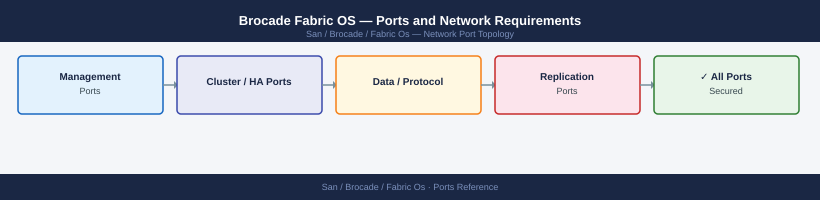

---
tags:
  - brocade
  - fabric-os
  - san
  - networking
  - firewall
  - ports
description: "Firewall port reference for Brocade Fabric OS (FOS) SAN switches. Covers management access (SSH, HTTPS, Telnet), SNMP monitoring, RADIUS/LDAP..."
---
# Brocade Fabric OS — Ports and Network Requirements

<div class="kb-summary">
Firewall port reference for Brocade Fabric OS (FOS) SAN switches. Covers management access (SSH, HTTPS, Telnet), SNMP monitoring, RADIUS/LDAP authentication, and NTP. Fibre Channel frame traffic is not IP-based and requires no firewall rules.

*Applies to: Fabric OS 9.x (Brocade / Broadcom)*
</div>


## Before you begin

- All management traffic uses the dedicated Ethernet management port (eth0) — physically separate from FC ports
- Telnet (port 23) is disabled by default in FOS 9.x and should remain disabled — use SSH exclusively
- FC fabric traffic (ISL, zone enforcement, FLOGI, FSPF) is Fibre Channel protocol, not TCP/IP — no firewall rules apply
- HTTPS (443) is used for the Web Tools GUI and REST API in FOS 9.x+

---

## Inbound — Admin Access to Switch Management Port

| Port | Protocol | Source | Purpose |
|---|---|---|---|
| 22 | TCP | Jump hosts, SANnav, admin workstations | SSH — FOS CLI (primary management method) |
| 443 | TCP | Admin browsers, SANnav, Brocade Network Advisor | HTTPS — Web Tools UI and REST API |
| 23 | TCP | Legacy tooling (disable) | Telnet — disabled by default in FOS 9.x; keep closed |
| 161 | UDP | SNMP monitoring systems | SNMP polling (GET/GETBULK) |

---

## Outbound — Switch to External Services

| Port | Protocol | Destination | Purpose |
|---|---|---|---|
| 162 | UDP | SNMP trap receiver / SANnav | SNMP traps (hardware events, port state changes) |
| 514 | UDP | Syslog server | FOS syslog event forwarding |
| 123 | UDP | NTP servers | Time synchronisation — required for log timestamps and certificate validity |
| 25 | TCP | SMTP relay | Email alerts (RASlog events) |

---

## Authentication — RADIUS and LDAP

When RADIUS or LDAP/LDAPS is configured for admin authentication:

| Port | Protocol | Destination | Purpose |
|---|---|---|---|
| 1812 | UDP | RADIUS server | RADIUS authentication (RFC 2865) |
| 1813 | UDP | RADIUS server | RADIUS accounting |
| 389 | TCP | LDAP server / Active Directory DC | LDAP — admin user lookup |
| 636 | TCP | LDAP server / Active Directory DC | LDAPS (recommended) |

---

## SANnav to Switch Communication

SANnav (Brocade SAN management platform) uses SSH to manage switches:

| Port | Protocol | Source | Destination | Purpose |
|---|---|---|---|---|
| 22 | TCP | SANnav server | Switch management IP | SSH — SANnav CLI access for monitoring and config |
| 443 | TCP | SANnav server | Switch management IP | REST API for FOS 9.x features |
| 161 | UDP | SANnav server | Switch management IP | SNMP polling by SANnav |
| 162 | UDP | Switch management IP | SANnav server | SNMP traps to SANnav |

---

## Inbound — SANnav Admin Access

| Port | Protocol | Source | Purpose |
|---|---|---|---|
| 443 | TCP | Admin browsers | SANnav web UI and REST API |
| 22 | TCP | Jump hosts | SANnav server SSH (OS access) |

---

## Firewall Zone Summary

| From | To | Ports | Notes |
|---|---|---|---|
| Admin clients | Switch mgmt IP | 22, 443 | SSH and HTTPS |
| SANnav | Switch mgmt IP | 22, 443, 161 UDP | Management and monitoring |
| Switch mgmt IP | SANnav / SNMP receiver | 162 UDP | SNMP traps |
| Switch mgmt IP | Syslog server | 514 UDP | Event log forwarding |
| Switch mgmt IP | NTP server | 123 UDP | Time sync |
| Switch mgmt IP | RADIUS / LDAP | 1812 UDP, 636 TCP | Authentication |

---

## Verify

```bash
# From admin workstation — test SSH to switch
ssh admin@<switch-mgmt-ip>

# From admin workstation — test HTTPS (Web Tools)
curl -sk -o /dev/null -w "%{http_code}" https://<switch-mgmt-ip>/

# From switch CLI — test NTP
tsclockserver show

# From switch CLI — test syslog connectivity
syslogdiagshow

# From switch CLI — test SNMP (from switch perspective)
snmpconfig --show snmpv1

# From monitoring server — test SNMP polling
snmpget -v2c -c <community> <switch-mgmt-ip> 1.3.6.1.2.1.1.1.0
```


```text title="Expected output"
admin@workstation:~$ ssh admin@192.168.1.50
Last login: Wed Mar 13 14:22:18 2024 from 192.168.1.10
FOS_switch_01:admin>

admin@workstation:~$ curl -sk -o /dev/null -w "%{http_code}" https://192.168.1.50/
200

FOS_switch_01:admin> tsclockserver show
NTP Enabled: true
NTP Server 1: 10.0.0.1 (synchronized)
NTP Server 2: 10.0.0.2 (reachable)
Last Update: 2024-03-13 14:25:33 UTC

FOS_switch_01:admin> syslogdiagshow
Syslog Server: 192.168.2.100
Syslog Port: 514
Syslog Status: Connected
Messages Sent: 4521

FOS_switch_01:admin> snmpconfig --show snmpv1
SNMPv1 Enabled: true
Read Community: public
Trap Community: public
Trap Receivers: 192.168.2.100

admin@workstation:~$ snmpget -v2c -c public 192.168.1.50 1.3.6.1.2.1.1.1.0
SNMPv2-MIB::sysDescr.0 = STRING: "Brocade G620 Fabric OS v9.1.0"
```

!!! warning "Common errors"
    | Error | Fix |
    |---|---|
    | `ssh: connect to host 192.168.1.50 port 22: Connection refused` | Verify the switch management IP is correct and SSH service is enabled with `sshconfig --show` on the switch. |
    | `curl: (60) SSL certificate problem: self signed certificate` | Remove the `-k` flag if your environment requires certificate validation, or ensure the switch certificate is trusted by your CA. |
    | `SNMP packet from 192.168.1.50:161 authentication failure` | Verify the SNMP community string matches the switch configuration with `snmpconfig --show snmpv1` and check firewall rules allow UDP 161. |
---

## See also

- [Brocade FOS — Architecture](../how-it-works/)
- [Brocade FOS — Operations](../../operations/)
- [Brocade SANnav — Ports](../../sannav/architecture/ports.md)
