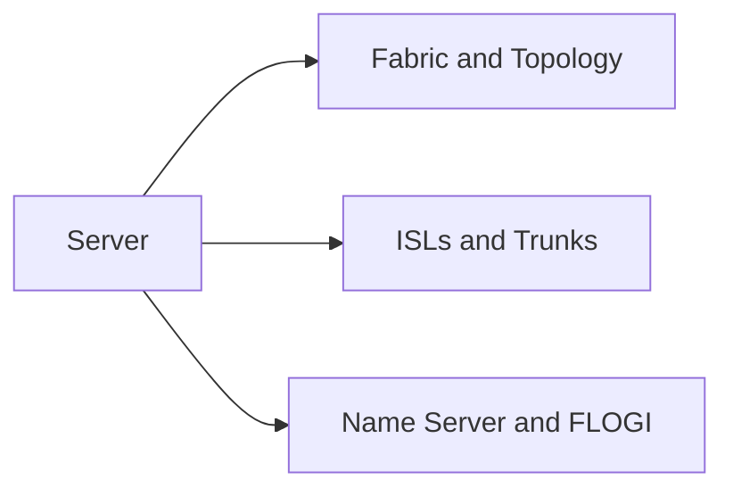

# Fabric, Topology & Name Server

> Part of the [Brocade Fabric OS CLI Reference](../).



---

## Fabric & Topology

```bash
# Fabric membership
fabricShow
topologyShow
nsShow
nsAllShow

# Domain IDs and routing
lsanZoneShow
routeShow
pathInfo <target_wwn>

# Fabric events
fabricLog --show
```

## ISLs & Trunks

```bash
# ISL and trunk status
islShow
trunkShow
portTrunkArea --show

# Trunk debug
trunkDebug <port>
```

## Name Server & FLOGI

```bash
# Name server
nsShow
nsAllShow
nsLookup <wwn>

# FLOGI / login database
portLoginShow
```
