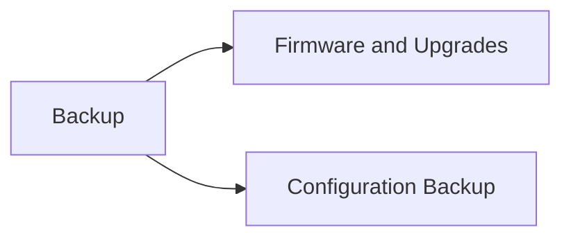

# Firmware, Upgrades & Config Backup

> Part of the [Brocade Fabric OS CLI Reference](../).



---

## Firmware & Upgrades

```bash
# Current firmware
version
firmwareShow

# Firmware upgrade
firmwareDownload -s <server_ip> -p <path/firmware.bin>
firmwareDownloadStatus

# Boot check
haShow          # Check HA / CP status
haFailover      # Force CP failover
```

## Configuration Backup

```bash
# Save / backup
configUpload -all -host <server_ip> -u <user> -f <backup_file>
configDownload -all -host <server_ip> -u <user> -f <backup_file>

# Show saved config
configShow

# Factory reset (destructive)
# configDefault
```
