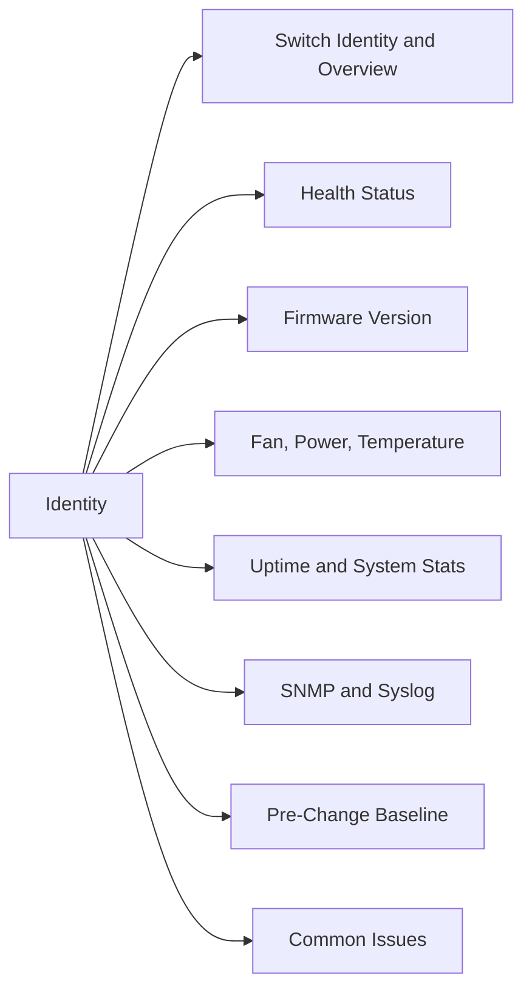

# Switch Status & Identity

> Part of the Brocade Fabric OS CLI Reference.



## Switch Identity & Overview

```bash
switchshow         # ports, state, speed, and connected WWNs
switchstatusshow   # overall switch health status
version            # Fabric OS version
ipAddrShow         # management IP addresses
licenseShow        # installed licenses
chassisShow        # chassis hardware inventory
slotShow           # blade/slot population
```

## Health Status

```bash
switchstatusshow
```

Expected: `HEALTHY`. Any status other than `HEALTHY` requires investigation.

## Firmware Version

```bash
version
# or
firmwareShow
```

## Fan, Power, Temperature

```bash
psShow      # power supplies
fanShow     # fan status
tempShow    # temperature sensors
sensorShow  # all environmental sensors
```

All sensors should show `OK` or `absent` (for empty slots). Any sensor in `FAILED` or `ABSENT` (for expected hardware) state requires immediate action.

## Uptime & System Stats

```bash
uptime
# or from switchShow: look for "Up Time"
```

## SNMP & Syslog

```bash
snmpConfig --show
syslogDIPShow    # syslog destinations
```

## Pre-Change Baseline

```bash
switchshow
switchstatusshow
fabricshow
nsShow
aliShow
zoneShow --all
```

## Common Issues

| Issue | Check | Action |
|---|---|---|
| Switch status not HEALTHY | Environmental or hardware | Check `psShow`, `fanShow`, `tempShow` |
| Firmware version mismatch | `version` | Schedule Fabric OS upgrade |
| License missing | `licenseShow` | Add license key via `licenseAdd` |
| IP not reachable | `ipAddrShow` | Verify OOB network and gateway |
