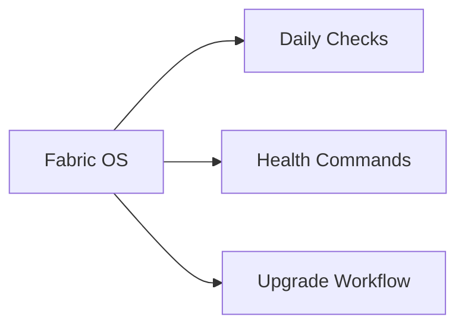

# Brocade Fabric OS

<div class="kb-grid kb-grid-14">
<a class="kb-card" href="architecture/"><strong>Architecture</strong><span>HA topology, components, connectivity, and sizing.</span></a>
<a class="kb-card" href="standards/"><strong>Standards</strong><span>Naming conventions, build baseline, and configuration checklist.</span></a>
<a class="kb-card" href="lifecycle/"><strong>Lifecycle</strong><span>Version matrix, upgrade paths, EOL tracking, and refresh planning.</span></a>
<a class="kb-card" href="operations/"><strong>Operations</strong><span>Daily checks, health monitoring, maintenance tasks, and runbooks.</span></a>
<a class="kb-card" href="cli-reference/"><strong>CLI Reference</strong><span>Command reference by category with syntax and examples.</span></a>
<a class="kb-card" href="scripts/"><strong>Scripts</strong><span>Automation scripts for daily checks, health, incident triage, and validation.</span></a>
<a class="kb-card" href="troubleshooting/"><strong>Troubleshooting</strong><span>Common issues, diagnostic commands, log locations, and error codes.</span></a>
<a class="kb-card" href="integration/"><strong>Integration</strong><span>VMware, backup tools, monitoring, authentication, and API integration.</span></a>
<a class="kb-card" href="security/"><strong>Security</strong><span>Hardening checklist, RBAC, encryption, audit logging, and compliance.</span></a>
<a class="kb-card" href="vendor-support/"><strong>Vendor Support</strong><span>Opening a case, information to collect, support portal, and SLA tiers.</span></a>

<a class="kb-card" href="firmware/">
  <strong>Firmware</strong>
  <span>Firmware notes, checks, commands, and references.</span>
</a>

<a class="kb-card" href="health-checks/">
  <strong>Health Checks</strong>
  <span>Health check procedures and validation steps.</span>
</a>

<a class="kb-card" href="isls/">
  <strong>Isls</strong>
  <span>Isls notes, checks, commands, and references.</span>
</a>

<a class="kb-card" href="ports/">
  <strong>Ports</strong>
  <span>Ports notes, checks, commands, and references.</span>
</a>
</div>



## Overview

Brocade Fabric OS is the operating system for Brocade Fibre Channel SAN switches.

## Daily Checks


| Check | Command | Notes |
|---|---|---|
| Review switch health |  |  |
| Check port errors |  |  |
| Validate zoning configuration |  |  |
| Confirm fabric membership |  |  |

## Health Commands

```bash
switchshow
fabricshow
porterrshow
zoneshow
```

## Upgrade Workflow

1. Backup switch configuration
2. Verify upgrade path
3. Upgrade redundant fabric first
4. Validate fabric health
