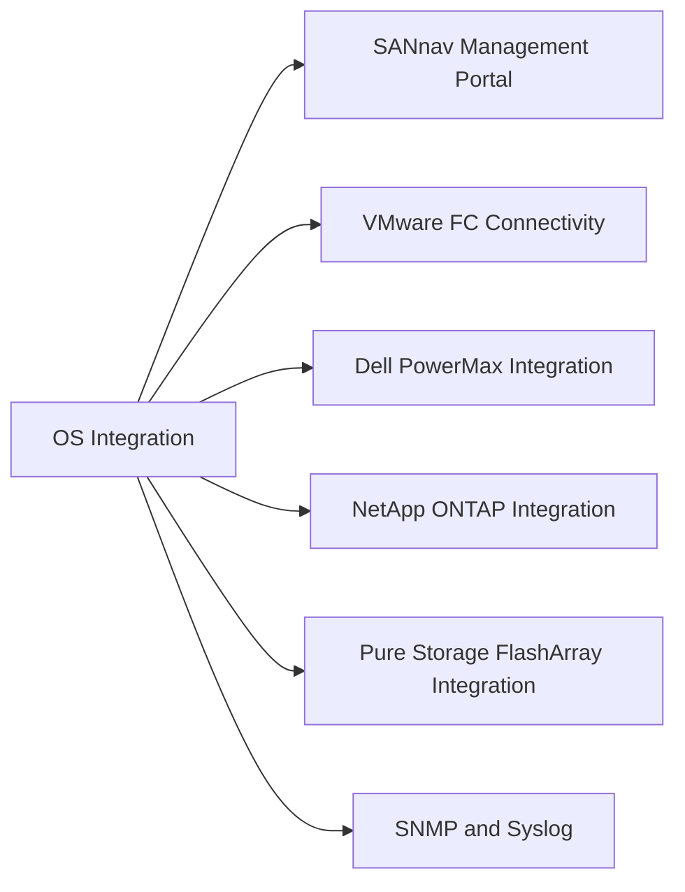

# Brocade Fabric OS Integration

> Part of the [Brocade Fabric OS](../) reference.

---



## SANnav Management Portal

SANnav provides fabric-wide monitoring, zoning management, and firmware orchestration across all Brocade switches, replacing the older DCFM/Network Advisor tools.

**Key capabilities:**

- Fabric topology with real-time port state and ISL utilisation
- Zone management across all fabrics from a single UI
- Per-port performance graphs (IOPS, MB/s, error rates)
- Firmware upgrade scheduling and execution
- Event and alert management with SMTP notification

**Setup:**

1. Deploy SANnav virtual appliance (OVA).
2. Discover switches: SANnav → Discover → enter switch management IPs.
3. SANnav connects via SSH and SNMP — configure SNMP v3 on each switch first.

---

## VMware FC Connectivity

ESXi host HBA ports log into the Brocade fabric and are zoned to storage target ports.

**Zone a new ESXi host:**

```bash
# Step 1 — Find the host HBA WWPN after FLOGI
nsshow | grep <domain-or-recent-entry>
# Or collect HBA WWPNs from the ESXi host:
# esxcli storage san fc list

# Step 2 — Create aliases for each host HBA port
alicreate "esxi-host01_hba0", "21:00:00:xx:xx:xx:xx:xx"
alicreate "esxi-host01_hba1", "21:00:00:xx:xx:xx:xx:xx"

# Step 3 — Create zones (single-initiator / single-target)
zonecreate "esxi-host01_hba0-powermax01_fa0", "esxi-host01_hba0;powermax01_fa0"

# Step 4 — Add to the active zone configuration and activate
cfgadd "prod-cfg", "esxi-host01_hba0-powermax01_fa0"
cfgenable "prod-cfg"
```

**Verify the host sees the storage after zoning:**

```bash
zoneshow "esxi-host01_hba0-powermax01_fa0"
```

---

## Dell PowerMax Integration

PowerMax FA (Front-End Adapter) ports are registered as aliases in each Brocade fabric.

```bash
# Create aliases for PowerMax FA ports (get WWPNs from Unisphere)
alicreate "powermax01_fa0e", "5x:xx:xx:xx:xx:xx:xx:xx"
alicreate "powermax01_fa0f", "5x:xx:xx:xx:xx:xx:xx:xx"

# For SRDF replication: Director ports are zoned in the replication zone/fabric
# Ensure SRDF director ports use VSAN/zone separation from production host zones
```

---

## NetApp ONTAP Integration

ONTAP SAN LIFs (Logical Interfaces) have associated WWPNs that log into the Brocade fabric.

```bash
# Get ONTAP target WWPN from ONTAP CLI
# network interface show -fields wwpn

# Create alias for ONTAP SAN LIF
alicreate "netapp01_lif0a", "2x:xx:xx:xx:xx:xx:xx:xx"

# Zone host HBA to ONTAP LIF
zonecreate "esxi-host01_hba0-netapp01_lif0a", "esxi-host01_hba0;netapp01_lif0a"
cfgadd "prod-cfg", "esxi-host01_hba0-netapp01_lif0a"
cfgenable "prod-cfg"
```

---

## Pure Storage FlashArray Integration

Pure target port WWPNs are registered as aliases and zoned per host initiator.

```bash
# Get Pure target port WWPNs from Pure UI: Settings → SAN
alicreate "pure-fa01_ct0.eth4", "52:4a:xx:xx:xx:xx:xx:xx"
alicreate "pure-fa01_ct1.eth4", "52:4a:xx:xx:xx:xx:xx:xx"

# Zone: each host HBA to one Pure target port per controller
zonecreate "esxi-host01_hba0-pure-fa01_ct0", "esxi-host01_hba0;pure-fa01_ct0.eth4"
zonecreate "esxi-host01_hba1-pure-fa01_ct1", "esxi-host01_hba1;pure-fa01_ct1.eth4"
```

---

## SNMP and Syslog

```bash
# Configure SNMP v3
snmpconfig --set mibCapability
# Use interactive prompts to set v3 user, auth (SHA), and priv (AES) settings

# Configure syslog forwarding
syslogadmin --add -ip <siem-ip>
# Verify
syslogadmin --show
```

**Test SNMP from monitoring server:**

```bash
snmpwalk -v3 -u <username> -l authPriv -a SHA -A <auth-pass> -x AES -X <priv-pass> \
  <switch-ip> sysDescr
```
