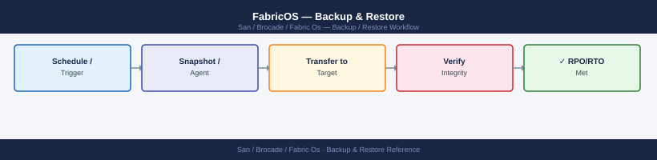

---
tags:
  - operations
  - san
---
# FabricOS — Backup & Restore

<div class="kb-summary">
FabricOS backup and restore: `configupload` to FTP/SCP, `firmwaredownload` staging, disaster recovery from a saved config, and switch replacement procedure.

*Applies to: Brocade FOS 9.x*
</div>


---

## Before you begin

- **Access:** Storage admin credentials (cluster admin or equivalent)
- **Timing:** safe to run during business hours unless a step is marked ⚠ (causes interruption)
- **Dependencies:** no active upgrades or migrations on the same infrastructure
- **Logging:** capture command output — paste into the change record on completion

---

## Backup and Restore Flow

```d2
direction: right

change: "Pre-Change / Scheduled" {shape: rectangle}
cfgsave: "cfgsave\n(flush zone DB to flash" {shape: rectangle}
upload: "configupload -all -scp\n(full switch config to backup server" {shape: rectangle}
record: "Record filename + timestamp\nin change ticket" {shape: rectangle}
failure: "Switch Failure / Rollback" {shape: rectangle}
newSwitch: "Boot replacement switch\nin isolation" {shape: rectangle}
domainId: "Set static domain ID\n(match original" {shape: rectangle}
download: "configdownload -all -scp\n(restore from backup" {shape: rectangle}
reboot: "Reboot if prompted\n(VF changes" {shape: rectangle}
connectISL: "Connect ISL cables\nto core switch" {shape: rectangle}
verify: "Verify: fabricshow\nnsshow · cfgshow" {shape: rectangle}
activate: "cfgenable zoneset-name\ncfgsave" {shape: rectangle}
done: "Restore Complete" {shape: rectangle}

change -> cfgsave
cfgsave -> upload
upload -> record
failure -> newSwitch
newSwitch -> domainId
domainId -> download
download -> reboot
reboot -> connectISL
connectISL -> verify
verify -> activate
activate -> done
```

### Restore Notes

- The switch must be running a compatible FOS version before restoring a config — do not restore a FOS 9.x config onto a switch running FOS 8.x.
- After restore, some settings require a reboot to take effect (Virtual Fabric changes, for example).
- Zone configuration is restored but the zone set is not automatically activated. Run `cfgenable <zoneset-name>` manually after confirming the zone database looks correct.
- If restoring to a replacement switch, set the correct static domain ID before connecting to the fabric to avoid domain conflicts.

---

## Zone Database Backup (cfgsave)

`cfgsave` writes the current in-memory zone configuration (including any unsaved changes) to the switch's persistent flash storage. Without `cfgsave`, zone changes are lost on reboot.

```bash
# Save zone database to flash
cfgsave

# Confirm the active zone set
cfgshow | head -20
```


```text title="Expected output"
Saving configuration to flash...
Configuration saved successfully.

Zone Configuration:
  Defined zone members: 128
  Active zone set: production-zones
  Zone set status: Active
  Last update: 2024-01-15 14:32:18
  
  Zone: zone_prod_01
    Members: 2
    - 50:00:09:73:00:1a:2b:3c (Storage_Array_01)
    - 50:00:0c:5a:12:34:56:78 (Server_Host_01)
  
  Zone: zone_prod_02
    Members: 2
    - 50:00:09:73:00:1a:2b:3d (Storage_Array_02)
    - 50:00:0c:5a:12:34:56:79 (Server_Host_02)
  
  Zone: zone_prod_03
    Members: 3
    - 50:00:09:73:00:1a:2b:3e (Storage_Array_03)
    - 50:00:0c:5a:12:34:56:7a (Server_Host_03)
    - 50:00:0c:5a:12:34:56:7b (Server_Host_04)
```

!!! warning "Common errors"
    **`cfgsave: command not found`** — Verify you are logged into the Brocade switch CLI (not the Linux shell) by checking the prompt shows `switch>` or `switch#`.
    **`Configuration save failed: Flash memory full`** — Free up flash space by removing old configuration backups using `cfgdelete` or contact support if persistent.
The zone database is included in the `configupload` archive. However, always run `cfgsave` immediately after any zoning change — before running `configupload` — so that the backup captures the latest zone state.

---

## Backup Schedule and Retention

| Trigger | Action |
|---|---|
| Pre-change (any maintenance window) | Manual `configupload` snapshot to dedicated pre-change directory |
| Weekly scheduled | Automated `configupload` via Ansible playbook or cron |
| Pre-firmware upgrade | Manual snapshot before and after upgrade |
| Post-zone change | Manual snapshot after confirming changes are correct |

Retention:
- Daily backups: 30 days
- Weekly backups: 6 months
- Pre-change snapshots: retained until the change is closed and validated

Store backups on a server outside the SAN fabric (not relying on FC connectivity) — typically the OOB management or backup network.

---

## Automated Backup with Ansible

The Ansible playbook in the [Scripts](scripts.md) page automates nightly `configupload` across all switches. Key steps:

1. Ensure SSH key-based authentication is configured from the Ansible control node to each switch.
2. Set the `backup_server` variable to the SCP server IP and `backup_path` to the destination directory.
3. Run the playbook nightly via cron or a scheduling tool:

```bash
ansible-playbook -i inventory brocade_backup.yml
```


```text title="Expected output"
PLAY [Brocade SAN Switches] *****************************************************

TASK [Gathering Facts] **********************************************************
ok: [switch-01.san.local]
ok: [switch-02.san.local]
ok: [switch-03.san.local]

TASK [Backup Fabric OS Configuration] *******************************************
changed: [switch-01.san.local]
changed: [switch-02.san.local]
changed: [switch-03.san.local]

TASK [Verify Backup Files] ******************************************************
ok: [switch-01.san.local]
ok: [switch-02.san.local]
ok: [switch-03.san.local]

PLAY RECAP **********************************************************************
switch-01.san.local            : ok=3    changed=1    unreachable=0    failed=0
switch-02.san.local            : ok=3    changed=1    unreachable=0    failed=0
switch-03.san.local            : ok=3    changed=1    unreachable=0    failed=0
```

!!! warning "Common errors"
    **`[Errno 2] No such file or directory: 'inventory'`** — Verify the inventory file exists in the current directory or provide the full path with `-i /path/to/inventory`.
    **`fatal: [switch-01.san.local]: UNREACHABLE! => {"msg": "Unable to open shell. SSH connection refused."}`** — Confirm SSH credentials are correct in the inventory file and that the switch management IP is reachable via `ping` or `ssh -v`.
    **`fatal: [switch-02.san.local]: FAILED! => {"msg": "Unsupported parameters for module: brocade_config"}`** — Update the Ansible Brocade module to a compatible version using `ansible-galaxy collection install brocade.fos` or verify playbook syntax matches your installed module version.
Each switch backup is archived with a datestamp in the filename: `<switchname>_config_20250507.cfg`.

---

## Manual Backup Procedure

Use this procedure before any change that touches the zone database, port configuration, or switch settings.

```bash
# Step 1 — Confirm switch is healthy
switchstatusshow
fabricshow

# Step 2 — Save zone database to flash
cfgsave

# Step 3 — Upload configuration to backup server
configupload -all -scp -host 10.0.0.5 -u svcbackup -f /backups/brocade/dc1-san-sw01_pre-change_20250507.cfg

# Step 4 — Note the filename and timestamp in the change record
# Step 5 — Confirm the file exists on the backup server before proceeding
```


```text title="Expected output"
Switch Status:
  Power Supply A: OK
  Power Supply B: OK
  Temperature: 42°C (Normal)
  Fan Status: OK
  Memory Usage: 68%

Fabric Information:
  Fabric Name: dc1-fabric
  Switch Name: dc1-san-sw01
  Switch IP: 10.0.1.42
  Fabric ID: 100
  Principal Switch: Yes
  Member Count: 4

(no output — command completes silently)

Upload Progress:
  Connecting to 10.0.0.5...
  Authentication successful
  Uploading configuration...
  Transfer complete: 2.3 MB
  Remote filename: /backups/brocade/dc1-san-sw01_pre-change_20250507.cfg
  Timestamp: 2025-05-07 14:32:18 UTC
```

!!! warning "Common errors"
    **`cfgsave: Configuration save failed - insufficient flash space`** — Run `spaceshow` to verify available flash memory and delete old configs with `cfgdelete` if needed.
    **`configupload: Connection timeout to 10.0.0.5`** — Verify network connectivity to the backup server and confirm the SCP service is running with `netstat -an | grep 22`.
    **`configupload: Authentication failed for user svcbackup`** — Confirm the backup server credentials are correct and the svcbackup user has write permissions on the `/backups/brocade/` directory.
---

## Restore Validation

After restoring a configuration (for example, after a switch replacement), run these checks to confirm the restore was successful.

```bash
# 1. Confirm zone database is correct
cfgshow                # Zone sets, zones, and aliases should match pre-failure state
alishow                # All expected aliases present

# 2. Activate the zone set if not automatically restored
cfgenable <zoneset-name>
cfgsave

# 3. Confirm all devices log back in
nsshow                 # All expected hosts and storage targets logged in
nsallshow              # Check across all domains

# 4. Confirm fabric is healthy
fabricshow             # All switches present, correct principal switch
islshow                # All ISLs up and at correct speed
switchshow             # All ports in expected state

# 5. Check host multipath from the host side
# VMware: esxcli storage nmp device list
# Linux:  multipath -ll
```


```text title="Expected output"
Defined zone set: production_zoneset
Active zone set: production_zoneset
Number of zones: 12
  zone: zone_esx_cluster_01; members: 50:00:144b:b0d1:2345 50:00:0b:1a2b:3c4d
  zone: zone_esx_cluster_02; members: 50:00:144b:b0d1:5678 50:00:0b:1a2b:9e8f
  zone: zone_db_san_01; members: 50:00:144b:b0d1:abcd 50:00:0b:1a2b:def0
  ...
Defined aliases: 24
  alias: esx01_hba0; members: 50:00:144b:b0d1:2345
  alias: esx02_hba0; members: 50:00:144b:b0d1:5678
  ...

Switch Index: 1  Fabric Id: 100  FC Router: No  Fabric State: Online
  Slot 0: 0  Brocade 6510  Serial: WZH2012345678  FW: v8.2.1c
  Slot 1: 1  Brocade 6510  Serial: WZH2012345679  FW: v8.2.1c
  Principal Switch: 1  (0x620000)

ISL Statistics:
  Port 0/24: Online  Speed: 16Gb  State: OK
  Port 0/25: Online  Speed: 16Gb  State: OK
  Port 1/24: Online  Speed: 16Gb  State: OK
  Port 1/25: Online  Speed: 16Gb  State: OK

Devices Logged In: 47
  50:00:144b:b0d1:2345  esx01.prod.local
  50:00:144b:b0d1:5678  esx02.prod.local
  50:00:0b:1a2b:3c4d    storage-array-01
  ...
```

!!! warning "Common errors"
    **`zone: <zoneset-name> not found`** — Verify the zone set name with `cfgshow` and use the exact name listed in the "Defined zone set" output.
    **`Access denied: zone database is locked`** — Wait 30 seconds for any ongoing zone operations to complete, then retry `cfgenable`.
    **`ISL port offline or degraded speed detected`** — Check physical cable connections and SFP transceivers on the offline ISL ports, then run `islshow` again to confirm recovery.
---

## Switch Replacement — Config Restore

When replacing a failed switch with the same model:

1. Boot the replacement switch in isolation (not connected to the fabric).
2. Assign the static domain ID to match the original switch:
   ```bash
   configure
   # Set "insistDomainId" to 1 at the Fabric Parameters prompt
   # Set the Domain ID to the value from the SAN design register
   ```
3. Restore the configuration from the most recent backup:
   ```bash
   configdownload -all -scp -host 10.0.0.5 -u svcbackup -f /backups/brocade/dc1-san-sw01_config_20250507.cfg
   ```
4. After configdownload completes, reboot the switch if prompted.
5. Connect ISL cables to the core switch.
6. Verify the switch joins the fabric:
   ```bash
   fabricshow        # Replacement switch appears with the correct domain ID
   topologyshow      # ISL path visible
   nsshow            # Devices log back in through the replacement switch
   ```
7. Activate the zone set if needed:
   ```bash
   cfgenable <zoneset-name>
   cfgsave
   ```
8. Update the CMDB with the new serial number and verify the support contract is transferred.

---

## Backup Integrity Check

Periodically verify that backup files are intact and restorable. For SCP-based backups, check that the file size is non-zero and the datestamp is current.

```bash
# On the backup server — list recent backups for a switch
ls -lh /backups/brocade/ | grep dc1-san-sw01

# Spot-check a backup file
head -20 /backups/brocade/dc1-san-sw01_config_20250507.cfg
# Expected: should begin with switch identity and FOS version comments
```


```text title="Expected output"
-rw-r--r-- 1 root root 2.3M May 07 2025 dc1-san-sw01_config_20250507.cfg
-rw-r--r-- 1 root root 2.3M May 06 2025 dc1-san-sw01_config_20250506.cfg
-rw-r--r-- 1 root root 2.3M May 05 2025 dc1-san-sw01_config_20250505.cfg
-rw-r--r-- 1 root root 2.2M May 04 2025 dc1-san-sw01_config_20250504.cfg

# FOS Configuration Backup
# Switch: dc1-san-sw01
# Serial Number: BRK2847001234
# Fabric OS Version: v9.1.1a
# Backup Date: 2025-05-07 03:15:22 UTC
# Domain ID: 1
#
# Port Configuration
portcfg --show
portname 0/0 "ISL_to_dc2-san-sw01"
portname 0/1 "Storage_Array_Port_1"
portname 0/2 "Storage_Array_Port_2"
portname 0/3 "Host_Server_01"
```

!!! warning "Common errors"
    **`ls: cannot access '/backups/brocade/': No such file or directory`** — Verify the backup mount path is correct and the NFS/SMB share is mounted with `mount | grep backups`.
    **`head: /backups/brocade/dc1-san-sw01_config_20250507.cfg: Permission denied`** — Check file permissions with `ls -l` and ensure the backup user has read access, or run with `sudo`.
A valid config backup file begins with a comment block identifying the switch hostname, serial number, FOS version, and backup timestamp. If the file is empty or contains only error messages, the backup failed and must be re-run.

---

## Verify

- Confirm the operation completed without errors in the log or management UI
- Verify the expected state change is visible (service running, object created, config applied)
- Document the outcome in the change record

---

## See also

- [Fabric Os — Procedures](../procedures/)
- [Fabric Os — Health Checks](../health-checks/)
- [Fabric Os — Common Issues](../../troubleshooting/common-issues/)
