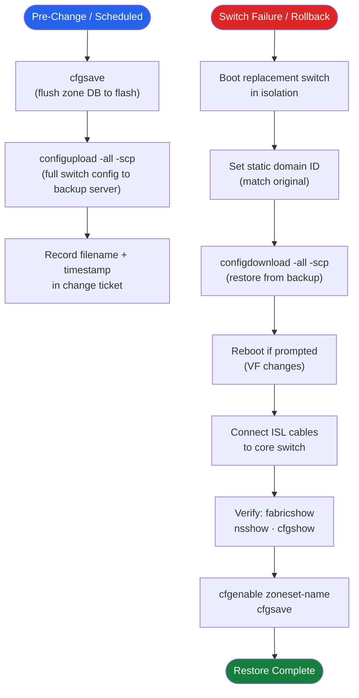

# FabricOS — Backup & Restore


<div class="kb-summary">
> Part of the [Operations](../index.md) reference.
</div>

---

## Backup and Restore Flow


```text
┌─────────────────────────────── Brocade Fabric OS — Backup and Restore ────────────────────────────────┐
│                                                                                                       │
│   ┌───────────────────────────────────────────────────────────────────────────────────────────────┐   │
│   │      FOS backup and restore: switch config, zone DB, and full switch replacement recovery     │   │
│   │          configupload: saves switch config (not zone DB) to SCP/FTP; schedule weekly          │   │
│   │           Zone DB backup: cfgsave persists to flash; also export zone DB via SANnav           │   │
│   │         Switch replacement: configdownload restores config; re-cable and verify fabric        │   │
│   │          Director blade: hot-swap with NDU; config on CP blade survives blade failure         │   │
│   └───────────────────────────────────────────────────────────────────────────────────────────────┘   │
│                                                                                                       │
│    Schedule backup -> verify backup file -> test restore -> store off-site copy securely              │
│                                                                                                       │
│                  ▼                                ▼                                ▼                  │
│                                                                                                       │
│   ┌─────────────────────────────┐  ┌─────────────────────────────┐  ┌─────────────────────────────┐   │
│   │        Config Backup        │  │           Zone DB           │  │           Recovery          │   │
│   │         configupload        │  │           cfgsave           │  │        configdownload       │   │
│   │        SCP/FTP target       │  │        SANnav export        │  │        Switch replace       │   │
│   │       Weekly schedule       │  │        Before changes       │  │       Re-cable fabric       │   │
│   │        Version tagged       │  │        Zone DB export       │  │         Verify zones        │   │
│   │        Off-site copy        │  │        Audit history        │  │         Test restore        │   │
│   └─────────────────────────────┘  └─────────────────────────────┘  └─────────────────────────────┘   │
│                                                                                                       │
│    Test restore quarterly; zone DB and config backup are independent procedures                       │
│                                                                                                       │
│                  ▼                                ▼                                ▼                  │
│                                                                                                       │
│   ┌───────────────────────────────────────────────────────────────────────────────────────────────┐   │
│   │   Backup type    │     Command      │     Frequency     │      Target      │      Notes       │   │
│   │  Switch config   │   configupload   │       Weekly      │    SCP server    │   All settings   │   │
│   │     Zone DB      │  cfgsave+export  │     Pre-change    │   SANnav/file    │   Fabric-wide    │   │
│   │   Full restore   │  configdownload  │     On failure    │    New switch    │ Re-cable needed  │   │
│   └───────────────────────────────────────────────────────────────────────────────────────────────┘   │
│                                                                                                       │
│    Physical: SCP/FTP backup server · offline config archive · replacement switch spare                │
│                                                                                                       │
│    Key terms:                                                                                         │
│                                                                                                       │
│    configupload   = FOS CLI: uploads switch config to SCP/FTP; includes port/security settings        │
│    configdownload = FOS CLI: restores switch config from remote file; triggers partial reboot         │
│    cfgsave        = Persists zone DB to non-volatile flash; must run after every zone change          │
│    Zone DB export = SANnav can export zone config as text file; keep with config backup               │
│    Switch replace = Install new switch, configdownload, re-cable ISLs and host/storage ports          │
│    NDU            = Non-Disruptive Upgrade; director blades hot-swapped with no fabric impact         │
│    Spare switch   = Pre-configured standby switch for rapid replacement; test restore regularly       │
│    SCP server     = Secure Copy Protocol server; preferred over FTP for encrypted transfer            │
│    Off-site copy  = Backup files replicated to secondary site or object storage for DR                │
│    Audit history  = SANnav logs all zone config changes; export as evidence for compliance            │
│    Version tag    = Include FOS version and date in backup filename for traceability                  │
│    Test restore   = Quarterly restore test on lab/spare switch to validate backup integrity           │
│                                                                                                       │
└───────────────────────────────────────────────────────────────────────────────────────────────────────┘
```

### Restore Notes

- The switch must be running a compatible FOS version before restoring a config — do not restore a FOS 9.x config onto a switch running FOS 8.x.
- After restore, some settings require a reboot to take effect (Virtual Fabric changes, for example).
- Zone configuration is restored but the zone set is not automatically activated. Run `cfgenable <zoneset-name>` manually after confirming the zone database looks correct.
- If restoring to a replacement switch, set the correct static domain ID before connecting to the fabric to avoid domain conflicts.

---

## Zone Database Backup (cfgsave)

`cfgsave` writes the current in-memory zone configuration (including any unsaved changes) to the switch's persistent flash storage. Without `cfgsave`, zone changes are lost on reboot.

```bash
# Save zone database to flash
cfgsave

# Confirm the active zone set
cfgshow | head -20
```

The zone database is included in the `configupload` archive. However, always run `cfgsave` immediately after any zoning change — before running `configupload` — so that the backup captures the latest zone state.

---

## Backup Schedule and Retention

| Trigger | Action |
|---|---|
| Pre-change (any maintenance window) | Manual `configupload` snapshot to dedicated pre-change directory |
| Weekly scheduled | Automated `configupload` via Ansible playbook or cron |
| Pre-firmware upgrade | Manual snapshot before and after upgrade |
| Post-zone change | Manual snapshot after confirming changes are correct |

Retention:
- Daily backups: 30 days
- Weekly backups: 6 months
- Pre-change snapshots: retained until the change is closed and validated

Store backups on a server outside the SAN fabric (not relying on FC connectivity) — typically the OOB management or backup network.

---

## Automated Backup with Ansible

The Ansible playbook in the [Scripts](../scripts/index.md) page automates nightly `configupload` across all switches. Key steps:

1. Ensure SSH key-based authentication is configured from the Ansible control node to each switch.
2. Set the `backup_server` variable to the SCP server IP and `backup_path` to the destination directory.
3. Run the playbook nightly via cron or a scheduling tool:

```bash
ansible-playbook -i inventory brocade_backup.yml
```

Each switch backup is archived with a datestamp in the filename: `<switchname>_config_20250507.cfg`.

---

## Manual Backup Procedure

Use this procedure before any change that touches the zone database, port configuration, or switch settings.

```bash
# Step 1 — Confirm switch is healthy
switchstatusshow
fabricshow

# Step 2 — Save zone database to flash
cfgsave

# Step 3 — Upload configuration to backup server
configupload -all -scp -host 10.0.0.5 -u svcbackup -f /backups/brocade/dc1-san-sw01_pre-change_20250507.cfg

# Step 4 — Note the filename and timestamp in the change record
# Step 5 — Confirm the file exists on the backup server before proceeding
```

---

## Restore Validation

After restoring a configuration (for example, after a switch replacement), run these checks to confirm the restore was successful.

```bash
# 1. Confirm zone database is correct
cfgshow                # Zone sets, zones, and aliases should match pre-failure state
alishow                # All expected aliases present

# 2. Activate the zone set if not automatically restored
cfgenable <zoneset-name>
cfgsave

# 3. Confirm all devices log back in
nsshow                 # All expected hosts and storage targets logged in
nsallshow              # Check across all domains

# 4. Confirm fabric is healthy
fabricshow             # All switches present, correct principal switch
islshow                # All ISLs up and at correct speed
switchshow             # All ports in expected state

# 5. Check host multipath from the host side
# VMware: esxcli storage nmp device list
# Linux:  multipath -ll
```

---

## Switch Replacement — Config Restore

When replacing a failed switch with the same model:

1. Boot the replacement switch in isolation (not connected to the fabric).
2. Assign the static domain ID to match the original switch:
   ```bash
   configure
   # Set "insistDomainId" to 1 at the Fabric Parameters prompt
   # Set the Domain ID to the value from the SAN design register
   ```
3. Restore the configuration from the most recent backup:
   ```bash
   configdownload -all -scp -host 10.0.0.5 -u svcbackup -f /backups/brocade/dc1-san-sw01_config_20250507.cfg
   ```
4. After configdownload completes, reboot the switch if prompted.
5. Connect ISL cables to the core switch.
6. Verify the switch joins the fabric:
   ```bash
   fabricshow        # Replacement switch appears with the correct domain ID
   topologyshow      # ISL path visible
   nsshow            # Devices log back in through the replacement switch
   ```
7. Activate the zone set if needed:
   ```bash
   cfgenable <zoneset-name>
   cfgsave
   ```
8. Update the CMDB with the new serial number and verify the support contract is transferred.

---

## Backup Integrity Check

Periodically verify that backup files are intact and restorable. For SCP-based backups, check that the file size is non-zero and the datestamp is current.

```bash
# On the backup server — list recent backups for a switch
ls -lh /backups/brocade/ | grep dc1-san-sw01

# Spot-check a backup file
head -20 /backups/brocade/dc1-san-sw01_config_20250507.cfg
# Expected: should begin with switch identity and FOS version comments
```

A valid config backup file begins with a comment block identifying the switch hostname, serial number, FOS version, and backup timestamp. If the file is empty or contains only error messages, the backup failed and must be re-run.
